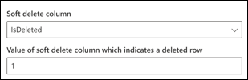
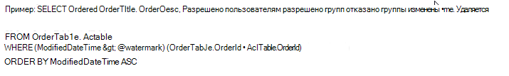

# Соединитель Microsoft SQL ServerMicrosoft SQL server connector

С помощью соединителя Microsoft SQL Server организация может находить и индексировать данные из локальной базы данных SQL Server.With a Microsoft SQL server connector, your organization can discover and index data from an on-premises SQL Server database. Соединитель индексирует указанное содержимое в Microsoft Search.The connector indexes specified content into Microsoft Search. Чтобы регулярно обновлять индекс с использованием исходных данных, он поддерживает периодический полный и добавочный обход контента.To keep the index up to date with source data, it supports periodic full and incremental crawls. С помощью соединителя SQL Server можно также ограничить доступ к результатам поиска для определенных пользователей.With the SQL Server connector, you can also restrict access to search results for certain users.

Эта статья предназначена для администраторов Microsoft 365 или пользователей, которые настраивают, запускают и отслеживают соединитель Microsoft SQL Server.This article is for Microsoft 365 administrators or anyone who configures, runs, and monitors a Microsoft SQL server connector. В этой статье объясняется, как настроить возможности соединителя и соединителя, ограничения и способы устранения неполадок.It explains how to configure your connector and connector capabilities, limitations, and troubleshooting techniques.

## Установка Data GatewayInstall a data gateway
Чтобы получить доступ к данным третьих сторон, необходимо установить и настроить шлюз Microsoft Power BI Gateway.In order to access your third-party data, you must install and configure a Microsoft Power BI gateway. Чтобы узнать больше, ознакомьтесь со статьей [Установка и локальный шлюз](https://docs.microsoft.com/data-integration/gateway/service-gateway-install) .See [Install and on-premises gateway](https://docs.microsoft.com/data-integration/gateway/service-gateway-install) to learn more.  

## Подключение к источнику данныхConnect to a data source
Чтобы подключить соединитель Microsoft SQL Server к источнику данных, необходимо настроить сервер базы данных, для которого выполняется обход, и локальный шлюз.To connect your Microsoft SQL server connector to a data source, you must configure the database server you want crawled and the on-premises gateway. Затем можно подключиться к базе данных с помощью требуемого метода проверки подлинности.You can then connect to the database with the required authentication method.

> [!NOTE]
> База данных должна работать под управлением SQL Server версии 2008 или более поздней.Your database must run SQL server version 2008 or later.

Чтобы выполнить поиск по контенту базы данных, необходимо указать SQL запросы при настройке соединителя.To search your database content, you must specify SQL queries when you configure the connector. Этим запросам SQL необходимо присвоить имена всем столбцам базы данных, которые необходимо индексировать (то есть свойствам источника), включая все соединения SQL, которые необходимо выполнить, чтобы получить все столбцы.These SQL queries need to name all the database columns that you want to index (i.e. source properties), including any SQL joins that need to be performed to get all the columns. Чтобы ограничить доступ к результатам поиска, необходимо указать списки управления доступом (ACL) с запросами SQL при настройке соединителя Microsoft SQL Server.To restrict access to search results, you must specify Access Control Lists (ACLs) with SQL queries when you configure the Microsoft SQL server connector.

## Полный обход (обязательный)Full crawl (Required)
На этом этапе настраивается SQL-запрос, выполняющий полный обход базы данных.In this step, you configure the SQL query that runs a full crawl of the database. Полный обход контента выбирает все столбцы или свойства, которые необходимо сделать доступными для **запроса**, **поиска**или **извлечения**.The full crawl selects all the columns or properties you want to be made **queryable**, **searchable**, or **retrievable**. Кроме того, можно указать столбцы ACL, чтобы ограничить доступ к результатам поиска для определенных пользователей или групп.You can also specify ACL columns to restrict access of search results to specific users or groups.

> [!Tip]
> Чтобы получить все необходимые столбцы, можно присоединиться к нескольким таблицам.To get all the columns that you need, you can join multiple tables.

### Выбор столбцов данных (обязательных) и столбцов ACL (необязательно)Select data columns (Required) and ACL columns (Optional)
В этом примере показано, как выбрать пять столбцов данных, в которых хранятся данные для поиска: OrderId, Ордертитле, Ордердеск, CreatedDateTime и с удалением.The example demonstrates selection of five data columns that hold the data for the search: OrderId, OrderTitle, OrderDesc, CreatedDateTime, and IsDeleted. Чтобы задать разрешения на просмотр для каждой строки данных, можно дополнительно выбрать следующие столбцы ACL: Алловедусерс, Алловедграупс, Дениедусерс и Дениедграупс.To set view permissions for each row of data, you can optionally select these ACL columns: AllowedUsers, AllowedGroups, DeniedUsers, and DeniedGroups. Все эти столбцы данных можно сделать доступными для **запроса**, **поиска**или **извлечения**.All these data columns can be made **queryable**, **searchable**, or **retrievable**.

Выберите столбцы данных, как показано в следующем примере запроса:`SELECT OrderId, OrderTitle, OrderDesc, AllowedUsers, AllowedGroups, DeniedUsers, DeniedGroups, CreatedDateTime, IsDeleted`Select data columns as shown in this example query: `SELECT OrderId, OrderTitle, OrderDesc, AllowedUsers, AllowedGroups, DeniedUsers, DeniedGroups, CreatedDateTime, IsDeleted`

### Водяной знак (обязательный)Watermark (Required)
Чтобы избежать перегрузки базы данных, пакеты соединителя и возобновляют запросы на полный обход контента с помощью столбца водяного знака для полного обхода.To prevent overloading the database, the connector batches and resumes full-crawl queries with a full-crawl watermark column. С помощью значения столбца водяного знака, каждый последующий пакет извлекается, а запрос возобновляется из последней контрольной точки.By using the value of the watermark column, each subsequent batch is fetched, and querying is resumed from the last checkpoint. По сути, это механизм для управления обновлением данных при полном обходе.Essentially this is a mechanism to control data refresh for full crawls.

Создайте фрагменты запросов для водяных знаков, как показано в следующих примерах:Create query snippets for watermarks as shown in these examples:
* `WHERE (CreatedDateTime > @watermark)`. Заменяйте имя столбца водяного знака на `@watermark`зарезервированное ключевое слово.Cite the watermark column name with the reserved keyword `@watermark`. Если порядок сортировки столбца водяного знака — по возрастанию, используйте `>`; в противном `<`случае используйте.If the sort order of the watermark column is ascending, use `>`; otherwise, use `<`.
* `ORDER BY CreatedDateTime ASC`. Сортировать по столбцу водяных знаков в возрастающем или убывающем порядке.Sort on the watermark column in ascending or descending order.

В конфигурации, показанной на следующем изображении `CreatedDateTime` , является выбранным столбцом водяных знаков.In the configuration shown in the following image, `CreatedDateTime` is the selected watermark column. Чтобы получить первый пакет строк, укажите тип данных столбца "водяной знак".To fetch the first batch of rows, specify the data type of the watermark column. В этом случае типом данных является `DateTime`.In this case, the data type is `DateTime`.

Первый запрос извлекает первые **N** строк, используя: "CreatedDateTime > 1 января 1753 00:00:00" (минимальное значение типа данных DateTime).The first query fetches the first **N** amount of rows by using: "CreatedDateTime > January 1, 1753 00:00:00" (min value of DateTime data type). После извлечения первого пакета наибольшее значение, `CreatedDateTime` возвращенное в пакете, сохраняется в виде контрольной точки, если строки сортируются в возрастающем порядке.After the first batch is fetched, the highest value of `CreatedDateTime` returned in the batch is saved as the checkpoint if the rows are sorted in ascending order. Пример: 1 марта 2019 03:00:00.An example is March 1, 2019 03:00:00. Затем следующий пакет из **N** строк извлекается с помощью "CreatedDateTime > 1 марта 2019 03:00:00" в запросе.Then the next batch of **N** rows is fetched by using "CreatedDateTime > March 1, 2019 03:00:00" in the query.

### Пропуск обратимо удаленных строк (необязательно)Skipping soft-deleted rows (Optional)
Чтобы исключить возможность индексирования обратимо удаленных строк в базе данных, укажите имя столбца с обратимым удалением и значение, указывающее на то, что строка удалена.To exclude soft-deleted rows in your database from being indexed, specify the soft-delete column name and value that indicates the row is deleted.

## Добавочный обход (необязательно)Incremental crawl (Optional)
На этом необязательном этапе необходимо предоставить SQL-запрос для выполнения добавочного обхода базы данных.In this optional step, provide a SQL query to run an incremental crawl of the database. С помощью этого запроса соединитель Microsoft SQL Server вносит изменения в данные с момента последнего добавочного обхода.With this query, the Microsoft SQL server connector makes any changes to the data since the last incremental crawl. Как и при полном обходе контента, выберите все столбцы, которые необходимо сделать доступными для **запроса**, **поиска**или **извлечения**.As in the full crawl, select all columns that you want to be made **queryable**, **searchable**, or **retrievable**. Укажите тот же набор столбцов ACL, который вы указали в запросе на полный обход контента.Specify the same set of ACL columns that you specified in the full crawl query.

Компоненты на следующем изображении похожи на компоненты полного обхода с одним исключением.The components in the following image resemble the full crawl components with one exception. В этом случае "Модифиеддатетиме" является выбранным столбцом водяного знака.In this case, "ModifiedDateTime" is the selected watermark column. Ознакомьтесь с [полными шагами обхода](#full-crawl-required) , чтобы узнать, как создать запрос добавочного обхода контента и просмотреть приведенный ниже рисунок в качестве примера.Review the [full crawl steps](#full-crawl-required) to learn how to write your incremental crawl query and see the following image as an example.

## ОграниченияLimitations
В предварительной версии Microsoft SQL Server Connector имеются следующие ограничения:The Microsoft SQL server connector has these limitations in the preview release:
* Локальная база данных должна работать под управлением SQL Server версии 2008 или более поздней.The on-premises database must run SQL server version 2008 or later.
* Списки управления доступом поддерживаются только с помощью имени участника-пользователя (UPN), Azure Active Directory (Azure AD) или безопасности Active Directory.ACLs are only supported by using a User Principal Name (UPN), Azure Active Directory (Azure AD), or Active Directory Security.
* Индексирование расширенного содержимого в столбцах базы данных не поддерживается.Indexing rich content inside database columns is not supported. Примерами такого содержимого являются HTML, JSON, XML, BLOB-объекты и разбор документов, которые существуют в качестве ссылок в столбцах базы данных.Examples of such content are HTML, JSON, XML, blobs, and document parsings that exist as links inside the database columns.

