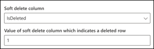

<!---Previous ms.author:vivg --->

# Соедините SQL GraphOracle SQL Graph connector

Соединитатель Oracle SQL Graph позволяет организации обнаруживть и индексировать данные из локальной базы данных Oracle.The Oracle SQL Graph connector allows your organization to discover and index data from an on-premises Oracle database. Соединителе индексирует указанный контент в Microsoft Search.The connector indexes specified content into Microsoft Search. Чтобы поддерживать индекс в курсе исходных данных, он поддерживает периодические полные и дополнительные обходы.To keep the index up to date with source data, it supports periodic full and incremental crawls. С соединитетелем Oracle SQL также можно ограничить доступ к результатам поиска для определенных пользователей.With the Oracle SQL connector, you can also restrict access to search results for certain users.

> [!NOTE]
> Ознакомьтесь [**с статьей Настройка соединиттеля Graph,**](configure-connector.md) чтобы понять общие инструкции по настройке соединитений Graph.Read the [**Setup for your Graph connector**](configure-connector.md) article to understand the general Graph connectors setup instructions.

Эта статья для всех, кто настраивает, запускает и отслеживает соединители Oracle SQL Graph.This article is for anyone who configures, runs, and monitors an Oracle SQL Graph connector. Он дополняет общий процесс установки и показывает инструкции, применимые только к соединитестру SQL Graph.It supplements the general setup process, and shows instructions that apply only for the Oracle SQL Graph connector. В этой статье также содержатся сведения о устранении [неполадок](#troubleshooting) и [ограничениях.](#limitations)This article also includes information about [Troubleshooting](#troubleshooting) and [Limitations](#limitations).

## Перед началом работыBefore you get started

### Установка агента соединителя GraphInstall the Graph connector agent

Чтобы получить доступ к локальной сторонней информации, необходимо установить и настроить агент соединителя Graph.In order to access your on-premises third-party data, you must install and configure the Graph connector agent. Дополнительные дополнительные данные см. в [дополнительных подробной](on-prem-agent.md) информации об установке агента соединителя Graph.See [Install the Graph connector agent](on-prem-agent.md) to learn more.  

## Шаг 1. Добавление соединителю Graph в центре администрирования Microsoft 365Step 1: Add a Graph connector in the Microsoft 365 admin center

Следуйте общим [инструкциям установки](https://docs.microsoft.com/microsoftsearch/configure-connector).Follow the general [setup instructions](https://docs.microsoft.com/microsoftsearch/configure-connector).
<!---If the above phrase does not apply, delete it and insert specific details for your data source that are different from general setup instructions.-->

## Шаг 2. Имя подключенияStep 2: Name the connection

Следуйте общим [инструкциям установки](https://docs.microsoft.com/microsoftsearch/configure-connector).Follow the general [setup instructions](https://docs.microsoft.com/microsoftsearch/configure-connector).
<!---If the above phrase does not apply, delete it and insert specific details for your data source that are different from general setup instructions.-->

## Шаг 3. Настройка параметров подключенияStep 3: Configure the connection settings

Чтобы подключить SQL Oracle к источнику данных, необходимо настроить сервер базы данных, который необходимо пройти, и локального агента соединители Graph.To connect your Oracle SQL connector to a data source, you must configure the database server you want crawled and the on-premises Graph connector agent. Затем вы можете подключиться к базе данных с помощью требуемого метода проверки подлинности.You can then connect to the database with the required authentication method.

Для соединителя SQL Oracle необходимо указать имя hostname, Port и Service (база данных) вместе с предпочтительным методом проверки подлинности, именем пользователя и паролем.For Oracle SQL connector, you need to specify the Hostname, Port and Service (database) name along with the preferred authentication method, username, and password.

> [!NOTE]
> Ваша база данных должна запускать версию базы данных Oracle 11g или более поздней версии для подключения соединитетеля.Your database must run Oracle database version 11g or later for the connector to be able to connect. Соединитатель поддерживает базу данных Oracle, которая содержится на платформах VM Windows, Linux и Azure.The connector supports Oracle database hosted on Windows, Linux and Azure VM platforms.

Для поиска контента базы данных необходимо указать SQL запросы при настройке соединители.To search your database content, you must specify SQL queries when you configure the connector. В SQL запросы необходимо назвать все столбцы баз данных, которые необходимо индексировать (то есть исходные свойства), включая все SQL, которые необходимо выполнить для получения всех столбцов.These SQL queries need to name all the database columns that you want to index (that is, source properties), including any SQL joins that need to be performed to get all the columns. Чтобы ограничить доступ к результатам поиска, при настройке соединителя необходимо указать списки управления доступом (ACLs) SQL запросов.To restrict access to search results, you must specify Access Control Lists (ACLs) within SQL queries when you configure the connector.

## Шаг 3a. Полный обход (обязательно)Step 3a: Full crawl (Required)

На этом шаге настраивается SQL запрос, который выполняет полный обход базы данных.In this step, you configure the SQL query that runs a full crawl of the database. Полный обход выбирает все столбцы или свойства, в которых необходимо выбрать **параметры Запрос,** **Поиск** или **Извлечение.**The full crawl selects all the columns or properties where you want to select the options **Query**, **Search**, or **Retrieve**. Также можно указать столбцы ACL, чтобы ограничить доступ к результатам поиска определенным пользователям или группам.You can also specify ACL columns to restrict access of search results to specific users or groups.

> [!Tip]
> Чтобы получить все необходимые столбцы, можно присоединиться к нескольким таблицам.To get all the columns that you need, you can join multiple tables.

### Выбор столбцов данных (обязательно) и столбцов ACL (необязательный)Select data columns (Required) and ACL columns (Optional)

В примере демонстрируется выбор пяти столбцов данных, которые удерживают данные для поиска: OrderId, OrderTitle, OrderDesc, CreatedDateTime и IsDeleted.The example demonstrates selection of five data columns that hold the data for the search: OrderId, OrderTitle, OrderDesc, CreatedDateTime, and IsDeleted. Чтобы установить разрешения представления для каждого ряда данных, можно дополнительно выбрать эти столбцы ACL: AllowedUsers, AllowedGroups, DeniedUsers и DeniedGroups.To set view permissions for each row of data, you can optionally select these ACL columns: AllowedUsers, AllowedGroups, DeniedUsers, and DeniedGroups. Для всех этих столбцов данных можно выбрать параметры **Запрос,** **Поиск** или **Извлечение**.For all these data columns you can select the options to **Query**, **Search**, or **Retrieve**.

Выберите столбцы данных, как показано в этом примере запроса: `SELECT OrderId, OrderTitle, OrderDesc, AllowedUsers, AllowedGroups, DeniedUsers, DeniedGroups, CreatedDateTime, IsDeleted`Select data columns as shown in this example query: `SELECT OrderId, OrderTitle, OrderDesc, AllowedUsers, AllowedGroups, DeniedUsers, DeniedGroups, CreatedDateTime, IsDeleted`

Чтобы управлять доступом к результатам поиска, в запросе можно указать один или несколько столбцов ACL.To manage access to the search results, you can specify one or more ACL columns in the query. Соединитель SQL позволяет управлять доступом на уровне записи.The SQL connector allows you to control access at per record level. Вы можете выбрать один и тот же контроль доступа для всех записей в таблице.You can choose to have the same access control for all records in a table. Если сведения ACL хранятся в отдельной таблице, может потребоваться присоединиться к этим таблицам в запросе.If the ACL information is stored in a separate table, you might have to do a join with those tables in your query.

Ниже описано использование каждого из столбцов ACL в приведенной выше области запроса.The use of each of the ACL columns in the above query is described below. В следующем списке рассказывается о четырех **механизмах управления доступом.**The following list explains the four **access control mechanisms**.

* **AllowedUsers.** Этот параметр указывает список пользовательских ИД, которые смогут получить доступ к результатам поиска.**AllowedUsers**: This option specifies the list of user IDs who will be able to access the search results. В следующем примере список пользователей: john@contoso.com, keith@contoso.com и lisa@contoso.com будут иметь доступ только к записи с orderId = 12.In the following example, list of users: john@contoso.com, keith@contoso.com, and lisa@contoso.com would only have access to a record with OrderId = 12.
* **AllowedGroups.** Этот параметр указывает группу пользователей, которые смогут получить доступ к результатам поиска.**AllowedGroups**: This option specifies the group of users who will be able to access the search results. В следующем примере группа sales-team@contoso.com будет иметь доступ к записи только с OrderId = 12.In the following example, group sales-team@contoso.com would only have access to record with OrderId = 12.
* **DeniedUsers.** Этот параметр указывает список пользователей, которые не имеют доступа к результатам поиска. **DeniedUsers**: This option specifies the list of users who do **not** have access to the search results. В следующем примере пользователи john@contoso.com и keith@contoso.com не имеют доступа к записи с OrderId = 13, в то время как все остальные имеют доступ к этой записи.In the following example, users john@contoso.com and keith@contoso.com do not have access to record with OrderId = 13, whereas everyone else has access to this record.
* **DeniedGroups.** Этот параметр указывает группу  пользователей, которые не имеют доступа к результатам поиска.**DeniedGroups**: This option specifies the group of users who do **not** have access to the search results. В следующем примере группы engg-team@contoso.com и pm-team@contoso.com не имеют доступа к записи с OrderId = 15, в то время как все остальные имеют доступ к этой записи.In the following example, groups engg-team@contoso.com and pm-team@contoso.com do not have access to record with OrderId = 15, whereas everyone else has access to this record.  

### Поддерживаемые типы данныхSupported data types

В приведенной ниже таблице приведены типы данных, поддерживаемые соединитетелем Oracle SQL.The below table summarizes the data types that are supported by the Oracle SQL connector. В таблице также кратко приводится тип индексации данных для поддерживаемого SQL типа данных.The table also summarizes the indexing data type for the supported SQL data type. Дополнительные сведения о соединители Microsoft Graph, поддерживаемые типами данных для индексации, переслать документацию по [типам ресурсов свойств.](https://docs.microsoft.com/graph/api/resources/property?view=graph-rest-beta#properties&preserve-view=true)To learn more about Microsoft Graph connectors supported data types for indexing, refer documentation on [property resource types](https://docs.microsoft.com/graph/api/resources/property?view=graph-rest-beta#properties&preserve-view=true).

| CategoryCategory | Тип исходных данныхSource data type | Тип индексации данныхIndexing data type |
| ------------ | ------------ | ------------ |
| Тип данных номеровNumber datatype | NUMBER (p,0)NUMBER(p,0) | int64 (для p <= 18)int64 (for p <= 18)   двойной (для p > 18)double (for p > 18) |
| Тип данных номеров с плавающей точкойFloating-point number datatype | NUMBER (p,s)NUMBER(p,s)   FLOAT (p)FLOAT(p) | doubledouble |
| Тип данных датыDate datatype | DATEDATE   TIMESTAMPTIMESTAMP   TIMESTAMP(n)TIMESTAMP(n) | datetimedatetime |
| Тип данных символовCharacter datatype | CHAR (n)CHAR(n)   VARCHARVARCHAR   VARCHAR2VARCHAR2   LONGLONG   CLOBCLOB   NCLOBNCLOB | stringstring |
| Тип данных символов ЮникодUnicode character datatype | NCHARNCHAR   NVARCHARNVARCHAR | stringstring |
| Тип данных RowIDRowID datatype | ROWIDROWID   UROWIDUROWID | stringstring |

Для любого другого типа данных, который в настоящее время не поддерживается напрямую, столбец должен быть явно отлит в поддерживаемый тип данных.For any other data type currently not directly supported, the column needs to be explicitly cast to a supported data type.

### Водяной знак (обязательно)Watermark (Required)

Чтобы предотвратить перегрузку базы данных, соединители пакеты и возобновляют запросы полного обхода с помощью столбца водяного знака полного обхода.To prevent overloading the database, the connector batches and resumes full-crawl queries with a full-crawl watermark column. Используя значение столбца водяного знака, каждая последующая партия получается, и запрос возобновляется с последней контрольной точки.By using the value of the watermark column, each subsequent batch is fetched, and querying is resumed from the last checkpoint. По сути это механизм для управления обновлением данных для полного обхода.Essentially this is a mechanism to control data refresh for full crawls.

Создание фрагментов запросов для водяных знаков, как показано в этих примерах:Create query snippets for watermarks as shown in these examples:

* `WHERE (CreatedDateTime > @watermark)`.`WHERE (CreatedDateTime > @watermark)`. Приведи имя столбца водяного знака с зарезервированным ключевым словом `@watermark` .Cite the watermark column name with the reserved keyword `@watermark`. Вы можете сортировать столбец водяных знаков только в порядке восхождения.You can only sort the watermark column in ascending order.
* `ORDER BY CreatedDateTime ASC`.`ORDER BY CreatedDateTime ASC`. Сортировка на столбце водяного знака в порядке подъема.Sort on the watermark column in ascending order.

В конфигурации, показанной на следующем изображении, `CreatedDateTime` находится выбранный столбец водяного знака.In the configuration shown in the following image, `CreatedDateTime` is the selected watermark column. Чтобы получить первую партию строк, укажите тип данных столбца водяного знака.To fetch the first batch of rows, specify the data type of the watermark column. В этом случае тип данных `DateTime` .In this case, the data type is `DateTime`.

Первый запрос получает первое число строк **N** с помощью: "CreatedDateTime > 1 января 1753 г. 00:00:00" (min value of DateTime data type).The first query fetches the first **N** number of rows by using: "CreatedDateTime > January 1, 1753 00:00:00" (min value of DateTime data type). После получения первой партии максимальное значение возвращается в пакете в качестве контрольной точки, если строки сортироваться в порядке `CreatedDateTime` восходящей.After the first batch is fetched, the highest value of `CreatedDateTime` returned in the batch is saved as the checkpoint if the rows are sorted in ascending order. Пример: 1 марта 2019 г. 03:00:00.An example is March 1, 2019 03:00:00. Затем следующая партия **строк N** извлекается с помощью "CreatedDateTime > 1 марта 2019 г. 03:00:00" в запросе.Then the next batch of **N** rows is fetched by using "CreatedDateTime > March 1, 2019 03:00:00" in the query.

### Пропуск строк с мягким удалением (необязательный)Skipping soft-deleted rows (Optional)

Чтобы исключить из индексации мягкие удаленные строки в базе данных, укажите имя и значение столбца с мягким удалением, указывав на удаление строки.To exclude soft-deleted rows in your database from being indexed, specify the soft-delete column name and value that indicates the row is deleted.

### Полный обход: управление разрешениями поискаFull crawl: Manage search permissions

Выберите **управление разрешениями** для выбора столбцов управления доступом (ACL), которые указывают механизм управления доступом.Select **Manage permissions** to choose the various access control (ACL) columns that specify the access control mechanism. Выберите имя столбца, указанное в полном запросе SQL обхода.Select the column name you specified in the full crawl SQL query.

Ожидается, что каждый из столбцов ACL будет иметь несколько значений.Each of the ACL columns is expected to be a multi-valued column. Эти несколько значений ID могут быть разделены сепараторами, такими как ;), запятая и так далее.These multiple ID values can be separated by separators such as semicolon (;), comma (,), and so on. Этот сепаратор необходимо указать в поле **сепаратора** значений.You need to specify this separator in the **value separator** field.

Следующие типы ID поддерживаются для использования в качестве acLs:The following ID types are supported for using as ACLs:

* **Имя основного пользователя (UPN).** Имя пользователя —имя пользователя в формате адресов электронной почты.**User Principal Name (UPN)**: A User Principal Name (UPN) is the name of a system user in an email address format. UpN (например: john.doe@domain.com) состоит из имени пользователя (имя логотипа), сепаратора (символ @) и доменного имени (суффикс UPN).A UPN (for example: john.doe@domain.com) consists of the username (logon name), separator (the @ symbol), and domain name (UPN suffix).
* **Azure Active Directory (AAD) ID:** В Azure AD каждый пользователь или группа имеет объектный ИД, который выглядит как 'e0d3ad3d-0000-1111-2222-3c5f5c52ab9b'**Azure Active Directory (AAD) ID**: In Azure AD, every user or group has an object ID that looks something like 'e0d3ad3d-0000-1111-2222-3c5f5c52ab9b'
* Идентификатор безопасности **Active Directory (AD).** В локальной установке AD каждый пользователь и группа имеют уникальный идентификатор безопасности, похожий на S-1-1-5-21-3878594291-2115959936-132693609-65242.'**Active Directory (AD) Security ID**: In an on-premises AD setup, every user and group have an immutable, unique security identifier that looks something like 'S-1-5-21-3878594291-2115959936-132693609-65242.'

## Шаг 3b. Дополнительный обход (необязательный)Step 3b: Incremental crawl (Optional)

На этом необязательный шаг SQL запрос для выполнения дополнительного обхода базы данных.In this optional step, provide a SQL query to run an incremental crawl of the database. С помощью этого запроса соединитель SQL определяет любые изменения в данных после последнего инкрементного обхода.With this query, the SQL connector determines any changes to the data since the last incremental crawl. Как и в полном обходе, выберите между вариантами **Запрос,** **Поиск** или **Извлечение**.As in the full crawl, select between the options **Query**, **Search**, or **Retrieve**. Укажите тот же набор столбцов ACL, который указан в полном запросе обхода.Specify the same set of ACL columns that you specified in the full crawl query.

Компоненты на следующем изображении напоминают компоненты полного обхода с одним исключением.The components in the following image resemble the full crawl components with one exception. В этом случае выбран столбец водяного знака "ModifiedDateTime".In this case, "ModifiedDateTime" is the selected watermark column. Просмотрите [все этапы обхода,](#step-3a-full-crawl-required) чтобы узнать, как написать дополнительный запрос обхода, и в качестве примера см. следующее изображение.Review the [full crawl steps](#step-3a-full-crawl-required) to learn how to write your incremental crawl query and see the following image as an example.

## Шаг 4. Назначение меток свойствStep 4: Assign property labels

Следуйте общим [инструкциям установки](https://docs.microsoft.com/microsoftsearch/configure-connector).Follow the general [setup instructions](https://docs.microsoft.com/microsoftsearch/configure-connector).
<!---If the above phrase does not apply, delete it and insert specific details for your data source that are different from general setup instructions.-->

## Шаг 5. Управление схемойStep 5: Manage schema

Следуйте общим [инструкциям установки](https://docs.microsoft.com/microsoftsearch/configure-connector).Follow the general [setup instructions](https://docs.microsoft.com/microsoftsearch/configure-connector).
<!---If the above phrase does not apply, delete it and insert specific details for your data source that are different from general setup instructions.-->

## Шаг 6. Управление разрешениями на поискStep 6: Manage search permissions

Вы можете использовать [acLs,](#full-crawl-manage-search-permissions) указанные на экране полного обхода, или переопределять их, чтобы сделать содержимое видимым для всех.You can choose to use the [ACLs specified in the full crawl screen](#full-crawl-manage-search-permissions) or you can override them to make your content visible to everyone.

## Шаг 7. Выбор параметров обновленияStep 7: Choose refresh settings

Соединитель oracle SQL поддерживает расписание обновления для полного и постепенного обхода.The Oracle SQL connector supports refresh schedules for both full and incremental crawls. Рекомендуется установить и то, и другое.We recommend that you set both.

Полное расписание обхода находит удаленные строки, которые ранее синхронизировались с индексом Microsoft Search, и все строки, которые вышли из фильтра синхронизации.A full crawl schedule finds deleted rows that were previously synced to the Microsoft Search index and any rows that moved out of the sync filter. При первом подключении к базе данных выполняется полный обход, чтобы синхронизировать все строки, извлеченные из полного запроса обхода.When you first connect to the database, a full crawl runs to sync all the rows retrieved from the full crawl query. Чтобы синхронизировать новые строки и сделать обновления, необходимо запланировать дополнительные обходы.To sync new rows and make updates, you need to schedule incremental crawls.

## Шаг 8. Просмотр подключенияStep 8: Review connection

Следуйте общим [инструкциям установки](https://docs.microsoft.com/microsoftsearch/configure-connector).Follow the general [setup instructions](https://docs.microsoft.com/microsoftsearch/configure-connector).
<!---If the above phrase does not apply, delete it and insert specific details for your data source that are different from general setup instructions.-->

<!--- ## Next steps: Customize the search results page

Create your own verticals and result types, so end users can view search results from new connections. Without this step, data from your connection won't show up on the search results page.

To learn more about how to create your verticals and MRTs, see [Search results page customization](customize-search-page.md). -->

## Устранение неполадокTroubleshooting

Ниже находится список распространенных ошибок, наблюдаемых при настройке соединитетеля и их возможных причин.Underneath is a list of common errors observed while configuring the connector and their possible reasons.

| Шаг конфигурацииConfiguration step | Сообщение об ошибкеError message | Возможная причина(ы)Possible reason(s) |
| ------------ | ------------ | ------------ |
| Параметры базы данныхDatabase settings | Ошибка с сервера базы данных. Время запроса на подключениеError from database server: Connection request timed out | Имя недействительных hostnameInvalid Hostname   Хост, недоступный дляHost not reachable |
| Параметры базы данныхDatabase settings | Ошибка с сервера базы данных: ORA-12541: TNS: Нет слушателяError from database server: ORA-12541: TNS: No listener | Недействительный портInvalid Port |
| Параметры базы данныхDatabase settings | Ошибка с сервера базы данных: ORA-12514: TNS: в настоящее время слушатель не знает о службе, запрашиваемой в дескрипторе соединителяError from database server: ORA-12514: TNS: listener does not currently know of service requested in connector descriptor | Имя недействительной службы (базы данных)Invalid service (database) name |
| Параметры базы данныхDatabase settings | Ошибка с сервера базы данных: ошибка входа для пользователя `user` '.Error from database server: Login failed for user '`user`'. | Имя пользователя или пароль, недействительныйInvalid username or password |

## ОграниченияLimitations

Соедините SQL Oracle имеет эти ограничения в выпуске предварительного просмотра:The Oracle SQL connector has these limitations in the preview release:

* В локальной базе данных должна работать версия Базы данных Oracle 11g или более поздней версии.The on-premises database must run Oracle Database version 11g or later.
* AcLs поддерживаются только с помощью основного имени пользователя (UPN), Azure Active Directory (Azure AD) или active Directory Security.ACLs are only supported by using a User Principal Name (UPN), Azure Active Directory (Azure AD), or Active Directory Security.
* Индексация богатого контента внутри столбцов баз данных не поддерживается.Indexing rich content inside database columns is not supported. Примерами такого контента являются HTML, JSON, XML, blobs и размыва документов, которые существуют в качестве ссылок внутри столбцов базы данных.Examples of such content are HTML, JSON, XML, blobs, and document parsings that exist as links inside the database columns.
