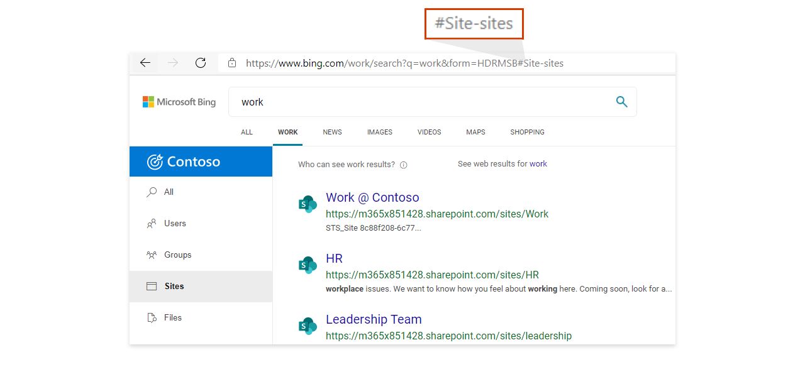

# <a name="add-a-search-box-to-your-intranet-site"></a><span data-ttu-id="8f328-103">Добавление поля поиска на сайте интрасети</span><span class="sxs-lookup"><span data-stu-id="8f328-103">Add a search box to your intranet site</span></span>

<span data-ttu-id="8f328-104">Чтобы предоставить пользователям легкий доступ к результатам организации, добавьте в поле поиска microsoft Search Bing на любой сайт или страницу интрасети.</span><span class="sxs-lookup"><span data-stu-id="8f328-104">To provide your users with easy access to results from your organization, add a Microsoft Search in Bing search box to any intranet site or page.</span></span> <span data-ttu-id="8f328-105">Вот некоторые из преимуществ:</span><span class="sxs-lookup"><span data-stu-id="8f328-105">These are some of the benefits:</span></span>

- <span data-ttu-id="8f328-106">Поле поиска на портале SharePoint или интрасети предоставляет знакомую и доверяемую точку входа для начала поиска</span><span class="sxs-lookup"><span data-stu-id="8f328-106">A search box on your SharePoint or intranet portal provides a familiar, trusted entry point to start searching</span></span>
- <span data-ttu-id="8f328-107">Поддерживает все основные веб-браузеры, включая Google Chrome и Microsoft Edge</span><span class="sxs-lookup"><span data-stu-id="8f328-107">Supports all major web browsers, including Google Chrome and Microsoft Edge</span></span>
- <span data-ttu-id="8f328-108">Отображаются только предложения поиска из организации, веб-предложения никогда не включаются</span><span class="sxs-lookup"><span data-stu-id="8f328-108">Only search suggestions from your organization appear, web suggestions are never included</span></span>
- <span data-ttu-id="8f328-109">Принимает пользователей на страницу Microsoft Search в Bing результатов работы, которая исключает рекламу и веб-результаты</span><span class="sxs-lookup"><span data-stu-id="8f328-109">Takes users to a Microsoft Search in Bing work results page, which excludes ads and web results</span></span>
- <span data-ttu-id="8f328-110">Вы контролируете внешний вид и поведение окна поиска, включая возможность посадки пользователей по умолчанию по вертикали или созданной вами настраиваемой вертикали.</span><span class="sxs-lookup"><span data-stu-id="8f328-110">You control the appearance and behavior of the search box, including the ability to land users on a default vertical or a custom vertical you've created</span></span>
  
## <a name="add-a-search-box-to-an-intranet-page"></a><span data-ttu-id="8f328-111">Добавление поля поиска на странице интрасети</span><span class="sxs-lookup"><span data-stu-id="8f328-111">Add a search box to an intranet page</span></span>

<span data-ttu-id="8f328-112">Нужно добавить на страницу два элемента: контейнер для поля поиска и скрипт, который его запустит.</span><span class="sxs-lookup"><span data-stu-id="8f328-112">You need to add two elements to the page: a container for the search box and the script that powers it.</span></span>
  
```html
<div id="bfb_searchbox"></div>
<script>
    var bfbSearchBoxConfig = {
        containerSelector: "bfb_searchbox"
    };
</script>
<script async src="https://www.bing.com/business/s?k=sb"></script>
```

<span data-ttu-id="8f328-113">На классическом сайте SharePoint добавьте веб-часть редактора скриптов и вставьте в нее этот скрипт.</span><span class="sxs-lookup"><span data-stu-id="8f328-113">On a SharePoint classic site, add a Script Editor Web Part and drop the script in it.</span></span>
  
## <a name="enable-the-search-box-for-mobile"></a><span data-ttu-id="8f328-114">Включение поля поиска для мобильных устройств</span><span class="sxs-lookup"><span data-stu-id="8f328-114">Enable the search box for mobile</span></span>

<span data-ttu-id="8f328-115">Для сайтов и страниц интрасети, которые доступны пользователям мобильных устройств, добавьте в объект параметров строку "isMobile: true":</span><span class="sxs-lookup"><span data-stu-id="8f328-115">For intranet sites or pages available to mobile users, add isMobile: true to the settings object:</span></span>
  
```html
<div id="bfb_searchbox"></div>
<script>
    var bfbSearchBoxConfig = {
        containerSelector: "bfb_searchbox", 
        isMobile: true
    };
</script>
<script async src="https://www.bing.com/business/s?k=sb"></script>
```

## <a name="put-focus-on-the-search-box-by-default"></a><span data-ttu-id="8f328-116">Установка фокуса в поле поиска по умолчанию</span><span class="sxs-lookup"><span data-stu-id="8f328-116">Put focus on the search box by default</span></span>

<span data-ttu-id="8f328-117">Чтобы пользователи быстрее находили нужную информацию, установите курсор в поле поиска, когда страница или сайт загружается. Для этого добавьте в объект параметров строку "focus: true":</span><span class="sxs-lookup"><span data-stu-id="8f328-117">To help users search faster, when the page or site loads place the cursor in the search box by adding focus: true to the settings object:</span></span>
  
```html
<div id="bfb_searchbox"></div>
<script>
    var bfbSearchBoxConfig = {
        containerSelector: "bfb_searchbox",
        focus: true
    };
</script>
<script async src="https://www.bing.com/business/s?k=sb"></script>
```

## <a name="customize-the-appearance-of-the-search-box"></a><span data-ttu-id="8f328-118">Настройка внешнего вида поля поиска</span><span class="sxs-lookup"><span data-stu-id="8f328-118">Customize the appearance of the search box</span></span> 

<span data-ttu-id="8f328-119">Чтобы поле поиска лучше подходило стилю вашей интрасети, можно использовать различные параметры настройки.</span><span class="sxs-lookup"><span data-stu-id="8f328-119">To help the search box better fit with the style of your intranet, there are a variety of configuration options you can use.</span></span> <span data-ttu-id="8f328-120">Комбинируйте параметры в соответствии со своими потребностями.</span><span class="sxs-lookup"><span data-stu-id="8f328-120">Mix and match options to suit your needs.</span></span>

```html
<div id="bfb_searchbox"></div>
<script>
    var bfbSearchBoxConfig = {
        containerSelector: "bfb_searchbox",
        width: 560,                             // default: 560, min: 360, max: 650
        height: 40,                             // default: 40, min: 40, max: 72
        cornerRadius: 6,                        // default: 6, min: 0, max: 25                                   
        strokeOutline: true,                    // default: true
        dropShadow: true,                       // default: false
        iconColor: "#067FA6",                   // default: #067FA6
        title: "Search box",                    // default: "Search box"
        vertical: "Person-people",              // default: not specified, search box directs to the All vertical on the WORK results page
        companyNameInGhostText: "Contoso"       // default: not specified
                                                // when absent, ghost text will be "Search work"
                                                // when specified, text will be "Search <companyNameInGhostText>"
    };
</script>
<script async src="https://www.bing.com/business/s?k=sb"></script>
```

## <a name="direct-users-to-a-default-or-custom-vertical"></a><span data-ttu-id="8f328-121">Перенаправляем пользователей на вертикаль по умолчанию или настраиваемую</span><span class="sxs-lookup"><span data-stu-id="8f328-121">Direct users to a default or custom vertical</span></span>

<span data-ttu-id="8f328-122">Чтобы обеспечить простую интеграцию между бизнес-приложениями или сайтами интрасети и результатами работы, вы также можете настроить поле поиска, указав по умолчанию или настраиваемую вертикаль, на которую пользователи должны приземлиться при нажатии предложения поиска.</span><span class="sxs-lookup"><span data-stu-id="8f328-122">To provide easy integration between your line-of-business apps or intranet sites and your work results, you can also customize the search box by specifying a default or custom vertical that users should land on when they click a search suggestion.</span></span>

<span data-ttu-id="8f328-123">Для определения нужной вертикали используйте вертикальный параметр в bfbSearchBoxConfig.</span><span class="sxs-lookup"><span data-stu-id="8f328-123">Use the vertical option in bfbSearchBoxConfig to define the vertical you want.</span></span> <span data-ttu-id="8f328-124">Например, если вы хотите, чтобы пользователи всегда приземлялись на вертикали Сайтов, одной из вертикали по умолчанию, используйте значение "Site-sites".</span><span class="sxs-lookup"><span data-stu-id="8f328-124">For example, if you want users to always land on the Sites vertical, one of the default verticals, use the value "Site-sites".</span></span>



<span data-ttu-id="8f328-126">Для настраиваемой вертикали используйте hash в конце URL-адреса.</span><span class="sxs-lookup"><span data-stu-id="8f328-126">For custom verticals, use the hash at the end of the URL.</span></span> <span data-ttu-id="8f328-127">Эти значения можно найти с помощью поиска на странице Bing, нажав вертикальную метку и скопив значение после знака номера (#).</span><span class="sxs-lookup"><span data-stu-id="8f328-127">You can find these values by searching from the work page on Bing, clicking a vertical label, and copying the value after the number sign (#).</span></span>


## <a name="use-an-iframe-to-embed-a-search-box"></a><span data-ttu-id="8f328-129">Внедрение поля поиска с помощью iFrame</span><span class="sxs-lookup"><span data-stu-id="8f328-129">Use an iFrame to embed a search box</span></span>

<span data-ttu-id="8f328-130">Если внедрить скрипт на сайт невозможно, добавьте поле поиска с помощью iFrame.</span><span class="sxs-lookup"><span data-stu-id="8f328-130">If embedding a script isn't an option for the site, use an iFrame to add the search box.</span></span> <span data-ttu-id="8f328-131">Вы не сможете настроить поле поиска.</span><span class="sxs-lookup"><span data-stu-id="8f328-131">You won't be able to customize the search box.</span></span>
  
```html
<iframe width="564" height="400" src="https://www.bing.com/business/searchbox"></iframe>
```

## <a name="inprivate-mode-and-conditional-access"></a><span data-ttu-id="8f328-132">Режим InPrivate и условный доступ</span><span class="sxs-lookup"><span data-stu-id="8f328-132">InPrivate mode and Conditional Access</span></span>

<span data-ttu-id="8f328-133">Встроенное поле поиска будет отключено, если страница или сайт будут открыты в окне InPrivate.</span><span class="sxs-lookup"><span data-stu-id="8f328-133">An embedded search box will be disabled if the page or site is opened in an InPrivate window.</span></span> <span data-ttu-id="8f328-134">Кроме того, с поддержкой условного доступа Azure AD в Microsoft Edge, Bing.com не поддерживает вход AAD при использовании режима InPrivate.</span><span class="sxs-lookup"><span data-stu-id="8f328-134">Also, with Azure AD Conditional Access support in Microsoft Edge, Bing.com doesn't support AAD sign in when using InPrivate mode.</span></span> <span data-ttu-id="8f328-135">Дополнительные сведения об условном доступе в Edge [см. в Microsoft Edge и условном доступе.](https://docs.microsoft.com/deployedge/ms-edge-security-conditional-access#accessing-conditional-access-protected-resources-in-microsoft-edge)</span><span class="sxs-lookup"><span data-stu-id="8f328-135">For more information about Conditional Access in Edge, see [Microsoft Edge and Conditional Access](https://docs.microsoft.com/deployedge/ms-edge-security-conditional-access#accessing-conditional-access-protected-resources-in-microsoft-edge).</span></span> 