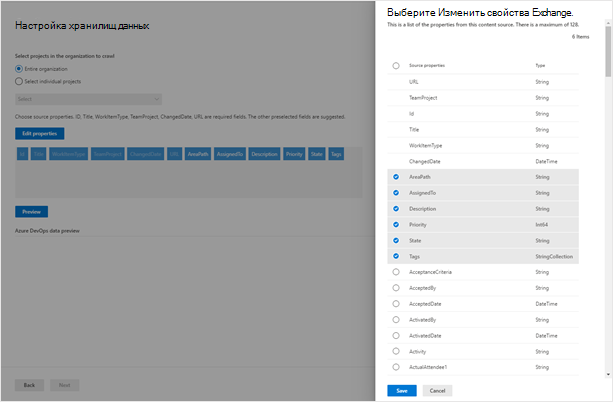

<!---Previous ms.author: shgrover --->

# Соединителю Azure DevOps Graph (предварительный просмотр)

Соединителю Azure DevOps Graph позволяет организации индексировать элементы работы в экземпляре службы Azure DevOps. После настройки соединителя и индекса контента из Azure DevOps конечные пользователи могут искать эти элементы в Microsoft Search.

> [!NOTE]
> Ознакомьтесь [**с статьей Настройка соединиттеля Graph,**](configure-connector.md) чтобы понять общие инструкции по настройке соединитений Graph.

Эта статья для всех, кто настраивает, запускает и отслеживает соединителю Azure DevOps Graph. Он дополняет общий процесс установки и показывает инструкции, применимые только к соединителю Azure DevOps Graph.

>[!IMPORTANT]
>Соединителю Azure DevOps поддерживается только облачная служба Azure DevOps. Этот соединитатель не поддерживает Azure DevOps Server 2019, TFS 2018, TFS 2017, TFS 2015 и TFS 2013.

<!---## Before you get started-->

<!---Insert "Before you get started" recommendations for this data source-->

## Шаг 1. Добавление соединителю Graph в центре администрирования Microsoft 365

Следуйте общим [инструкциям установки](https://docs.microsoft.com/microsoftsearch/configure-connector).
<!---If the above phrase does not apply, delete it and insert specific details for your data source that are different from general setup 
instructions.-->

## Шаг 2. Имя подключения

Следуйте общим [инструкциям установки](https://docs.microsoft.com/microsoftsearch/configure-connector).
<!---If the above phrase does not apply, delete it and insert specific details for your data source that are different from general setup 
instructions.-->

## Шаг 3. Настройка параметров подключения

Чтобы подключиться к экземпляру Azure DevOps,  необходимо имя организации Azure DevOps, его ID приложения и секрет клиента для проверки подлинности OAuth.

### Регистрация приложения

Зарегистрируйте приложение в Azure DevOps, чтобы приложение Microsoft Search можно было получить доступ к экземпляру. Дополнительные новости см. в документации Azure DevOps о регистрации [приложения.](https://docs.microsoft.com/azure/devops/integrate/get-started/authentication/oauth?view=azure-devops#register-your-app&preserve-view=true)

В следующей таблице указаны инструкции по заполняемой форме регистрации приложений:

Обязательные поля | Описание | Рекомендуемое значение
--- | --- | ---
| Имя компании         | Имя вашей компании. | Использование соответствующего значения   |
| Имя приложения     | Уникальное значение, которое идентифицирует приложение, авторизуя его.    | Поиск (Майкрософт)     |
| Веб-сайт приложения  | URL-адрес приложения, который запрашивает доступ к экземпляру Azure DevOps во время установки соединителя. (Обязательно).  | https://gcs.office. com/
| URL-адрес вызова авторизации        | Необходимый URL-адрес вызова, на который перенаправляется сервер авторизации. | https://gcs.office. com/v1.0/admin/oauth/callback|
| Разрешенные области | Область доступа для приложения | Выберите следующие области: Identity (чтение), Work Items (чтение), Переменные группы (чтение), Project и Team (чтение), Graph (чтение)|

При регистрации приложения с вышеуказанными сведениями вы получите  **ID** приложения и клиентскую тайну, которые будут использоваться для настройки соединитетеля.

>[!NOTE]
>Чтобы отопустить доступ к любому приложению, зарегистрированным в Azure DevOps, перейдите к настройкам пользователя в правой верхней части экземпляра Azure DevOps. Выберите профиль, а затем выберите авторизации в разделе Безопасность боковой области. Наведите курсор на авторизованном приложении OAuth, чтобы увидеть кнопку Revoke в углу сведений о приложении.

### Параметры подключения

После регистрации приложения Microsoft Search в Azure DevOps можно выполнить шаг по настройке подключения. Введите имя организации, имя приложения и секрет клиента.

### Настройка данных: выбор проектов и полей

Вы можете выбрать для подключения индексировать всю организацию или конкретные проекты.

Если вы решите индексировать всю организацию, элементы во всех проектах организации будут индексироваться. Новые проекты и элементы будут индексироваться во время следующего обхода после их создания.

Если вы выбираете отдельные проекты, индексировать будут только элементы работы в этих проектах.

Далее выберите, в каких полях необходимо подключение для индексации и предварительного просмотра данных в этих полях перед началом.

## Шаг 4. Управление разрешениями на поиск

Соединителю Azure DevOps поддерживаются разрешения на поиск, видимые только людям с доступом к этому источнику данных  **или** **каждому.** Если выбрать только людей с доступом к этому источнику **данных,** индексируемые данные будут отображаться в результатах поиска для пользователей, которые имеют к ним доступ на основе разрешений для пользователей или групп на уровне пути организации, проекта или области в Azure DevOps. Если вы **выбираете Everyone,** индексные данные будут отображаться в результатах поиска для всех пользователей.

## Шаг 5. Назначение меток свойств

Следуйте общим [инструкциям установки](https://docs.microsoft.com/microsoftsearch/configure-connector).

## Шаг 6. Управление схемой

Следуйте общим [инструкциям установки](https://docs.microsoft.com/microsoftsearch/configure-connector).

## Шаг 7. Выбор параметров обновления

Соединителю Azure DevOps поддерживается расписание обновления для полного и постепенного обхода.
Рекомендуемое расписание — один час для инкрементного обхода и один день для полного обхода.

## Шаг 8. Просмотр подключения

Следуйте общим [инструкциям установки](https://docs.microsoft.com/microsoftsearch/configure-connector).
<!---If the above phrase does not apply, delete it and insert specific details for your data source that are different from general setup 
instructions.-->

<!---## Troubleshooting-->
<!---Insert troubleshooting recommendations for this data source-->

<!---## Limitations-->
<!---Insert limitations for this data source-->
