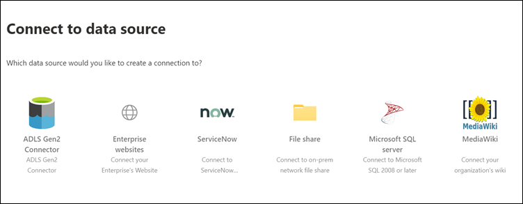
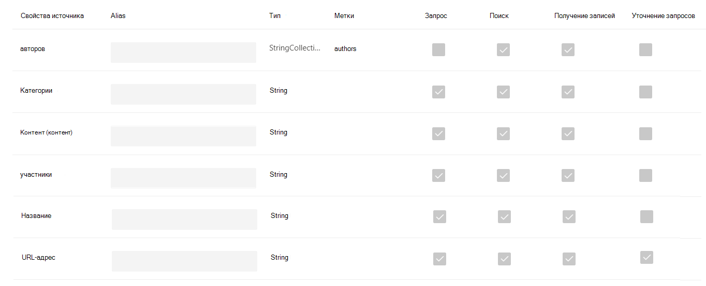
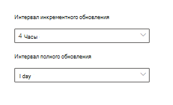

<!-- markdownlint-disable no-trailing-punctuation -->

# Настройка соединителя, созданного корпорацией Майкрософт для поиска Microsoft SearchSet up your Microsoft-built connector for Microsoft Search

В этой статье описывается настройка соединителя, созданного корпорацией Майкрософт.This article guides you through the steps of configuring a Microsoft-built connector. Он обработает процесс настройки подключения в [центре администрирования](https://admin.microsoft.com)Microsoft 365.It outlines the flow of setting up a connection in the Microsoft 365 [admin center](https://admin.microsoft.com). Дополнительные сведения о настройке конкретных соединителей, созданных корпорацией Майкрософт, можно найти в следующих статьях:For more details on how to set up specific Microsoft-built connectors, see these articles:

* [Azure Data Lake Storage 2-го поколенияAzure Data Lake Storage Gen2](azure-data-lake-connector.md)
* [Корпоративные веб-сайтыEnterprise websites](enterprise-web-connector.md)
* [Файловый ресурсFile share](file-share-connector.md)
* [MediaWikiMediaWiki](mediawiki-connector.md)
* [Microsoft SQL ServerMicrosoft SQL server](MSSQL-connector.md)
* [ServiceNowServiceNow](servicenow-connector.md)

## НастройкаSet up

Чтобы настроить любой из встроенных соединителей Майкрософт, перейдите в [центр администрирования](https://admin.microsoft.com):To configure any of the Microsoft-built connectors, go to the [admin center](https://admin.microsoft.com):

1. Войдите в свою учетную запись, используя учетные данные для тестового клиента [Microsoft 365](https://www.microsoft.com/microsoft-365) .Sign in to your account with the credentials for your [Microsoft 365](https://www.microsoft.com/microsoft-365) test tenant.
2. Перейдите к разделу **Параметры**  >  **Microsoft Search**  >  **Connectors**.Go to **Settings** > **Microsoft Search** > **Connectors**.
3. Выберите **Добавить соединитель**.Select **Add a connector**.
4. В списке доступных соединителей выберите нужный соединитель.From the list of available connectors, select the connector of your choice.

### Имя соединителяName the connector

Чтобы создать подключение, сначала укажите следующие атрибуты:To create a connection, first specify these attributes:

1. Имя подключенияName of the connection
2. Идентификатор подключенияConnection ID
3. Описание (необязательно)Description (optional)

Идентификатор подключения создает неявные свойства для соединителя.The connection ID creates implicit properties for your connector. Он должен содержать только буквенно-цифровые символы и содержать не более 32 символов.It must contain only alphanumeric characters and be a maximum of 32 characters.

### Подключение к источнику данныхConnect to a data source

Процесс подключения к данным зависит от типа соединителя.The data connection process varies based on the type of connector. Чтобы узнать больше о подключении к локальному источнику данных, ознакомьтесь со статьей [Установка локального шлюза данных](https://aka.ms/configuregateway).To learn more about connecting to your on-premises data source, see [Install an on-premises data gateway](https://aka.ms/configuregateway).

### Выбор свойств источникаSelect source properties

Поля данных, заданные сторонним источником данных как свойства источника, индексируются в Microsoft Search.The data fields set by your third-party data source as source properties are indexed into Microsoft Search. Чтобы изменить эти свойства, выберите **изменить свойства** в боковой панели справа от страницы **соединителей** .To modify these properties, select **Edit properties** in the side bar on the right of the **Connectors** page. Можно выбрать **до 64 свойств источника**.You can select **up to 64 source properties**.

### Управление схемой поискаManage the search schema

Администраторы могут задать атрибуты схемы поиска для управления функциями поиска каждого исходного свойства.Admins can set the search schema attributes to control search functionality of each source property. Схема поиска помогает определить, какие результаты отображаются на странице результатов поиска и какие данные пользователи могут просматривать и получать.A search schema helps determine what results display on the search results page and what information end users can view and access.

Атрибуты схемы поиска включают в себя возможность **поиска**, возможность **запроса**и возможность **извлечения**.Search schema attributes include **searchable**, **queryable**, and **retrievable**. В следующей таблице перечислены все атрибуты, поддерживаемые соединителями Microsoft Graph, и объясняются их функции.The following table lists each of the attributes that Microsoft Graph connectors support and explains their functions.

**Атрибут схемы поиска****Search schema attribute** | **Function****Function** | **Пример****Example**
--- | --- | ---
ВОЗМОЖНОСТЬЮ поискаSEARCHABLE | Делает текстовое содержимое свойства искомым.Makes the text content of a property searchable. Содержимое свойства включается в полнотекстовый индекс.Property contents are included in the full-text index. | Если свойство имеет **название**, запрос **Enterprise** возвращает ответы, содержащие слово **Корпоративный** в любом тексте или заголовке.If the property is **title**, a query for **Enterprise** returns answers that contain the word **Enterprise** in any text or title.
ВОЗМОЖНОСТЬ запросаQUERYABLE | Поиск по запросу для определенного свойства.Searches by query for a match for a particular property. Затем имя свойства можно указать в запросе программно или буквально.The property name can then be specified in the query either programmatically or verbatim. |  Если свойство **Title** является запросом, то **заголовок запроса: Enterprise** поддерживается.If the **Title** property is queryable, then the query **Title: Enterprise** is supported.
ВОЗМОЖНОСТЬ извлеченияRETRIEVABLE | Только извлекаемые свойства можно использовать в результатах поиска и отображать в результатах поиска.Only retrievable properties can be used in the result type and display in the search result. |

Для всех соединителей, кроме соединителя файлового ресурса, пользовательские типы необходимо задать вручную.For all connectors except the file share connector, custom types must be set manually. Чтобы активировать возможности поиска для каждого поля, необходима схема поиска, сопоставленная со списком свойств.To activate search capabilities for each field, you need a search schema mapped to a list of properties. Мастер подключения автоматически выбирает схему поиска в соответствии с выбранным набором свойств источника.The connection wizard automatically selects a search schema based on the set of source properties you choose. Вы можете изменить эту схему, установив флажки для каждого свойства и атрибута на странице схема поиска.You can modify this schema by selecting the check boxes for each property and attribute in the search schema page.

Эти ограничения и рекомендации применимы к параметрам схемы поиска:These restrictions and recommendations apply to search schema settings:

* Для соединителей, в которых индексация пользовательских типов не рекомендуется, **не** следует помечать поле, содержащее основное содержимое, которое можно **получить**.For connectors that index custom types, we recommend that you **do not** mark the field that contains the main content **retrievable**. При отображении результатов поиска с этим атрибутом поиска возникают значительные проблемы с производительностью.Significant performance issues occur when search results render with that search attribute. Например, это поле **текстового** содержимого для статьи базы знаний [ServiceNow](https://www.servicenow.com) .An example is the **Text** content field for a [ServiceNow](https://www.servicenow.com) knowledge-base article.
* Только свойства, помеченные как доступные для получения в результатах поиска, и могут использоваться для создания современных типов результатов (МРТС).Only properties marked as retrievable render in the search results and can be used to create modern result types (MRTs).
* Только строковые свойства можно пометить как доступные для поиска.Only string properties can be marked searchable.

> [!Note]
> После создания подключения изменить схему **невозможно** .After you create a connection, you **can't** modify the schema. Для этого необходимо удалить подключение и создать новое.To do that, you need to delete your connection and create a new one.

### Управление разрешениями поискаManage search permissions

Списки управления доступом (ACL) определяют, какие пользователи в организации могут получать доступ к каждому элементу данных.Access Control Lists (ACLs) determine which users in your organization can access each item of data. Соединитель файлового ресурса поддерживает только списки управления доступом, которые могут быть сопоставлены с [Azure Active Directory (Azure AD)](https://docs.microsoft.com/azure/active-directory/).The file share connector supports only ACLs that can be mapped to [Azure Active Directory (Azure AD)](https://docs.microsoft.com/azure/active-directory/). Все остальные соединители поддерживают разрешения поиска, которые видимы всем пользователям.All the other connectors support search permissions that are visible to all users.

### Настройка расписания обновленияSet the refresh schedule

Расписание обновления определяет частоту синхронизации данных с индексом в Microsoft Graph и Microsoft Search.The refresh schedule determines how often your data is synced with the index in Microsoft Graph and Microsoft Search. Вы можете запланировать обновление двумя способами: полный обход контента или добавочный обход контента.You can schedule the refresh in two ways: full crawl or incremental crawl.

При **полном обходе**поисковая система обрабатывает и индексирует каждый элемент в источнике контента независимо от предыдущих обходов.With a **full crawl**, the search engine processes and indexes every item in the content source, regardless of previous crawls. Полный обход контента лучше всего подходит в следующих случаях:Full crawl works best in these situations:

* Необходимо обнаружить удаления данных.You need to detect deletions of data.
* Добавочный обход контента не смог выполнить обход контента для ошибок.The incremental crawl failed to crawl content for errors.
* Необходимо обновление программного обеспечения для поиска Майкрософт.A software update for Microsoft Search is required. Обновления изменяют схему поиска.Updates modify the search schema.
* Изменены списки управления доступом (ACL).ACLs were modified.
* Изменены правила обхода.Crawl rules were modified.

При **добавочном обходе**поисковая система может обрабатывать и индексировать только те элементы, которые были созданы или изменены с момента последнего успешного обхода.With an **incremental crawl**, the search engine can process and index only the items that were created or modified since the last successful crawl. Таким образом, не все данные в источнике контента переиндексируются повторно.Therefore, not all the data in the content source is re-indexed. Добавочный обход контента лучше всего подходит для обнаружения контента, метаданных, разрешений и других обновлений.Incremental crawls works best to detect content, metadata, permission, and other updates.

Добавочные обходы работают гораздо быстрее, чем полные обходы контента, так как неизмененные элементы не обрабатываются.Incremental crawls are much faster than full crawls because unchanged items aren’t processed. Чтобы обеспечить точную синхронизацию данных между источником контента и индексом поиска, необходимо периодически выполнять оба обхода контента.To maintain an accurate data sync between the content source and the search index, you need to run both crawls periodically.

Каждый соединитель будет иметь другой оптимальный набор расписаний обновления на основе частоты изменения данных и типа изменений.Each connector will have a different optimal set of refresh schedules based on how often data is modified and the type of modifications.

### Обзор параметров соединителяReview connector settings

После настройки соединителя [центр администрирования](https://admin.microsoft.com) переходит на страницу, на которой можно просмотреть параметры.After you configure your connector, the [admin center](https://admin.microsoft.com) takes you to a page where you can review your settings. Чтобы изменить параметр перед подтверждением подключения, можно вернуться в процесс настройки.You can go back through the configuration process to edit any setting before you confirm the connection. Чтобы узнать больше, ознакомьтесь со статьей [Управление соединителем](manage-connector.md).To learn more, see [Manage your connector](manage-connector.md).

## Дальнейшие действия: Настройка страницы результатов поискаNext steps: Customize the search results page

С помощью пользовательского интерфейса Microsoft Search пользователи могут выполнять поиск в содержимом приложений [microsoft 365](https://www.microsoft.com/microsoft-365) для продуктивной работы и широкой Microsoft экосистеме.With the Microsoft Search user interface (UI), your end users can search content from your [Microsoft 365](https://www.microsoft.com/microsoft-365) productivity apps and the broader Microsoft ecosystem. Вертикаль поиска указывает вкладки, которые отображаются, когда пользователь просматривает результаты поиска в [SharePoint](https://sharepoint.com/), [Microsoft Office](https://Office.com)и Microsoft Search в [Bing](https://Bing.com).A search vertical refers to the tabs that are shown when a user views their search results in [SharePoint](https://sharepoint.com/), [Microsoft Office](https://Office.com), and Microsoft Search in [Bing](https://Bing.com). Для сужения результатов поиска можно настроить вертикальные результаты поиска, чтобы отображался только определенный тип результатов поиска.You can customize search verticals to narrow down results, so that only a certain type of search results is displayed. Эти вертикальные вертикальные черты отображаются в виде вкладки в верхней части страницы результатов поиска.These verticals appear as a tab on the top of the search results page. Современный тип результатов (MRT) — это пользовательский интерфейс, который определяет способ представления результатов.A modern result type (MRT) is the UI that designates how results are presented.

Необходимо создать собственные вертикальные типы и типы результатов, чтобы пользователи могли просматривать результаты поиска из новых подключений.You must create your own verticals and result types, so end users can view search results from new connections. Без этого действия данные из вашего подключения не будут отображаться на странице результатов поиска.Without this step, data from your connection won’t show up on the search results page.

Чтобы узнать больше о создании вертикальных и МРТС, обратитесь к разделу [Настройка страницы результатов поиска](customize-search-page.md).To learn more about how to create your verticals and MRTs, see [Search results page customization](customize-search-page.md).

## Как проверить, что это работает?How do I know this worked?

Перейдите к списку опубликованных подключений на вкладке **соединители** в [центре администрирования](https://admin.microsoft.com).Go to the list of your published connections under the **Connectors** tab in the [admin center](https://admin.microsoft.com). Чтобы узнать, как выполнить обновление и удаление, ознакомьтесь со статьей [Управление соединителем](manage-connector.md).To learn how to make updates and deletions, see [Manage your connector](manage-connector.md).
