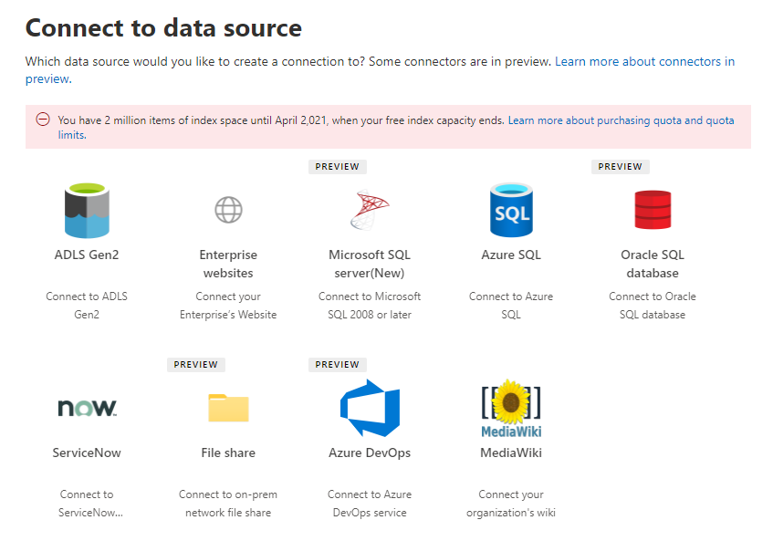

<!-- Previous ms.author: monaray -->

<!-- markdownlint-disable no-trailing-punctuation -->

# Общие сведения о настройке соединители Graph от Майкрософт

В этой статье показан основной процесс, необходимый для Graph соединители **Microsoft** в [Центр администрирования Microsoft 365](https://admin.microsoft.com). Базовый процесс состоит из следующих этапов:  
<!---Add links to each section in the doc--->

1. [Добавление соединителя Graph в Центр администрирования Microsoft 365.](#step-1-add-a-graph-connector-in-the-microsoft-365-admin-center)
2. [Присвоение имени соединению](#step-2-name-the-connection)
3. [Настройка параметров соединения](#step-3-configure-the-connection-settings)
4. [Выбор свойств](#step-4-select-properties)
5. [Управление разрешениями поиска](#step-5-manage-search-permissions)
6. [Назначение меток свойств](#step-6-assign-property-labels)
7. [Управление схемой](#step-7-manage-schema)
8. [Параметры обновления](#step-8-refresh-settings)
9. [Проверка соединения.](#step-9-review-connection)

В этой статье также содержатся сведения о устранении неполадок, ограничениях и следующих действиях:

* [Устранение неполадок](#troubleshooting)
* [Ограничения](#limitations)
* [Дальнейшие действия](#next-steps)

> [!NOTE]
> Процесс установки похож на все соединители Graph Microsoft, но не совсем то же самое. **В дополнение к чтению этой статьи обязательно ознакомьтесь с информацией, определенной для соединитетеля, для источника данных.**  

<!---## Before you get started-->

<!---Insert "Before you get started" recommendations for this data source-->

## Шаг 1. Добавление соединителю Graph в Центр администрирования Microsoft 365

Выполните следующие действия, чтобы настроить любой из встроенных Graph Microsoft:

1. Вопишите в свою учетную запись администратора [в Центр администрирования Microsoft 365](https://admin.microsoft.com).

2. В области навигации выберите **Параметры,** а затем выберите **поиск &.** Выберите [вкладку Источники данных](https://admin.microsoft.com/Adminportal/Home#/MicrosoftSearch/Connectors).

3. Выберите **+Add**, а затем выберите источник данных по вашему выбору из меню доступных вариантов.

   > [!div class="mx-imgBorder"]
   > 

> [!NOTE]
> Вы можете добавить не более десяти подключений Graph каждого клиента.

## Шаг 2. Имя подключения

Укажите эти атрибуты:

* Name (обязательный)
* ID подключения (обязательно)
* Описание (необязательно)
* Выбор контрольного окна (обязательно)

ID подключения создает неявные свойства для соединитетеля. Он должен содержать только буквы и не более 32 символов.

## Шаг 3. Настройка параметров подключения

Процесс настройки параметров подключения зависит от типа источника данных. Сведения о [типе](/microsoftsearch/servicenow-connector#step-31-basic-authentication) источника данных, который необходимо добавить для клиента, чтобы завершить этот шаг в процессе настройки, см. в специальной информации.  

Дополнительные сведения о подключении к локальному источнику данных см. в статьи Установка локального шлюза [данных.](/data-integration/gateway/service-gateway-install)

## Шаг 4. Выбор свойств

Вы можете выбрать свойства, которые будут индексироваться Поиск (Майкрософт).

Запрос ServiceNow можно использовать для фильтрации данных до индексации Поиск (Майкрософт); это дает больше контроля над данными, которые можно искать. Дополнительные новости о запросах ServiceNow см. в дополнительных подробной информации [о запросах ServiceNow.](https://go.microsoft.com/fwlink/?linkid=2151447)

## Шаг 5. Управление разрешениями на поиск

Списки управления доступом (ACLs) определяют, какие пользователи в организации могут получить доступ к каждому элементу.  

Некоторые соединители, [такие как Microsoft SQL](MSSQL-connector.md) и Azure Data Lake служба хранилища [Gen2,](azure-data-lake-connector.md) поддерживают Azure Active Directory [(Azure AD).](/azure/active-directory/)

Другие соединители, такие как [ServiceNow Knowledge,](servicenow-knowledge-connector.md) [ServiceNow Catalog,](servicenow-catalog-connector.md) [Azure DevOps](azure-devops-connector.md)и [Salesforce,](salesforce-connector.md) поддерживают синхронизацию пользователей и групп, не в том что касается Azure AD.  

Выбор всех пользователей позволяет всем в вашей организации видеть результаты поиска из этого источника данных.

## Шаг 6. Назначение меток свойств

Семантические метки можно назначить исходным свойствам на странице "Назначение меток свойств". Метки — это хорошо известные теги, предоставляемые Корпорацией Майкрософт, которые дают смысл. Они позволяют Корпорации Майкрософт интегрировать данные соединитетеля в Microsoft 365, такие как расширенный поиск, карточки людей, интеллектуальные открытия и другие.  

В следующей таблице перечислены поддерживаемые в настоящее время метки и их описания.  

Метка | Описание
--- | ---  
**заголовок** | Заголовок элемента, который необходимо показать в поиске и других впечатлениях
**url** | Целевой URL-адрес элемента в системе исходных данных
**Созданный** | Имя человека, создавшего элемент
**Автор последнего изменения** | Имя человека, который недавно редактировал элемент
**Authors** | Имя людей, которые участвовали или сотрудничали в элементе
**Время создания даты** | Когда был создан элемент
**Время последней измененной даты** | Когда последний элемент редактировался
**Имя файла** | Имя элемента файла
**Расширение файла** | Тип элемента файла, например .pdf или .word

Свойства на этой странице предварительно выбраны в зависимости от источника данных, но этот выбор можно изменить, если имеется другое свойство, которое лучше подходит для определенной метки.  

Название **метки** является наиболее важным меткой. Настоятельно рекомендуется **иметь свойство,** назначенное этому метку, чтобы ваше подключение участвовало в работе кластера [результатов.](result-cluster.md)

Неправильное сопоставление меток приведет к ухудшению работы поиска. Для некоторых меток нормально не иметь свойство, назначенное ему.  

## Шаг 7. Управление схемой

### Свойство Content

Рекомендуется выбрать свойство контента  из выпадаемого меню параметров или сохранить значение по умолчанию, если оно присутствует. Это свойство используется для полнотексовой индексации контента, генерации фрагмента страницы результатов [поиска,](result-cluster.md) участия в кластере результатов, обнаружения языков, поддержки HTML/текста, ранжирования и релевантности, а также разработки запросов.

Если вы выберете свойство контента, у вас будет возможность использовать созданный системой свойство **ResultSnippet** при [создании типа результатов.](customize-results-layout.md) Это свойство служит в качестве места для динамических фрагментов, созданных из свойства контента во время запроса. Если вы используете это свойство в типе результатов, в результатах поиска будут созданы фрагменты.

### Создание псевдонимов для исходных свойств

Псевдонимы можно добавить в свойства в столбце "Псевдонимы" на странице "Управление схемой". Псевдонимы являются удобными именами для свойств, а также используются в запросах и при создании фильтров. Они также используются для нормализации исходных свойств из нескольких подключений, таких как одно и то же имя. Таким образом можно создать единый фильтр для вертикали с несколькими подключениями. Дополнительные сведения см. [в странице Настройка страницы результатов поиска.](customize-search-page.md)  

### Атрибуты схемы поиска

Атрибуты схемы поиска можно настроить для управления функциями поиска каждого свойства источника. Схема поиска помогает определить, какие результаты отображаются на странице результатов поиска и какие сведения могут просматривать конечные пользователи и получать к ним доступ.

Атрибуты схемы поиска включают **параметры Запрос,** **Поиск,** **Извлечение** и **уточнение.** В следующей таблице перечислены все атрибуты, Graph поддерживаются соединители и объясняются их функции.

Атрибут схемы поиска | Функция | Пример
--- | --- | ---
ПОИСК | Делает текстовое содержимое свойства поиском. Содержимое свойства включено в полно текстовый индекс. | Если свойство является **заголовком,** запрос для Enterprise возвращает ответы, содержащие слово **Enterprise** в любом тексте или заголовке. 
ЗАПРОС | Поиск по запросу для совпадения для определенного свойства. Затем имя свойства может быть указано в запросе программным или дословным. |  Если свойство **Title** можно запросить, то запрос **Title: Enterprise** поддерживается.
RETRIEVE | Только свойства, которые можно получить, можно использовать в типе результата и отобразить в результате поиска. |
УТОЧНЕНИЕ | Параметр уточнения можно использовать как на странице Поиск (Майкрософт) результатов. | Пользователи в организации могут [фильтровать](custom-filters.md) **по URL-адресу** на странице результатов поиска, если свойство уточнения отмечено во время установки подключения.

Для всех соединители, за исключением соединителю file share, настраиваемые типы должны устанавливаться вручную. Чтобы активировать возможности поиска для каждого поля, нужна схема поиска, относящемся к списку свойств. Мастер подключения автоматически выбирает схему поиска на основе выбранного набора исходных свойств. Эту схему можно изменить, выбрав флажки для каждого свойства и атрибута на странице схемы поиска.

:::image type="content" alt-text="Схему соединителем можно настроить, добавив или удалив функции &quot;Запрос&quot;, &quot;Поиск&quot; и &quot;Извлечение&quot;." source="media/manageschema.png" lightbox="media/manageschema.png":::

### Ограничения и рекомендации для параметров схемы поиска

* Свойство **контента** можно искать только. После выбора в отсеве это свойство нельзя использовать с помощью параметров **получения** или **запроса.**

* Значительные проблемы с производительностью возникают при отрисовывии результатов поиска с **свойством** контента. В качестве примера можно **привести поле текстового** контента для статьи базы знаний [ServiceNow.](https://www.servicenow.com)

* Только свойства, помеченные как рендеры, которые можно получить в результатах поиска, могут использоваться для создания современных типов результатов (MRTs).

* Поиск можно помечать только свойства строки.

> [!NOTE]
> После создания подключения **изменить** схему нельзя. Для этого необходимо удалить подключение и создать новое.

## Шаг 8. Параметры обновления

Интервал обновления определяет частоту синхронизации данных между источником данных и Поиск (Майкрософт). Каждый тип источника данных имеет свой набор оптимальных расписания обновления в зависимости от частоты изменений данных и типа изменений.

Существует два типа интервалов обновления: **Полное** обновление и инкрементное **обновление,** но дополнительные обновления недоступны для некоторых источников данных.

При полном обновлении поисковая система обрабатывает и индексирует элементы, которые изменились в источнике контента, независимо от предыдущих обходов. Полное обновление лучше всего работает в таких ситуациях:

* Обнаружение удалений данных.
* При постепенном обновлении обнаружены ошибки, которые не удалось.
* Были изменены acLs.
* Изменены правила обхода.
* Схема подключения обновлена (обновления схемы еще не поддерживаются).

При **постепенном обновлении** поисковая система может обрабатывать и индексировать только элементы, созданные или измененные с момента последнего успешного обхода. В результате не все данные в источнике контента реиндексировали. Дополнительные обновления лучше всего работают для обнаружения контента, метаданных, разрешений и других обновлений.

Дополнительные обновления значительно быстрее полного обновления, так как не обрабатываются неизменяемые элементы. Однако при запуске дополнительных обновлений необходимо периодически запускать полные обновления, чтобы поддерживать правильную синхронизацию данных между источником контента и индексом поиска.

> [!div class="mx-imgBorder"]
> 

<!---Change screenshot for one that shows both options in new UI (try ServiceNow)--->

## Шаг 9. Просмотр подключения

Перед завершением подключения вы можете просмотреть всю конфигурацию и изменить параметры по мере необходимости. **Не забудьте прочитать сведения о соединители для источника данных, если вы еще этого не сделали.** Выберите **обновление Готово,** когда вы будете готовы к завершению подключения.

### Подтверждение того, сработала ли установка подключения

Перейдите к списку опубликованных подключений в вкладке **Соединители** в центре [администрирования.](https://admin.microsoft.com) Подробнее о том, как делать обновления и удаления, см. в руб. [Управление соединитетелем.](manage-connector.md)

## Устранение неполадок
<!---Insert troubleshooting recommendations for this data source-->
Ознакомьтесь с информацией, определенной для соединитетеля, для источника данных.

> [!NOTE]
> Не все статьи, определенные соединители, включают рекомендации по устранению неполадок на данном этапе.

## Ограничения
<!---Insert limitations for this data source-->
Сведения об ограничениях, которые применяются к всем источникам данных, см. в статье Обзор соединители [Graph](connectors-overview.md) Microsoft.

Чтобы узнать, применяются ли другие ограничения к этому конкретному Graph, см. в специальной информации для источника данных.

## Дальнейшие действия

После публикации подключения необходимо настроить страницу результатов поиска вертикалями и типами результатов. Чтобы узнать о настройке результатов поиска, вы можете просмотреть управление вертикалями [и](manage-verticals.md) [типами результатов.](manage-result-types.md)
