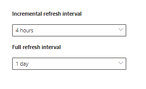

<!-- markdownlint-disable no-trailing-punctuation -->

# Обзор настройки соединители Graph корпорацией Майкрософт 

В этой статье приводится базовый процесс, необходимый для использования Центра администрирования [Microsoft 365](https://admin.microsoft.com) для настройки соединители Graph корпорацией Майкрософт. Базовый процесс включает в себя следующие этапы:  
<!---Add links to each section in the doc--->

1. Добавьте соединителю Graph в Центр администрирования Microsoft 365.
2. Заявим имя подключения.
3. Настройте параметры подключения.
4. Управление разрешениями поиска.
5. Назначьте метки свойств.
6. Управление схемой.
7. Выберите параметры обновления.
8. Просмотрите подключение.

Важно отметить, что процесс настройки очень похож на все соединители Graph корпорацией Майкрософт, но не является точно одинаковым. **Помимо прочтения этой статьи обязательно ознакомьтесь с информацией о соединители для источника данных.**  

## Шаг 1. Добавление соединителю Graph в Центре администрирования Microsoft 365

Выполните следующие действия, чтобы настроить любые соединители, построенные корпорацией Майкрософт.

1. Во входе в учетную запись администратора в Центре администрирования [Microsoft 365](https://admin.microsoft.com)
2. В области навигации выберите **"Параметры"** и выберите "Поиск **& аналитики".** Выберите [вкладку "Соединители".](https://admin.microsoft.com/Adminportal/Home#/MicrosoftSearch/Connectors)
3. Выберите **пункт "Добавить"** и выберите выбранный источник данных в меню доступных параметров.

>[! Примечание.] В каждый клиент можно добавить не более десяти подключений Graph.

## Шаг 2. Имя подключения
Вам потребуется указать эти атрибуты: 

* Имя  
* ИД подключения 
* Описание (необязательно) 

ИД подключения создает неявные свойства для соединители. Он должен содержать только буквы и цифры и содержать не более 32 символов. 

## Шаг 3. Настройка параметров подключения

Процесс настройки параметров подключения зависит от типа источника данных. Сведения о типе источника данных, который вы хотите добавить в клиент для выполнения этого шага в процессе настройки, см. в сведениях о соединители.  

Дополнительные сведения о подключении к локальному источнику данных см. в подключении к локальному шлюзу [данных.](https://aka.ms/configuregateway)

## Шаг 4. Управление разрешениями поиска

Списки управления доступом (ALS) определяют, какие пользователи в организации могут получать доступ к каждому элементу данных.  

Некоторые соединители, такие [как Microsoft SQL](MSSQL-connector.md) и Azure Data Lake Storage [Gen2,](azure-data-lake-connector.md) по своей инициативе поддерживают ALS [Azure Active Directory (Azure AD).](https://docs.microsoft.com/azure/active-directory/)

Другие соединители, такие как [ServiceNow,](servicenow-connector.md) [Azure DevOps](azure-devops-connector.md)и [Salesforce,](salesforce-connector.md) поддерживают синхронизацию пользователей и групп, не влияющих на Azure AD.  

## Шаг 5. Назначение меток свойств
Семантические метки можно назначить свойствам источника на странице "Назначение меток свойств". Метки — это хорошо известные теги, предоставляемые корпорацией Майкрософт, которые предоставляют семантическое значение. Они позволяют корпорации Майкрософт интегрировать данные соединители в возможности Microsoft 365, такие как расширенный поиск, карточки людей, интеллектуальное обнаружение и другие.  

В следующей таблице перечислены поддерживаемые в настоящее время метки и их описания.  

Метка | Описание
--- | ---  
**заголовок** | Заголовок элемента, который необходимо показать в поиске и других элементах 
**url** | Целевой URL-адрес элемента в системе источника 
**createdBy** | Имя человека, создавшего элемент 
**lastModifiedBy**; | Имя человека, который последним редактировал элемент 
**authors** | Имя участников или участников совместной работы над элементом 
**createdDateTime** | Когда был создан элемент 
**lastModifiedDateTime** | Время последнего изменения элемента 
**fileName** | Имя элемента файла 
**fileExtension** | Тип элемента файла, например PDF или .word 

Свойства на этой странице предварительно выбраны в зависимости от источника данных, но вы можете изменить этот выбор, если имеется другое свойство, которое лучше подходит для определенной метки.  

Название **метки** является самой важной меткой. Настоятельно рекомендуется **иметь свойство,** назначенное этой меткой, чтобы ваше подключение участвовало в работе [кластера результатов.](result-cluster.md)

Неправильное сопоставление меток приведет к ухудшению работы поиска. У некоторых меток нет назначенного свойства.  

## Шаг 6. Управление схемой

### Свойство Content

Настоятельно рекомендуется выбрать свойство **Content Property в выпадаемом меню параметров или оставить значение по умолчанию, если оно присутствует. Это свойство используется для полнотексового индексирования контента, генерации фрагмента страницы результатов [поиска,](result-cluster.md) участия в кластере результатов, обнаружения языка, поддержки HTML/текста, ранжирования и релевантности, а также формулы запроса.

Если выбрано свойство контента, при создании типа результата можно будет использовать созданные системой [свойства](customize-results-layout.md) **ResultSnippet.** Это свойство служит в качестве замещего материала для динамических фрагментов, которые создаются из свойства контента во время запроса. Если вы используете это свойство в своем типе результатов, в результатах поиска будут созданы фрагменты кода.

### Создание псевдонимов для свойств источника

Псевдонимы можно добавлять в свойства в столбце "Псевдоним" на странице "Управление схемой". Псевдонимы — это имена свойств. Они используются в запросах и при создании фильтров. Они также используются для нормализации свойств источника из нескольких подключений, например с одинаковыми именами. Таким образом можно создать один фильтр для вертикали с несколькими подключениями. Дополнительные [сведения см.](customize-search-page.md) в подстройке страницы результатов поиска.  

### Атрибуты схемы поиска

Атрибуты схемы поиска можно настроить для управления функциями поиска каждого свойства источника. Схема поиска помогает определить, какие результаты отображаются на странице результатов поиска и какие сведения конечные пользователи могут просматривать и получать к ним доступ.

Атрибуты схемы поиска включают **в себя поиск,** запросы, инициализируемые и **уточняемые.**  В следующей таблице перечислены все атрибуты, поддерживаемые соединитеями Microsoft Graph, и поясняется их функции.

Атрибут схемы поиска | Функция | Пример
--- | --- | ---
ПОИСК | Делает текстовое содержимое свойства поискуемым. Содержимое свойств включается в полно текстовый индекс. | Если свойством является **заголовок,** запрос **enterprise** возвращает ответы, содержащие слово **Enterprise** в любом тексте или заголовке.
QUERYABLE | Поиск совпадения для конкретного свойства по запросу. Затем имя свойства можно упросить в запросе программным или подробным образом. |  Если свойство **Title** поддерживает запрос, то запрос **Title: Enterprise** поддерживается. 
RETRIEVABLE | В качестве типа результатов и отображения в результатах поиска можно использовать только свойства, которые можно получить. |
УТОЧНЕНИЕ | Свойства, которые можно уточнить, можно использовать, как на странице результатов поиска (Майкрософт). | Пользователи в организации могут [фильтровать](custom-filters.md) по **lastModifiedDateTime** на странице результатов поиска, если свойство помечено как уточняемое во время настройки подключения

Для всех соединителю, кроме соединителю файлового папки, настраиваемые типы необходимо устанавливать вручную. Чтобы активировать возможности поиска для каждого поля, необходима схема поиска, соеданная со списком свойств. Мастер подключения автоматически выбирает схему поиска на основе выбранного набора свойств источника. Эту схему можно изменить, выбрав флажки для каждого свойства и атрибута на странице схемы поиска.

 
### Ограничения и рекомендации для параметров схемы поиска

* Свойство **контента** можно найти только. После выбора в dropdown это свойство нельзя пометить как искомое **или** **запрашиваемое.**

* При отрисовки результатов поиска с помощью свойства **контента** возникают значительные проблемы с производительностью. В качестве примера можно привести **текстовое** поле для статьи базы знаний [ServiceNow.](https://www.servicenow.com)

* Только свойства, помеченные как искомые в результатах поиска, и их можно использовать для создания современных типов результатов (MRTS).

* Поиск можно пометить только для строк.

> [!NOTE]
> После создания подключения изменить  схему нельзя. Для этого необходимо удалить подключение и создать новое.

## Шаг 7. Параметры обновления

Интервал обновления определяет частоту синхронизации данных между источником данных и Поиском (Майкрософт). Каждый тип источника данных имеет свой набор оптимальных расписажений обновления в зависимости от частоты изменения данных и типа изменений.

Существует два типа интервалов обновления:  "Полное обновление" и "Добавотельный", но для некоторых источников данных добавонные обновления недоступны.

При полном обновлении поисковая система обрабатывает и индексирует каждый элемент в источнике контента независимо от предыдущих обходов. Полное обновление лучше всего работает в таких ситуациях:

* Обнаружение удаления данных.
* При добавоичном обновлении не удалось обновить содержимое из-за ошибок.
* ALS были изменены.
* Правила обхода были изменены.
* Обновление схемы для подключения (обновления схемы пока не поддерживаются)

При **добавоичном обновлении** поисковая система может обрабатывать и индексировать только элементы, созданные или измененные с момента последнего успешного обхода контента. Таким образом, не все данные в источнике контента будут переиндексироваться. Добавотельные обновления лучше всего работают для обнаружения контента, метаданных, разрешений и других обновлений.

Добавотельные обновления гораздо быстрее, чем полные обновления, так как неизменененные элементы не обрабатываются. Однако если вы решили выполнить добавочная обработка обновлений, вам все равно придется периодически запускать полные обновления, чтобы обеспечить точную синхронизацию данных между источником контента и индексом поиска.

<!---Change screenshot for one that shows both options in new UI (try ServiceNow)--->

## Шаг 8. Проверка подключения

Перед завершением подключения можно просмотреть всю конфигурацию и изменить параметры по мере необходимости. **Обязательно прочитайте сведения о соединители для источника данных, если это еще не сделано.** Выберите **"Готово",** когда будете готовы к завершению подключения.

## Как узнать, что настройка подключения сработала?

Перейдите к списку опубликованных подключений на вкладке **"Соединители"** в [Центре администрирования.](https://admin.microsoft.com) Чтобы узнать, как делать обновления и удаления, см. в [подключении "Управление соединитетелем".](manage-connector.md)
