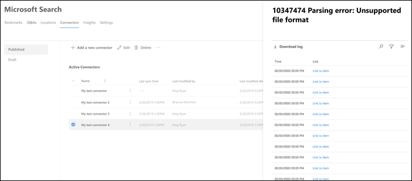

<!-- markdownlint-disable no-inline-html -->

# Просмотр сведений о под подключениех и ошибок

Для доступа к соединитетелям и управления ими необходимо назначить администратора поиска для клиента. Обратитесь к администратору клиента, чтобы у вас была роль администратора поиска.

Перейдите на [вкладку "Соединители"](https://admin.microsoft.com/Adminportal/Home#/MicrosoftSearch/Connectors) в Центре администрирования [Microsoft 365.](https://admin.microsoft.com)

При щелчке по подключению на вкладке "Соединители" можно просматривать сведения о подключении и [ошибки.](https://admin.microsoft.com/Adminportal/Home#/MicrosoftSearch/Connectors)  

## Просмотр последней информации обхода контента

После успешного первого добавочная или полного обхода контента последние значения данных обхода отображаются под последним заголовщиком обхода в области подробностей. Если последнего обхода контента не было, вы не увидите никаких сведений под последним заголком обхода. Эти сведения о последнем обходе контента помогут вам получить представление о том, как был выполнен обход контента, и выполнить необходимые действия в необходимых случаях.

Для каждого подключения будут доступны следующие значения последнего обхода:

Значение | Описание
--- | ---
**Завершено по** | Дата и время завершения последнего обхода контента
**Тип** | Добавоальный или полный обход контента
**Duration** | сколько времени прошло с последнего обхода контента
**Успешные операции** | Количество элементов, которые были успешно вошел в последний обход контента
**сведения об ошибках**; | Количество элементов, которые произошли в последнем обходе контента

## Отслеживание ошибок

Для каждого **активного соединитела** на вкладке **"Соединители"** все существующие ошибки обхода показываются на **вкладке "Ошибка".** На вкладке перечислены коды ошибок, их количество и параметры скачивания журнала ошибок. См. пример на следующем изображении. Выберите код **ошибки,** чтобы просмотреть сведения об ошибке.

Чтобы просмотреть сведения об ошибке, выберите ее код ошибки. Появится экран с сведениями об ошибке и ссылкой. Последние ошибки отображаются вверху. См. пример в следующей таблице.

Ниже приведен список различных ошибок, которые могут отображаться для любого подключения.

Код ошибки | Сообщение об ошибке | Решение
--- | --- | ---
1000 | Источник данных не доступен. Проверьте подключение к Интернету или убедитесь, что соединители по-прежнему доступны для источника данных. | Эта ошибка возникает, когда источник данных не достигается из-за сетевой проблемы или при удалении, перемещении или переименовании самого источника данных. Проверьте, являются ли предоставленные сведения о источнике данных действительными.
1001 | Не может обновить данные, так как источник данных регулирования соединители. | Чтобы отлажить источник данных, проверьте, можно ли увеличить ограничения масштабирования, или дождиться менее интенсивного трафика в течение дня.
1002 | Не может проверить подлинность в источнике данных. Проверьте правильность учетных данных, связанных с этим источником данных. | Нажмите **кнопку** "Изменить", чтобы обновить учетные данные проверки подлинности.
1003 | Учетная запись, связанная с соединитетелем, не имеет разрешения на доступ к элементу. |  Убедитесь, что у соответствующей учетной записи есть доступ к элементу, который нужно проиндексировать.
1004 | Не удается связаться с локального шлюза данных. Убедитесь, что служба шлюза запущена, а сведения о шлюзе обновлены в конфигурации подключения. | Проверьте компьютер со шлюзом, откройте приложение Шлюз Power BI и убедитесь, что шлюз запущен. Убедитесь, что шлюз использует ту же учетную запись администратора, что и Поиск (Майкрософт), а затем убедитесь, что все сведения о шлюзе обновлены в конфигурации подключения.
1005 | Срок действия учетных данных, связанных с этим источником данных, истек. Обновив учетные данные и обновив подключение. | Нажмите **кнопку** "Изменить", чтобы обновить учетные данные проверки подлинности.
1006 | Версия шлюза устарела и больше не поддерживает этот соединител. Вам потребуется обновить шлюз. | Посетите сайт ["Установка локального](https://docs.microsoft.com/data-integration/gateway/service-gateway-install) шлюза данных", чтобы скачать и установить последнюю версию шлюза Power BI на компьютере со шлюзом.
1007 | Действительная лицензия Power BI не обнаружена. Для выполнения этого обхода требуется действующая лицензия Power BI. | Для выполнения этого обхода требуется действующая лицензия Power BI. Убедитесь, что у вашей организации есть действительная лицензия. В этом случае попробуйте еще раз. Если это не так, получите лицензию и попробуйте еще раз.
1008 | Общее использование квоты клиента достигло своего предела. | Попробуйте удалить подключение, чтобы освободить часть квоты или настроить фильтры присоединения, чтобы уменьшить объем данных. Если это не поможет решить проблему, обратитесь в службу поддержки Майкрософт.
1009 | Общее использование квоты для подключения достигло своего предела. | Попробуйте настроить фильтры ingestion, чтобы уменьшить объем данных. Если это не решает проблему, обратитесь в службу поддержки Майкрософт.
1010 | Общий объем использования квоты для индексирования групп, не в том же Azure AD, достиг предела в 100 000. | Попробуйте удалить подключение, чтобы освободить часть квоты или настроить фильтры присоединения, чтобы уменьшить объем данных. Если это не поможет решить проблему, обратитесь в службу поддержки Майкрософт.
1011 | Агент [соединители](on-prem-agent.md) Graph не может быть подключен к сети или находится в автономном режиме. | 
1012 | Не удалось проверить подлинность подключения из-за неподдерживания режима проверки подлинности. | Изменить подключение, чтобы обновить параметры проверки подлинности для подключения.
2001 | Индексация регулирование из-за большого количества обновлений в очереди. В зависимости от очереди обновление может занять некоторое время. | Подождите, пока очередь не будет очищена.
2002 | Не удалось индексировать из-за неподтверченного форматирования элементов. | Дополнительные сведения см. в документации по соединителам.
2003 | Сбой индексации из-за неподтверченного содержимого элемента. | Дополнительные сведения см. в документации по соединителам.
2004 | Сбой индексации из-за неподтверченного элемента или размера файла. | Дополнительные сведения см. в документации по соединителам.
2005 | Сбой индексации, так как URI слишком длинный. | Дополнительные сведения см. в документации по соединителам.
2006 | Сбой сопоставления пользователей из-за недопустимой формулы сопоставления или отсутствие пользователя Azure AD с этим свойством. | Попробуйте удалить и воссоздать подключение с помощью другой формулы сопоставления. 
2007 | Этот элемент не будет отображаться в Поиске (Майкрософт), так как некоторые пользователи или группы без разрешения на просмотр этого элемента не могут быть проиндексироваться. | 
2008 | Подключения не могут иметь группы, не в том же Azure AD, с более чем 50 000 участников. | Попробуйте удалить пользователей из группы или попробуйте удалить элементы acLed с этой группой из ingestion и повторно создать подключение.
2009 | Индексация групп, не в том числе Azure AD, временно приостановлена из-за большого количества запросов. Индексация возобновится, когда система завершит обработку этих запросов. Please check back later. | 
2010 | Это подключение больше не является допустимым из-за обновления, выполненного корпорацией Майкрософт. Удалите подключение и создайте новое. | Удалите подключение и создайте новое.
5000 | Что-то пошло не так. Если это продолжается, обратитесь в службу поддержки. |
