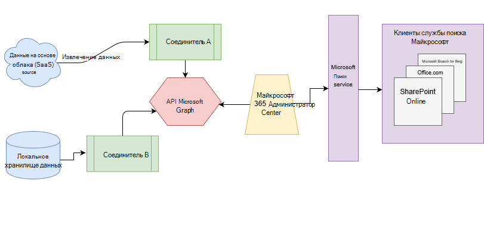

# Обзор соединителей Microsoft GraphOverview of Microsoft Graph connectors

Microsoft Search индексирует все данные [microsoft 365](https://www.microsoft.com/microsoft-365) , чтобы обеспечить возможность поиска для пользователей.Microsoft Search indexes all your [Microsoft 365](https://www.microsoft.com/microsoft-365) data to make it searchable for users. С помощью соединителей Microsoft Graph ваша организация может индексировать сторонние данные, чтобы отображать их в результатах Поиска (Майкрософт).With Microsoft Graph connectors, your organization can index third-party data to appear in Microsoft Search results. Сторонние данные могут размещаться в локальной среде или в общедоступных или частных облаках.The third-party data can be hosted on-premises or in the public or private clouds. Соединители расширяют типы источников контента, которые доступны для поиска в приложениях Microsoft 365 для продуктивной работы, а также в более широком наборе Microsoft экосистеме.Connectors expand the types of content sources that are searchable in your Microsoft 365 productivity apps and the broader Microsoft ecosystem.

> [!IMPORTANT]
> **Заявление об отказе**: Microsoft Graph Connectors и API службы поиска Microsoft (запрос и индекс) в настоящее время доступны для клиентов в целевом выпуске.**DISCLAIMER**: Microsoft Graph connectors and Microsoft Search APIs (query and index) are currently in preview status available for tenants in Targeted release. Чтобы использовать соединители с поиском Майкрософт или создавать соединители, следует отказаться от [целевой версии](https://docs.microsoft.com/office365/admin/manage/release-options-in-office-365?view=o365-worldwide).To use connectors with Microsoft Search or to build connectors, opt into [Targeted release](https://docs.microsoft.com/office365/admin/manage/release-options-in-office-365?view=o365-worldwide). Чтобы узнать больше о предварительном просмотре, ознакомьтесь со статьей [Просмотр соединителей](connectors-preview.md).To learn more about the preview, see [connectors preview program](connectors-preview.md).

## АрхитектураArchitecture

На следующей архитектурной схеме платформы Microsoft Graph показано, как соединительное содержимое проходит через индексирование содержимого для пользователей в клиентах [Microsoft Search](https://docs.microsoft.com/microsoftsearch/overview-microsoft-search) .The following architectural diagram of the Microsoft Graph platform shows how connector content flows through content indexing to user results in [Microsoft Search](https://docs.microsoft.com/microsoftsearch/overview-microsoft-search) clients. В этой статье описываются основные конструктивные блоки в процессе обработки поток данных Microsoft Graph Connectors.This article explains each of the key building blocks in the Microsoft Graph connectors data flow process.

API создает экземпляр одного подключения для каждого источника данных.The API instantiates one connection per data source. Затем API индексирует и сохраняет данные.Then the API indexes and stores the data. Установленные подключения взаимодействуют с Microsoft Search, поэтому пользователи могут получать результаты поиска.Established connections interact with Microsoft Search, so users can get search results.

Все соединители, созданные корпорацией Майкрософт, можно настроить в [центре администрирования](https://admin.microsoft.com)Microsoft 365.You can configure all the Microsoft-built connectors in the Microsoft 365 [admin center](https://admin.microsoft.com). Центр администрирования упрощает настройку соединителя с помощью простого пользовательского интерфейса.The admin center simplifies configuring your connector with a simple user interface.

Чтобы создать **Подключение** к источнику данных, администраторам необходим доступ с проверкой подлинности к данным и всему репозиторию контента.To create a **connection** to a data source, admins need authenticated access to the data and the entire content repository. Данные отправляются в службу соединителя Graph для индексирования.The data is fed to the graph connector service for indexing.

## Доступные соединителиAvailable connectors

В настоящее время существует 6 соединителей, созданных корпорацией Майкрософт, и более чем через 100 соединители доступны у наших партнеров по экосистеме.There are currently 6 Microsoft-built connectors, and over 100 connectors are available from our ecosystem partners.

Чтобы просмотреть соединители от одного из наших партнеров по экосистеме, свяжитесь с ними напрямую.To preview connectors from one of our ecosystem partners, contact them directly. Дополнительные сведения можно найти в [коллекции соединителей Microsoft Graph](connectors-gallery.md).For more information, see the [Microsoft Graph connectors gallery](connectors-gallery.md).

Вы также можете [создать собственный соединитель](https://docs.microsoft.com/graph/search-concept-overview).You can also [build your own connector](https://docs.microsoft.com/graph/search-concept-overview).

### Соединители от МайкрософтConnectors by Microsoft

Ознакомительная версия Microsoft Graph Connectors содержит шесть соединителей, созданных корпорацией Майкрософт.The Microsoft Graph connectors preview release includes 6 Microsoft-built connectors. Вы можете настроить их в [центре администрирования](https://admin.microsoft.com) и узнать, как [настроить соединитель, созданный корпорацией Майкрософт](configure-connector.md).You can set them up in the [admin center](https://admin.microsoft.com) and learn how to [Set up your Microsoft-built connector](configure-connector.md).

В следующих разделах приведены краткие описания для этих соединителей, созданных корпорацией Майкрософт.The following sections provide brief descriptions for these Microsoft-built connectors. В связанных статьях можно получить дополнительные сведения о каждом соединителе.You can get more information in the linked articles for each connector.

- **[Azure Data Lake Storage Gen2](https://docs.microsoft.com/azure/storage/blobs/data-lake-storage-introduction)**.**[Azure Data Lake Storage Gen2](https://docs.microsoft.com/azure/storage/blobs/data-lake-storage-introduction)**. С помощью этого соединителя Microsoft Graph пользователи в вашей организации могут искать файлы и контент, хранящиеся в контейнерах больших двоичных объектов Azure.With this Microsoft Graph connector, users in your organization can search for files and content stored in Azure Blob containers. Соединитель Gen2 для Azure Data Lake Storage также индексирует папки с включенной иерархией в учетных записях Azure Data Lake Storage Gen2, которые вы указали.The Azure Data Lake Storage Gen2 connector also indexes hierarchy-enabled folders in Azure Data Lake Storage Gen2 accounts that you specify.
Дополнительные сведения о [соединителе Gen2 для Azure Data Lake Storage](azure-data-lake-connector.md).Learn more about the [Azure Data Lake Storage Gen2 connector](azure-data-lake-connector.md).

- **[Azure DevOps](https://azure.microsoft.com/services/devops)**.**[Azure DevOps](https://azure.microsoft.com/services/devops)**. С помощью этого соединителя Microsoft Graph пользователи в вашей организации могут выполнять поиск рабочих элементов из экземпляра Azure DevOps.With this Microsoft Graph connector, users in your organization can search for work items from your Azure DevOps instance.
Узнайте больше о [соединителе Azure DevOps Connector](azure-devops-connector.md).Learn more about the [Azure DevOps connector](azure-devops-connector.md).

- **[Azure SQL](https://azure.microsoft.com/services/sql-database)**.**[Azure SQL](https://azure.microsoft.com/services/sql-database)**. С помощью этого соединителя Microsoft Graph пользователи в вашей организации могут выполнять поиск данных из базы данных SQL Azure.With this Microsoft Graph connector, users in your organization can search for data from your Azure SQL database.
Узнайте больше о [соединителе Azure SQL Connector](MSSQL-connector.md).Learn more about the [Azure SQL connector](MSSQL-connector.md).

- **Корпоративные веб-сайты**.**Enterprise websites**. С помощью этого соединителя Microsoft Graph пользователи в вашей организации могут выполнять поиск на страницах любого веб-сайта, отличного от SharePoint Enterprise.With this Microsoft Graph connector, users in your organization can search over pages in any non-SharePoint enterprise website.
Узнайте больше о [соединителе корпоративных веб-сайтов](enterprise-web-connector.md).Learn more about the [Enterprise websites connector](enterprise-web-connector.md).

- **[Медиавики](https://www.mediawiki.org/wiki/MediaWiki)**.**[MediaWiki](https://www.mediawiki.org/wiki/MediaWiki)**. С помощью этого соединителя Microsoft Graph пользователи могут выполнять поиск в статьях базы знаний на вики-сайтах, создаваемых в Организации с помощью Медиавики.With this Microsoft Graph connector, users can search for knowledge-base articles on wiki sites your organization creates with MediaWiki.
Дополнительные сведения о [соединителе Медиавики](mediawiki-connector.md).Learn more about the [MediaWiki connector](mediawiki-connector.md).

- **[Microsoft SQL Server](https://www.microsoft.com/sql-server/sql-server-2017)**.**[Microsoft SQL server](https://www.microsoft.com/sql-server/sql-server-2017)**. С помощью этого соединителя Microsoft Graph пользователи в вашей организации могут выполнять поиск данных в локальных базах данных SQL Server.With this Microsoft Graph connector, users in your organization can search for data in on-premises SQL server databases.
Дополнительные сведения о [соединителе Microsoft SQL Server](MSSQL-connector.md).Learn more about the [Microsoft SQL server connector](MSSQL-connector.md).

- **[ServiceNow](https://www.servicenow.com)**.**[ServiceNow](https://www.servicenow.com)**. С помощью этого соединителя Microsoft Graph пользователи в вашей организации могут выполнять поиск в статьях базы знаний в экземпляре ServiceNow.With this Microsoft Graph connector, users in your organization can search for knowledge-base articles from your ServiceNow instance.
Дополнительные сведения о [соединителе ServiceNow](servicenow-connector.md).Learn more about the [ServiceNow connector](servicenow-connector.md).

### Соединители от наших партнеровConnectors from our partners

Для предварительного просмотра на наших партнерах по экосистеме доступно свыше 100 соединителей.There are over 100 connectors available for preview from our ecosystem partners. Чтобы просмотреть соединители от одного из наших партнеров по экосистеме, свяжитесь с ними напрямую.To preview connectors from one of our ecosystem partners, contact them directly.
Узнайте больше о соединителях наших партнеров в [коллекции соединителей Microsoft Graph](connectors-gallery.md).Learn more about connectors from our partners in the [Microsoft Graph connectors gallery](connectors-gallery.md).

### Создание собственного соединителяBuild your own connector

Чтобы индексировать пользовательские типы данных или файлы, разработчики могут создавать соединители в [Microsoft Graph](https://developer.microsoft.com/graph/).To index custom data types or files, developers can create connectors in [Microsoft Graph](https://developer.microsoft.com/graph/). Соединитель — это приложение, которое [создает подключение](https://docs.microsoft.com/graph/search-index-manage-connections) и передает элементы в индекс поиска Майкрософт.A connector is an application that [creates a connection](https://docs.microsoft.com/graph/search-index-manage-connections) and pushes items into the Microsoft Search index. Для получения дополнительных сведений ознакомьтесь с [обзором, чтобы расширить возможности поиска Microsoft для приложений в Microsoft Graph](https://docs.microsoft.com/graph/search-concept-overview).For more information, see the [Overview for extending the Microsoft Search experience for apps on Microsoft Graph](https://docs.microsoft.com/graph/search-concept-overview).

### Результаты поиска с помощью созданного настраиваемого соединителяSearch results with your custom-built connector

После индексирования пользовательских данных разработчики могут [запрашивать эти данные](https://docs.microsoft.com/graph/search-concept-custom-types).After custom data is indexed, developers can [query this data](https://docs.microsoft.com/graph/search-concept-custom-types). Вы можете просматривать данные в любом приложении.You can view your data in any application. Для получения дополнительных сведений ознакомьтесь с [обзором, чтобы расширить возможности поиска Microsoft для приложений в Microsoft Graph](https://docs.microsoft.com/graph/search-concept-overview).For more information, see the [Overview for extending the Microsoft Search experience for apps on Microsoft Graph](https://docs.microsoft.com/graph/search-concept-overview).

## Требования лицензированияLicense requirements

Для просмотра данных из соединителей в результатах поиска пользователи должны иметь одну из следующих подписок на Microsoft 365 или Office 365:To view data from connectors in your search results, users must have one of the following Microsoft 365 or Office 365 subscriptions:

- [Microsoft 365 или Office 365 корпоративный E3 или "е"Microsoft 365 or Office 365 Enterprise E3 or E5](https://www.microsoft.com/microsoft-365/compare-all-microsoft-365-plans)

- [Microsoft 365 или Office 365 для образования a3 или A5Microsoft 365 or Office 365 Education A3 or A5](https://www.microsoft.com/microsoft-365/academic/compare-office-365-education-plans?activetab=tab:primaryr1)
