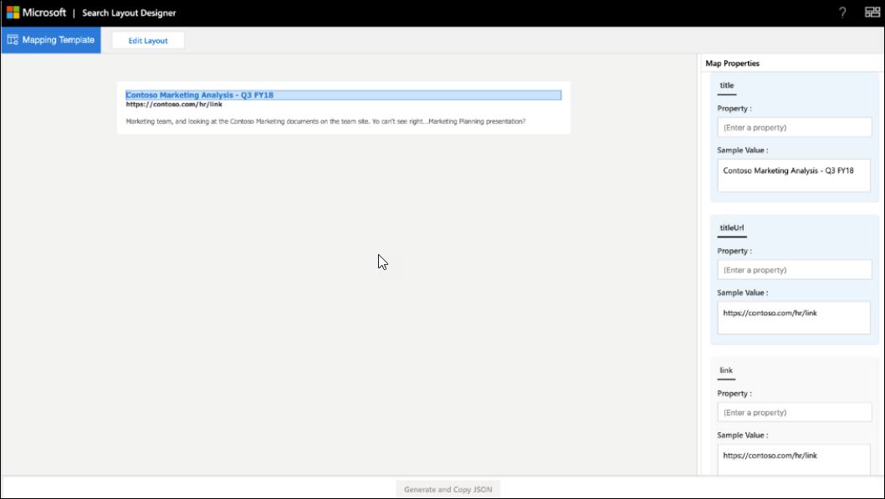

<!-- markdownlint-disable no-hard-tabs -->
# <a name="create-a-layout-to-customize-search-results"></a>Создание макета для настройки результатов поиска

Макет результатов можно создать для настраиваемой вертикали с помощью конструктора макета поиска. Вы можете приступить к разработке макета, выбрав шаблоны, предлагаемые в конструкторе макета, и используя их, если они соответствуют вашим требованиям. Или вы можете изменить эти шаблоны различными способами, чтобы соответствовать вашим требованиям. Например, добавьте или удалите изображения, добавьте или удалите текст и измените текст. Если ни один из шаблонов не соответствует вашим требованиям, можно приступить к разработке макета с помощью пустого шаблона.  

После готовности макета используйте язык [шаблона адаптивных](/adaptive-cards/templating/language) карт для создания макета результатов JSON, который используется для определения типа результатов. Свойства результатов сопоставлены с макетом с помощью шага Сопоставление в конструкторе макета.  

## <a name="create-a-layout-on-your-own"></a>Создание макета самостоятельно

Создание макета самостоятельно требует знаний о [адаптивных](/adaptive-cards/authoring-cards/getting-started) картах и [их схеме.](https://adaptivecards.io/explorer/) Макет результатов поиска использует подмножество элементов, предлагаемых адаптивными картами, и вы можете использовать конструктор макета, чтобы узнать о поддерживаемом наборе элементов.  

Создав собственный макет, создайте макет адаптивной карты с помощью данных из соединителя, а затем завершите макет.
Существует два основных шага в создании собственного макета:

- Разработать макет.
- Отделять данные от шаблона.

### <a name="design-the-layout"></a>Разработка макета

В этом примере мы показывем макет с загонком, ссылкой и описательным текстом.


И вот связанный файл JSON макета:

```json
{
    "type": "AdaptiveCard",
    "version": "1.0",
     "body": [
{

            "type": "ColumnSet",
             "columns": [
                 {
                     "type": "Column",
                     "width": 8,
                     "items": [
                         {
                             "type": "TextBlock",
                             "text": "Contoso Marketing Analysis - Q3 FY18",
                             "color": "Accent",
                             "size": "Medium",
                             "spacing": "None",
                             "$when": "{title != \"\"}",
                             "weight": "Bolder"
                        },
                        {
                        "type": "TextBlock",  
                        "text": "https://contoso.com/hr/link",
                        "spacing": "None",  
                        "color": "Dark",
                        "weight": "Bolder"

                        },

                        {  
                        "type": "TextBlock",
                        "text": "Marketing team at Contoso.., and looking at the Contoso Marketing documents on the team site. This contains the data from FY20 and will taken over to FY21...Marketing Planning is ongoing for FY20..",  
                        "wrap": true,
                        "maxLines": 2,
                        "spacing": "Medium"
                        }
                        ],

                    "horizontalAlignment": "Center",
                    "spacing": "None"

                }

            ]

        }
        ],

    "$schema": "http://adaptivecards.io/schemas/adaptive-card.json"
}
```

### <a name="separate-the-data-from-the-layout"></a>Отделять данные от макета

Вы можете отделить данные от макета и связать данные.

Вот макет JSON после привязки данных:

```json
{

    "type": "AdaptiveCard",
    "version": "1.0",
    "body": [
    {
    "type": "ColumnSet",
"columns": [

                {
                "type": "Column",
                "width": 8,
                "items": [
                {
                "type": "TextBlock",
                "text": "[{title}]({titleUrl})",
                "color": "Accent",
                "size": "Medium",
                "spacing": "None",
                "weight": "Bolder"

                 },
                 {
                 "type": "TextBlock",
                 "text": "{link}",
                 "spacing": "None",
                 "color": "Dark",
                 "weight": "Bolder"
                 },
                 {
                 "type": "TextBlock",
                 "text": "{description}",
                 "wrap": true,
                 "maxLines": 2,
                 "spacing": "Medium"
                 }
                 ],
                 "horizontalAlignment": "Center",
                 "spacing": "None"
                 }
                 ]

        }

    ],

    "$schema": "http://adaptivecards.io/schemas/adaptive-card.json"
}
```

Пример данных. Укажите пример данных в редакторе **выборки** данных, чтобы просмотреть привязанную к данным карту в **режиме предварительного просмотра.**

```json
{

    "title": "Contoso Marketing Analysis - Q3 FY18",
    "titleUrl": "https://contoso.com/hr/link",
    "link": "https://contoso.com/hr/link",
    "description": "Marketing team, and looking at the Contoso Marketing documents on the team site. Yo can't see right...Marketing Planning presentation?"

}
```

## <a name="map-the-layout-to-the-result-properties"></a>Наметить макет с свойствами результатов

Для создания макета результатов JSON необходимо соединять каждое поле макета с свойством результатов или соединитетелем.



Выберите поле в макете, чтобы выделить переменные, которые необходимо наметить. Для одного поля можно использовать несколько переменных, и все поля должны быть соедемы с свойствами результата.

### <a name="show-snippet-on-search-result"></a>Показать фрагмент результата поиска  

Динамические фрагменты, созданные **в** свойстве контента результата соединители, могут быть показаны в результате поиска. **ResultSnippet** — это свойство системы, которое выступает в качестве свойства placeholder для фрагментов, созданных для каждого результата Соединитель. Чтобы показать фрагменты макета результатов, свойство **системы ResultSnippet** должно быть соописуется с соответствующим полем, например Description, в макете результатов поиска. Фрагменты, созданные для каждого результата, также выделяют совпадения в фрагменте с термином запроса, в который ввел пользователь.

## <a name="things-to-consider"></a>Важные факторы

Перед началом работы необходимо сделать несколько вещей, которые следует избегать, чтобы убедиться, что макеты будут успешными.

### <a name="do"></a>Правильно

- Изменить шаблон, чтобы предоставить ссылку на логотип в макете, если вы используете статические ссылки для логотипов, а не свойства результатов.
- Проверка макета результатов для сценариев, в которых данные не возвращаются для свойства результатов, используемой в результате JSON. Используйте `$when` условие, чтобы скрыть элемент, если свойство не содержит данных.  
- Убедитесь, что типы данных `$when` условия и свойства результатов совпадают. Например, не сравнивайтесь `Number` с `Text` `$when` состоянием.  
- При разработке макета результатов подумайте о требованиях к темам.  
- Убедитесь, что `Textblock`   элемент может обрабатывать динамическое содержимое. Для этого можно `wrap` использовать `maxLines` свойства элементов и элементов.
- Правильно форматировать дату при использовании `{DATE()}` в Markdown.  

### <a name="dont"></a>Неправильно

- Не определяйте недопустимые типы данных при привязке значений. Дополнительные сведения о типах данных см. в [схеме Управление схемой поиска.](/sharepoint/search/manage-the-search-schema)
- Избегайте обрезки результата на странице результатов, следуя максимальной высоте макета результатов JSON. Если вы превышаете максимальную высоту макета результатов, результат будет обрезан на странице результатов.
- Не используйте `px` значения в свойствах элементов.
- Не используйте разметку с **свойством ResultSnippet** в макете результатов для выделения совпадения запросов в результате поиска.

## <a name="resources"></a>Ресурсы

[Настройка страницы результатов поиска](customize-search-page.md)

[Адаптивные карты](/adaptive-cards/authoring-cards/getting-started)

[Язык шаблона адаптивных карт](/adaptive-cards/templating/language)

[Схема адаптивной карты](https://adaptivecards.io/explorer/)