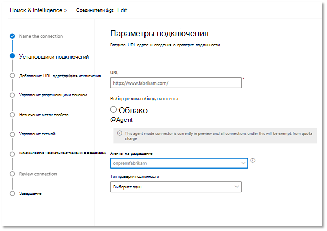

<!---Previous ms.author: monaray --->

<!-- markdownlint-disable no-inline-html -->

# Соединители Graph для корпоративных веб-сайтовEnterprise websites Graph connector

Соединители Graph корпоративных веб-сайтов позволяют организации индексировать статьи и контент с внутренних **веб-сайтов.**The Enterprise websites Graph connector allows your organization to index articles and **content from its internal-facing websites**. После настройки соединители и синхронизации контента с веб-сайта конечные пользователи смогут искать этот контент из любого клиента Поиска (Майкрософт).After you configure the connector and sync content from the website, end users can search for that content from any Microsoft Search client.

> [!NOTE]
> Прочитайте [**статью "Настройка соединители Graph",**](configure-connector.md) чтобы ознакомиться с общим процессом настройки соединители Graph.Read the [**Setup your Graph connector**](configure-connector.md) article to understand the general Graph connectors setup process.

Эта статья для всех, кто настраивает, запускает и отслеживает соединители корпоративных веб-сайтов.This article is for anyone who configures, runs, and monitors a Enterprise websites connector. Он дополняет общий процесс настройки и показывает инструкции, применимые только к соединитеструктору корпоративных веб-сайтов.It supplements the general setup process, and shows instructions that apply only for the Enterprise websites connector. В этой статье также содержатся сведения об [устранении неполадок](#troubleshooting) [и ограничениях.](#limitations)This article also includes information about [Troubleshooting](#troubleshooting) and [Limitations](#limitations).

<!---## Before you get started-->

<!---Insert "Before you get started" recommendations for this data source-->

## Шаг 1. Добавление соединителю Graph в Центре администрирования Microsoft 365Step 1: Add a Graph connector in the Microsoft 365 admin center

Следуйте общим [инструкциям по настройке.](https://docs.microsoft.com/microsoftsearch/configure-connector)Follow the general [setup instructions](https://docs.microsoft.com/microsoftsearch/configure-connector).
<!---If the above phrase does not apply, delete it and insert specific details for your data source that are different from general setup instructions.-->

## Шаг 2. Имя подключенияStep 2: Name the connection

Следуйте общим [инструкциям по настройке.](https://docs.microsoft.com/microsoftsearch/configure-connector)Follow the general [setup instructions](https://docs.microsoft.com/microsoftsearch/configure-connector).
<!---If the above phrase does not apply, delete it and insert specific details for your data source that are different from general setup instructions.-->

## Шаг 3. Настройка параметров подключенияStep 3: Configure the connection settings

Чтобы подключиться к источнику данных, необходимо ввести корневой URL-адрес веб-сайта, выбрать источник обхода контента и тип проверки подлинности, который вы хотите использовать: None, Basic Authentication или OAuth 2.0 с [Azure Active Directory (Azure AD).](https://docs.microsoft.com/azure/active-directory/)To connect to your data source, you need to fill in the root URL of the website, select a crawl source, and the type of authentication you'd like to use: None, Basic Authentication, or OAuth 2.0 with [Azure Active Directory (Azure AD)](https://docs.microsoft.com/azure/active-directory/). После получения этих сведений выберите "Проверить подключение", чтобы проверить параметры.After you complete this information, select Test Connection to verify your settings.

### URLURL

Используйте поле URL-адреса, чтобы указать корневой сайт, который вы хотите обходить.Use the URL field to specify the root of the website that you'd like to crawl. Соединителятор корпоративных веб-сайтов будет использовать этот URL-адрес в качестве отправной точки и переходить по всем ссылкам с этого URL-адреса для обхода контента.The enterprise websites connector will use this URL as the starting point and follow all the links from this URL for its crawl.

### Режим обхода: облако или локальное (предварительная версия)Crawl mode: Cloud or On-premises (Preview)

Режим обхода контента определяет тип веб-сайтов, которые необходимо проиндексировать, как облачных, так и локально.The crawl mode determines the type of websites you want to index, either cloud or on-premises. Для облачных веб-сайтов выберите **"Облако"** в качестве режима обхода.For your cloud websites, select **Cloud** as the crawl mode.

Кроме того, соединители теперь поддерживают обход контента на локальном веб-сайтах.Also, the connector now supports crawling of on-premises websites. Этот режим находится в режиме предварительной версии.This mode is in preview. Чтобы получить доступ к локальному данным, необходимо сначала установить и настроить агент соединителя Graph.To access your on-premises data, you must first install and configure the Graph connector agent. Дополнительные данные см. в [агенте соединители Graph.](https://docs.microsoft.com/microsoftsearch/on-prem-agent)To learn more, see [Graph connector agent](https://docs.microsoft.com/microsoftsearch/on-prem-agent).

Для локального **веб-сайтов** выберите  "Агент" в качестве режима обхода контента, а в поле локального агента выберите агент соединительных окне Graph, который вы установили и настроили ранее.For your on-premises websites, select **Agent** as the crawl mode and in the **On-Prem Agent** field, choose the Graph connector agent that you installed and configured earlier.  

> [!div class="mx-imgBorder"]
> 

### Проверка подлинностиAuthentication

Для базовой проверки подлинности требуется имя пользователя и пароль.Basic Authentication requires a username and password. Создайте эту учетную запись бота с помощью Центра администрирования [Microsoft 365.](https://admin.microsoft.com)Create this bot account by using the [Microsoft 365 admin center](https://admin.microsoft.com).

Для OAuth 2.0 с [Azure AD](https://docs.microsoft.com/azure/active-directory/) требуется ИД ресурса, ИД клиента и секрет клиента.OAuth 2.0 with [Azure AD](https://docs.microsoft.com/azure/active-directory/) requires a resource ID, Client ID, and Client Secret. OAuth 2.0 работает только в режиме облака.OAuth 2.0 only works with Cloud mode.

Дополнительные сведения см. в сведениях о авторизации доступа к веб-приложениям Azure Active Directory с помощью потока предоставления кода [OAuth 2.0.](https://docs.microsoft.com/azure/active-directory/develop/v1-protocols-oauth-code)For more information, see [Authorize access to Azure Active Directory web applications using OAuth 2.0 code grant flow](https://docs.microsoft.com/azure/active-directory/develop/v1-protocols-oauth-code). Зарегистрируйтесь со следующими значениями:Register with the following values:

**Имя:** Поиск (Майкрософт)**Name:** Microsoft Search  
**Redirect_URI:**`https://gcs.office.com/v1.0/admin/oauth/callback`**Redirect_URI:** `https://gcs.office.com/v1.0/admin/oauth/callback`

Чтобы получить значения для ресурса, client_id и client_secret, перейдите  к коду авторизации, чтобы запросить маркер доступа на веб-странице URL-адреса перенаправления.To get the values for the resource, client_id, and client_secret, go to **Use the authorization code to request an access token** on the redirect URL webpage.

Дополнительные сведения см. в [кратком примере: регистрация приложения с помощью платформы удостоверений Майкрософт.](https://docs.microsoft.com/azure/active-directory/develop/quickstart-register-app)For even more information, see [Quickstart: Register an application with the Microsoft identity platform](https://docs.microsoft.com/azure/active-directory/develop/quickstart-register-app).

## Шаг 3a. Добавление URL-адресов для исключения (необязательные ограничения обхода)Step 3a: Add URLs to exclude (Optional crawl restrictions)

Существует два способа запретить обход страниц: запретить их в файле robots.txt или добавить в список исключений.There are two ways to prevent pages from being crawled: disallow them in your robots.txt file or add them to the Exclusion list.

### Поддержка robots.txtSupport for robots.txt

Соединители проверяют наличие robots.txt корневого сайта и, если он существует, он будет следовать указаниям, найденным в этом файле, и соблюдать их.The connector checks to see if there is a robots.txt file for your root site and, if one exists, it will follow and respect the directions found within that file. Если соединитель не должен обходить определенные страницы или каталоги на сайте, вы можете вызвать эти страницы или каталоги в объявлениях "Disallow" в robots.txt файле.If you do not want the connector to crawl certain pages or directories on your site, you can call out those pages or directories in the "Disallow" declarations in your robots.txt file.

### Добавление URL-адресов для исключенияAdd URLs to exclude

При желании можно  создать список исключений, чтобы исключить некоторые URL-адреса из обхода, если этот контент является конфиденциальным или обход не стоит.You can optionally create an **Exclusion list** to exclude some URLs from getting crawled if that content is sensitive or not worth crawling. Чтобы создать список исключений, просмотрите корневой URL-адрес.To create an exclusion list, browse through the root URL. Вы можете добавить исключенные URL-адреса в список во время процесса настройки.You can add the excluded URLs to the list during the configuration process.

## Шаг 4. Назначение меток свойствStep 4: Assign property labels

Для каждой метки можно назначить свойство источника, выбрав в меню параметры.You can assign a source property to each label by choosing from a menu of options. Хотя этот шаг не является обязательным, наличие некоторых меток свойств улучшит релевантность поиска и обеспечит более точные результаты поиска для конечных пользователей.While this step is not mandatory, having some property labels will improve the search relevance and ensure more accurate search results for end users.

## Шаг 5. Управление схемойStep 5: Manage schema

На  экране "Управление схемой" можно изменить атрибуты схемы (параметры "  **Запрос",**"Поиск", "Извлечение" и "Уточнение"), связанные со свойствами, добавить необязательные псевдонимы и выбрать свойство **Content.** On the **Manage Schema** screen, you can change the schema attributes (the options are **Query**, **Search**, **Retrieve**, and **Refine**) associated with the properties, add optional aliases, and choose the **Content** property.

## Шаг 6. Управление разрешениями поискаStep 6: Manage search permissions

Соединители корпоративных веб-сайтов поддерживают только разрешения поиска, видимые **всем.**The Enterprise websites connector only supports search permissions visible to **Everyone**. Индексные данные появляются в результатах поиска и видны всем пользователям в организации.Indexed data appears in the search results and is visible to all users in the organization.

## Шаг 7. Настройка расписания обновленияStep 7: Set the refresh schedule

Соединители корпоративных веб-сайтов поддерживают только полное обновление.The Enterprise websites connector only supports a full refresh. Это означает, что во время каждого обновления соединитенок будет повторно обсбор всего контента веб-сайта.This means that the connector will recrawl all the website's content during every refresh. Чтобы убедиться, что соединитенду достаточно времени для обхода контента, рекомендуется установить большой интервал расписания обновления.To make sure the connector gets enough time to crawl the content, we recommend that you set a large refresh schedule interval. Рекомендуется запланированное обновление от одной до двух недель.We recommend a scheduled refresh between one and two weeks.

## Шаг 8. Проверка подключенияStep 8: Review connection

Следуйте общим [инструкциям по настройке.](https://docs.microsoft.com/microsoftsearch/configure-connector)Follow the general [setup instructions](https://docs.microsoft.com/microsoftsearch/configure-connector).
<!---If the above phrase does not apply, delete it and insert specific details for your data source that are different from general setup instructions.-->

## Устранение неполадокTroubleshooting

При чтении контента веб-сайта при обходе могут возникнуть некоторые исходные ошибки, представленные в подробных кодах ошибок ниже.When reading the website's content, the crawl may encounter some source errors, which are represented by the detailed error codes below. Чтобы получить дополнительные сведения о типах  ошибок, перейдите на страницу сведений об ошибках после выбора подключения.To get more information on the types of errors, go to the **error details** page after selecting the connection. Выберите код **ошибки,** чтобы увидеть более подробные ошибки.Select the **error code** to see more detailed errors. Дополнительные узнать также можно [в](https://docs.microsoft.com/microsoftsearch/manage-connector) подключении "Управление соединитетелем".Also refer to [Manage your connector](https://docs.microsoft.com/microsoftsearch/manage-connector) to learn more.

 Подробный код ошибкиDetailed Error code | Сообщение об ошибкеError message
 --- | ---
 60016001 | Сайт, который пытается проиндексировать, не достигаетсяThe site that is being tried to index is not reachable
 60056005 | Исходные страницы, которые пытаются индексировать, заблокированы по robots.txt конфигурации.The source page that is being tried to index has been blocked by as per robots.txt configuration.
 60086008 | Не удается разрешить DNSUnable to resolve the DNS
 60096009 | Сведения обо всех клиентских ошибках (кроме HTTP 404, 408) см. в подробных кодах ошибок HTTP 4xx.For all client-side errors (Except HTTP 404, 408), refer to HTTP 4xx error codes for details.
 60136013 | Не удалось найти исходный лист, который пытается проиндексировать.The source page that is being tried to index could not be found. (Ошибка HTTP 404)(HTTP 404 error)
 60186018 | Исходный запрос не отвечает, и время отклика на запрос было иным. (Ошибка HTTP 408)The source page is not responding, and the request has timed out. (HTTP 408 error)
 60216021 | На странице источника, которую пытаются проиндексировать, нет текстового содержимого на странице.The source page that is being tried to index has no textual content on the page.
 60236023 | Исходные страницы, которые пытаются проиндексировать, неподтверчены (а не HTML-страница)The source page that is being tried to index is unsupported (not an HTML page)
 60246024 | Исходный контент, который пытается индексировать, имеет неподтверченное содержимое.The source page that is being tried to index has unsupported content.

* Ошибки 6001–6013 возникают, когда источник данных не может быть достигнут из-за сетевой проблемы или при удалении, перемещении или переименовании самого источника данных.Errors 6001-6013 occur when the data source is not reachable due to a network issue or when the data source itself is deleted, moved, or renamed. Проверьте, являются ли предоставленные сведения о источнике данных действительными.Check if the data source details provided are still valid.
* Ошибки 6021-6024 возникают, когда источник данных содержит не текстовый контент на странице или страница не является HTML-кодом.Errors 6021-6024 occur when the data source contains non-textual content on the page or when the page is not an HTML. Проверьте источник данных и добавьте эту страницу в список исключений или игнорируйте ошибку.Check the data source and add this page in exclusion list or ignore the error.

## ОграниченияLimitations

Соединители корпоративных веб-сайтов не поддерживают поиск данных на **динамических веб-странице.**The Enterprise websites connector doesn't support searching data on **dynamic webpages**. Примеры этих веб-страниц хранятся в системах управления контентом, таких как [Confluence](https://www.atlassian.com/software/confluence) и [Unily,](https://www.unily.com/) или базах данных, в которой хранится контент веб-сайтов.Examples of those webpages live in content management systems like [Confluence](https://www.atlassian.com/software/confluence) and [Unily](https://www.unily.com/) or databases that store website content.