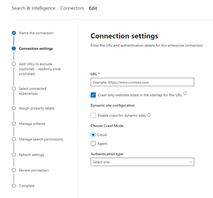

<!---Previous ms.author: monaray --->

<!-- markdownlint-disable no-inline-html -->

# Enterprise веб Graph соединителиEnterprise websites Graph connector

Соедините Enterprise веб-Graph позволяет организации индексировать статьи и контент с внутренних **веб-сайтов.**The Enterprise websites Graph connector allows your organization to index articles and **content from its internal-facing websites**. После настройки соединители и синхронизации контента с веб-сайта конечные пользователи могут искать этот контент из любого Поиск (Майкрософт) клиента.After you configure the connector and sync content from the website, end users can search for that content from any Microsoft Search client.

> [!NOTE]
> Ознакомьтесь [**с статьей Настройка Graph соединители,**](configure-connector.md) чтобы понять общие инструкции Graph соединители.Read the [**Setup your Graph connector**](configure-connector.md) article to understand the general Graph connectors setup instructions.

Эта статья для всех, кто настраивает, запускает и отслеживает соединители Enterprise веб-сайтов.This article is for anyone who configures, runs, and monitors an Enterprise websites connector. Он дополняет общий процесс установки и показывает инструкции, которые применяются только для соединитетеля Enterprise веб-сайтов.It supplements the general setup process, and shows instructions that apply only for the Enterprise websites connector. В этой статье также содержатся сведения о устранении [неполадок](#troubleshooting) и [ограничениях.](#limitations)This article also includes information about [Troubleshooting](#troubleshooting) and [Limitations](#limitations).

<!---## Before you get started-->

<!---Insert "Before you get started" recommendations for this data source-->

## Шаг 1. Добавление соединителю Graph в Центр администрирования Microsoft 365Step 1: Add a Graph connector in the Microsoft 365 admin center

Следуйте общим [инструкциям установки](./configure-connector.md).Follow the general [setup instructions](./configure-connector.md).
<!---If the above phrase does not apply, delete it and insert specific details for your data source that are different from general setup instructions.-->

## Шаг 2. Имя подключенияStep 2: Name the connection

Следуйте общим [инструкциям установки](./configure-connector.md).Follow the general [setup instructions](./configure-connector.md).
<!---If the above phrase does not apply, delete it and insert specific details for your data source that are different from general setup instructions.-->

## Шаг 3. Настройка параметров подключенияStep 3: Configure the connection settings

Чтобы подключиться к источнику данных, заполните корневой URL-адрес веб-сайта, выберите источник обхода и тип проверки подлинности, который вы хотите использовать: None, Basic Authentication или OAuth 2.0 с [помощью Azure Active Directory (Azure AD).](/azure/active-directory/)To connect to your data source, fill in the root URL of the website, select a crawl source, and the type of authentication you'd like to use: None, Basic Authentication, or OAuth 2.0 with [Azure Active Directory (Azure AD)](/azure/active-directory/). После получения этих сведений выберите тест-подключение для проверки параметров.After you complete this information, select Test Connection to verify your settings.

### URLURL

Используйте поле URL-адресов, чтобы указать корень веб-сайта, который необходимо обходить.Use the URL field to specify the root of the website that you'd like to crawl. Соединителя веб-сайтов предприятия будет использовать этот URL-адрес в качестве отправной точки и следовать всем ссылкам из этого URL-адреса для обхода.The enterprise websites connector will use this URL as the starting point and follow all the links from this URL for its crawl.

### Веб-сайты обхода, указанные в карте сайтаCrawl websites listed in the sitemap

При выборе соединитель будет обходать URL-адреса, указанные в карте сайта.When selected the connector will only crawl the URLs listed in the sitemap. Если не выбрана или не найдена карта сайта, соединителя будет глубоко обхода всех ссылок, найденных на корневом URL-адресе сайта.If not selected or no site map is found, the connector will do a deep crawl of all the links found on the root URL of the site.

> [!div class="mx-imgBorder"]
> 

### Режим обхода: облако или локальноеCrawl mode: Cloud or On-premises

Режим обхода определяет тип веб-сайтов, которые необходимо индексировать, облачные или локально.The crawl mode determines the type of websites you want to index, either cloud or on-premises. Для облачных веб-сайтов выберите **Облако** в качестве режима обхода.For your cloud websites, select **Cloud** as the crawl mode.

Кроме того, соединители теперь поддерживает обход локального веб-сайтов.Also, the connector now supports crawling of on-premises websites. Чтобы получить доступ к локальной информации, сначала необходимо установить и настроить Graph соединителя.To access your on-premises data, you must first install and configure the Graph connector agent. Подробнее см. в [Graph агент соединители.](./on-prem-agent.md)To learn more, see [Graph connector agent](./on-prem-agent.md).

Для локального веб-сайтов выберите  Агент в режиме обхода и в поле **On-prem Agent** выберите агент соединительных Graph, который был установлен и настроен ранее.For your on-premises websites, select **Agent** as the crawl mode and in the **On-prem Agent** field, choose the Graph connector agent that you installed and configured earlier.  

### Проверка подлинностиAuthentication

Для базовой проверки подлинности требуется имя пользователя и пароль.Basic Authentication requires a username and password. Создайте эту учетную запись бота с помощью [Центр администрирования Microsoft 365.](https://admin.microsoft.com)Create this bot account by using the [Microsoft 365 admin center](https://admin.microsoft.com).

OAuth 2.0 с [Azure AD](/azure/active-directory/) требует ИД ресурса, ИД клиента и секрет клиента.OAuth 2.0 with [Azure AD](/azure/active-directory/) requires a resource ID, Client ID, and Client Secret. OAuth 2.0 работает только в облачном режиме.OAuth 2.0 only works with Cloud mode.

Дополнительные сведения см. в странице Авторизованный доступ к Azure Active Directory веб-приложениям с помощью потока грантов кода [OAuth 2.0.](/azure/active-directory/develop/v1-protocols-oauth-code)For more information, see [Authorize access to Azure Active Directory web applications using OAuth 2.0 code grant flow](/azure/active-directory/develop/v1-protocols-oauth-code). Зарегистрируйтесь со следующими значениями:Register with the following values:

**Имя:** Поиск (Майкрософт)**Name:** Microsoft Search  
**Redirect_URI:**`https://gcs.office.com/v1.0/admin/oauth/callback`**Redirect_URI:** `https://gcs.office.com/v1.0/admin/oauth/callback`

Чтобы получить значения для ресурса, client_id и client_secret перейдите к  коду авторизации для запроса маркера доступа на веб-странице URL-адреса перенаправления.To get the values for the resource, client_id, and client_secret, go to **Use the authorization code to request an access token** on the redirect URL webpage.

Дополнительные сведения см. в [сайте Quickstart: Регистрация](/azure/active-directory/develop/quickstart-register-app)приложения с помощью платформа удостоверений Майкрософт.For even more information, see [Quickstart: Register an application with the Microsoft identity platform](/azure/active-directory/develop/quickstart-register-app).

## Шаг 3a. Добавление URL-адресов для исключения (необязательные ограничения обхода)Step 3a: Add URLs to exclude (Optional crawl restrictions)

Существует два способа предотвратить обход страниц: запретить их в файле robots.txt или добавить их в список исключений.There are two ways to prevent pages from being crawled: disallow them in your robots.txt file or add them to the Exclusion list.

### Поддержка robots.txtSupport for robots.txt

Соединитатель проверяет наличие файла robots.txt корневого сайта и, если он существует, он будет следовать указаниям, найденным в этом файле, и соблюдать их.The connector checks to see if there is a robots.txt file for your root site and, if one exists, it will follow and respect the directions found within that file. Если вы не хотите, чтобы соединитель обходал определенные страницы или каталоги на вашем сайте, вы можете вызвать эти страницы или каталоги в объявлениях "Disallow" в robots.txt файле.If you do not want the connector to crawl certain pages or directories on your site, you can call out those pages or directories in the "Disallow" declarations in your robots.txt file.

### Добавление URL-адресов для исключенияAdd URLs to exclude

Можно дополнительно создать  список исключений, чтобы исключить обход некоторых URL-адресов, если этот контент является конфиденциальным или не стоит обхода.You can optionally create an **Exclusion list** to exclude some URLs from getting crawled if that content is sensitive or not worth crawling. Чтобы создать список исключений, просмотрите корневой URL-адрес.To create an exclusion list, browse through the root URL. Исключенные URL-адреса можно добавить в список во время процесса настройки.You can add the excluded URLs to the list during the configuration process.

## Шаг 4. Назначение меток свойствStep 4: Assign property labels

Вы можете назначить свойству источника для каждой метки, выбрав из меню параметры.You can assign a source property to each label by choosing from a menu of options. Хотя этот шаг не является обязательным, наличие меток свойств повысит релевантность поиска и обеспечит более точные результаты поиска для конечных пользователей.While this step isn't mandatory, having some property labels will improve the search relevance and ensure more accurate search results for end users.

## Шаг 5. Управление схемойStep 5: Manage schema

На экране Manage **Schema** можно изменить атрибуты схемы (это параметры **Запрос,** **Поиск,** Извлечение и уточнение), связанные с свойствами, добавить необязательные псевдонимы и выбрать свойство **Content.**  On the **Manage Schema** screen, you can change the schema attributes (the options are **Query**, **Search**, **Retrieve**, and **Refine**) associated with the properties, add optional aliases, and choose the **Content** property.

## Шаг 6. Управление разрешениями на поискStep 6: Manage search permissions

Соедините Enterprise веб-сайтов поддерживает только разрешения поиска, видимые **каждому.**The Enterprise websites connector only supports search permissions visible to **Everyone**. Индексные данные появляются в результатах поиска и видны всем пользователям в организации.Indexed data appears in the search results and is visible to all users in the organization.

## Шаг 7. Настройка расписания обновленияStep 7: Set the refresh schedule

Соедините Enterprise веб-сайтов поддерживает только полное обновление.The Enterprise websites connector only supports a full refresh. Это означает, что соединителер будет повторно заснять все содержимое веб-сайта во время каждого обновления.This means that the connector will recrawl all the website's content during every refresh. Чтобы соединитатель получил достаточно времени для обхода контента, рекомендуется установить большой интервал расписания обновления.To make sure the connector gets enough time to crawl the content, we recommend that you set a large refresh schedule interval. Рекомендуется запланированное обновление от одной до двух недель.We recommend a scheduled refresh between one and two weeks.

## Шаг 8. Просмотр подключенияStep 8: Review connection

Следуйте общим [инструкциям установки](./configure-connector.md).Follow the general [setup instructions](./configure-connector.md).
<!---If the above phrase does not apply, delete it and insert specific details for your data source that are different from general setup instructions.-->

## Устранение неполадокTroubleshooting

При чтении контента веб-сайта обход может столкнуться с некоторыми исходными ошибками, которые представлены подробными кодами ошибок ниже.When reading the website's content, the crawl may encounter some source errors, which are represented by the detailed error codes below. Чтобы получить дополнительные сведения о типах  ошибок, перейдите на страницу сведения об ошибках после выбора подключения.To get more information on the types of errors, go to the **error details** page after selecting the connection. Выберите код **ошибки,** чтобы увидеть более подробные ошибки.Select the **error code** to see more detailed errors. Кроме того, [обратитесь к управлению соединитетелем,](./manage-connector.md) чтобы узнать больше.Also refer to [Manage your connector](./manage-connector.md) to learn more.

 Подробный код ошибкиDetailed Error code | Сообщение об ошибкеError message
 --- | ---
 60016001 | Сайт, который пытаются индексировать, не досяжимThe site that is being tried to index is not reachable
 60056005 | Исходные страницы, которые пытаются индексировать, заблокированы по robots.txt конфигурации.The source page that is being tried to index has been blocked by as per robots.txt configuration.
 60086008 | Невозможно разрешить DNSUnable to resolve the DNS
 60096009 | Для всех клиентских ошибок (кроме HTTP 404, 408) обратитесь к кодам ошибок HTTP 4xx.For all client-side errors (Except HTTP 404, 408), refer to HTTP 4xx error codes for details.
 60136013 | Исходные страницы, которые пытаются индексировать, не удалось найти.The source page that is being tried to index could not be found. (ошибка HTTP 404)(HTTP 404 error)
 60186018 | Исходные страницы не отвечают, и запрос был ото времени. (ОШИБКА HTTP 408)The source page is not responding, and the request has timed out. (HTTP 408 error)
 60216021 | На первой странице, которую пытаются индексировать, нет текстового контента на странице.The source page that is being tried to index has no textual content on the page.
 60236023 | Исходные страницы, которые пытаются индексировать, неподтверчены (не HTML-страница)The source page that is being tried to index is unsupported (not an HTML page)
 60246024 | На первой странице, которую пытаются индексировать, есть неподтверченное содержимое.The source page that is being tried to index has unsupported content.

* Ошибки 6001-6013 возникают, когда источник данных не может быть достигнут из-за проблемы с сетью или при удалении, перемещении или переименовании самого источника данных.Errors 6001-6013 occur when the data source is not reachable due to a network issue or when the data source itself is deleted, moved, or renamed. Проверьте, действительны ли предоставленные сведения о источнике данных.Check if the data source details provided are still valid.
* Ошибки 6021-6024 возникают, когда источник данных содержит не текстовый контент на странице или когда страница не является HTML.Errors 6021-6024 occur when the data source contains non-textual content on the page or when the page is not an HTML. Проверьте источник данных и добавьте эту страницу в список исключений или игнорируйте ошибку.Check the data source and add this page in exclusion list or ignore the error.

## ОграниченияLimitations

Соедините Enterprise веб-сайтов не поддерживает поиск данных на **динамических веб-сайтах.**The Enterprise websites connector doesn't support searching data on **dynamic webpages**. Примеры этих веб-страниц живут в системах управления контентом, таких как [Confluence](https://www.atlassian.com/software/confluence) и [Unily,](https://www.unily.com/) или базах данных, которые хранят содержимое веб-сайта.Examples of those webpages live in content management systems like [Confluence](https://www.atlassian.com/software/confluence) and [Unily](https://www.unily.com/) or databases that store website content.