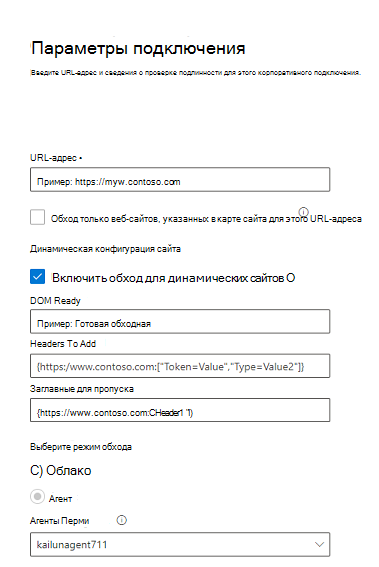

<!---Previous ms.author: monaray --->

<!-- markdownlint-disable no-inline-html -->

# Enterprise веб Graph соединители

Соедините Enterprise веб-Graph позволяет организации индексировать статьи и контент с внутренних **веб-сайтов.** После настройки соединители и синхронизации контента с веб-сайта конечные пользователи могут искать этот контент из любого Поиск (Майкрософт) клиента.

> [!NOTE]
> Ознакомьтесь [**с статьей Настройка Graph соединители,**](configure-connector.md) чтобы понять общие инструкции Graph соединители.

Эта статья для всех, кто настраивает, запускает и отслеживает соединители Enterprise веб-сайтов. Он дополняет общий процесс установки и показывает инструкции, которые применяются только для соединитетеля Enterprise веб-сайтов. В этой статье также содержатся сведения о [устранении неполадок.](#troubleshooting)

<!---## Before you get started-->

<!---Insert "Before you get started" recommendations for this data source-->

## Шаг 1. Добавление соединителю Graph в Центр администрирования Microsoft 365

Следуйте общим [инструкциям установки](./configure-connector.md).
<!---If the above phrase does not apply, delete it and insert specific details for your data source that are different from general setup instructions.-->

## Шаг 2. Имя подключения

Следуйте общим [инструкциям установки](./configure-connector.md).
<!---If the above phrase does not apply, delete it and insert specific details for your data source that are different from general setup instructions.-->

## Шаг 3. Настройка параметров подключения

Чтобы подключиться к источнику данных, заполните корневой URL-адрес веб-сайта, выберите источник обхода и тип проверки подлинности, который вы хотите использовать: None, Basic Authentication или OAuth 2.0 с [помощью Azure Active Directory (Azure AD).](/azure/active-directory/) После получения этих сведений выберите тест-подключение для проверки параметров.

### URL

Используйте поле URL-адресов, чтобы указать корень веб-сайта, который необходимо обходить. Соединителя веб-сайтов предприятия будет использовать этот URL-адрес в качестве отправной точки и следовать всем ссылкам из этого URL-адреса для обхода.

### Веб-сайты обхода, указанные в карте сайта

При выборе соединитель будет обходать URL-адреса, указанные в карте сайта. Если не выбрана или не найдена карта сайта, соединителя будет глубоко обхода всех ссылок, найденных на корневом URL-адресе сайта.

### Динамическая конфигурация сайта

Если веб-сайт содержит динамическое содержимое, например веб-страницы, которые живут в системах управления контентом, таких как Confluence или Unily, вы можете включить динамический обходной обход. Чтобы включить его, выберите **Включить обход для динамических сайтов.** Сканер будет ждать отрисовки динамического контента перед началом обхода.

> [!div class="mx-imgBorder"]
> 

Помимо контрольного окна доступны три необязательных поля:

1. **DOM Ready:** Введите элемент DOM, который должен использовать обходник в качестве сигнала о полном отрисовке контента и начале обхода.
1. **Заглавные страницы для** добавления. Укажите, какие http-заглавные страницы должен включать обходчик при отправке этого конкретного веб-URL-адреса. Вы можете установить несколько заглавных заглав для различных веб-сайтов. Мы предлагаем включить значения токенов auth.
1. **Headers to Skip:** Specify any unnecessary headers that should be excluded from dynamic crawling requests.

> [!NOTE]
> Динамический обход поддерживается только для режима обхода агента.

### Режим обхода: облако или локальное

Режим обхода определяет тип веб-сайтов, которые необходимо индексировать, облачные или локально. Для облачных веб-сайтов выберите **Облако** в качестве режима обхода.

Кроме того, соединители теперь поддерживает обход локального веб-сайтов. Чтобы получить доступ к локальной информации, сначала необходимо установить и настроить Graph соединителя. Подробнее см. в [Graph агент соединители.](./graph-connector-agent.md)

Для локального веб-сайтов выберите  Агент в режиме обхода и в поле **On-prem Agent** выберите агент соединительных Graph, который был установлен и настроен ранее.  

### Аутентификация

Для базовой проверки подлинности требуется имя пользователя и пароль. Создайте эту учетную запись бота с помощью [Центр администрирования Microsoft 365.](https://admin.microsoft.com)

OAuth 2.0 с [Azure AD](/azure/active-directory/) требует ИД ресурса, ИД клиента и секрет клиента. OAuth 2.0 работает только в облачном режиме.

Дополнительные сведения см. в странице Авторизованный доступ к Azure Active Directory веб-приложениям с помощью потока грантов кода [OAuth 2.0.](/azure/active-directory/develop/v1-protocols-oauth-code) Зарегистрируйтесь со следующими значениями:

**Имя:** Поиск (Майкрософт)  
**Redirect_URI:**`https://gcs.office.com/v1.0/admin/oauth/callback`

Чтобы получить значения для ресурса, client_id и client_secret перейдите к  коду авторизации для запроса маркера доступа на веб-странице URL-адреса перенаправления.

Дополнительные сведения см. в [сайте Quickstart: Регистрация](/azure/active-directory/develop/quickstart-register-app)приложения с помощью платформа удостоверений Майкрософт.

## Шаг 3a. Добавление URL-адресов для исключения (необязательные ограничения обхода)

Существует два способа предотвратить обход страниц: запретить их в файле robots.txt или добавить их в список исключений.

### Поддержка robots.txt

Соединитатель проверяет наличие файла robots.txt корневого сайта и, если он существует, он будет следовать указаниям, найденным в этом файле, и соблюдать их. Если вы не хотите, чтобы соединитель обходал определенные страницы или каталоги на вашем сайте, вы можете вызвать эти страницы или каталоги в объявлениях "Disallow" в robots.txt файле.

### Добавление URL-адресов для исключения

Можно дополнительно создать  список исключений, чтобы исключить обход некоторых URL-адресов, если этот контент является конфиденциальным или не стоит обхода. Чтобы создать список исключений, просмотрите корневой URL-адрес. Исключенные URL-адреса можно добавить в список во время процесса настройки.

## Шаг 4. Назначение меток свойств

Вы можете назначить свойству источника для каждой метки, выбрав из меню параметры. Хотя этот шаг не является обязательным, наличие меток свойств повысит релевантность поиска и обеспечит более точные результаты поиска для конечных пользователей.

## Шаг 5. Управление схемой

На экране Manage **Schema** можно изменить атрибуты схемы (это параметры **Запрос,** **Поиск,** Извлечение и уточнение), связанные с свойствами, добавить необязательные псевдонимы и выбрать свойство **Content.**  

## Шаг 6. Управление разрешениями на поиск

Соедините Enterprise веб-сайтов поддерживает только разрешения поиска, видимые **каждому.** Индексные данные появляются в результатах поиска и видны всем пользователям в организации.

## Шаг 7. Настройка расписания обновления

Соедините Enterprise веб-сайтов поддерживает только полное обновление. Это означает, что соединителер будет повторно заснять все содержимое веб-сайта во время каждого обновления. Чтобы соединитатель получил достаточно времени для обхода контента, рекомендуется установить большой интервал расписания обновления. Рекомендуется запланированное обновление от одной до двух недель.

## Шаг 8. Просмотр подключения

Следуйте общим [инструкциям установки](./configure-connector.md).
<!---If the above phrase does not apply, delete it and insert specific details for your data source that are different from general setup instructions.-->

## Устранение неполадок

При чтении контента веб-сайта обход может столкнуться с некоторыми исходными ошибками, которые представлены подробными кодами ошибок ниже. Чтобы получить дополнительные сведения о типах  ошибок, перейдите на страницу сведения об ошибках после выбора подключения. Выберите код **ошибки,** чтобы увидеть более подробные ошибки. Кроме того, [обратитесь к управлению соединитетелем,](./manage-connector.md) чтобы узнать больше.

 Подробный код ошибки | Сообщение об ошибке
 --- | ---
 6001 | Сайт, который пытаются индексировать, не досяжим
 6005 | Исходные страницы, которые пытаются индексировать, заблокированы по robots.txt конфигурации.
 6008 | Невозможно разрешить DNS
 6009 | Для всех клиентских ошибок (кроме HTTP 404, 408) обратитесь к кодам ошибок HTTP 4xx.
 6013 | Исходные страницы, которые пытаются индексировать, не удалось найти. (ошибка HTTP 404)
 6018 | Исходные страницы не отвечают, и запрос был ото времени. (ОШИБКА HTTP 408)
 6021 | На первой странице, которую пытаются индексировать, нет текстового контента на странице.
 6023 | Исходные страницы, которые пытаются индексировать, неподтверчены (не HTML-страница)
 6024 | На первой странице, которую пытаются индексировать, есть неподтверченное содержимое.

* Ошибки 6001-6013 возникают, когда источник данных не может быть достигнут из-за проблемы с сетью или при удалении, перемещении или переименовании самого источника данных. Проверьте, действительны ли предоставленные сведения о источнике данных.
* Ошибки 6021-6024 возникают, когда источник данных содержит не текстовый контент на странице или когда страница не является HTML. Проверьте источник данных и добавьте эту страницу в список исключений или игнорируйте ошибку.
