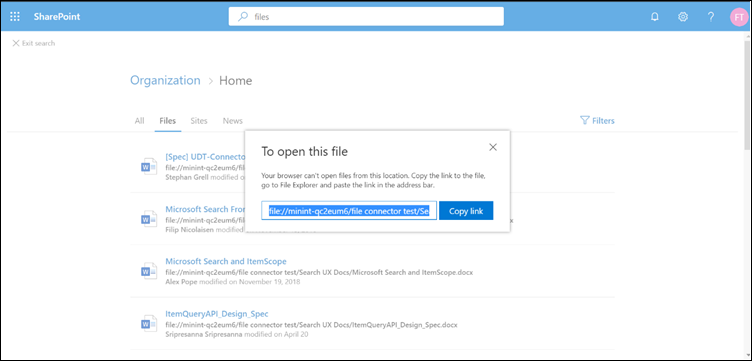

# <a name="file-share-connector"></a><span data-ttu-id="9edb3-103">Соединитель файлов общего доступа</span><span class="sxs-lookup"><span data-stu-id="9edb3-103">File share connector</span></span>

<span data-ttu-id="9edb3-104">С помощью соединителя файлового ресурса пользователи организации могут выполнять поиск в локальных файловых ресурсах.</span><span class="sxs-lookup"><span data-stu-id="9edb3-104">With the File share connector, users in your organization can search on-premises file shares.</span></span> <span data-ttu-id="9edb3-105">Результаты поиска из этих общих файловых ресурсов объединены с результатами из SharePoint и Microsoft OneDrive для бизнеса.</span><span class="sxs-lookup"><span data-stu-id="9edb3-105">The search results from these shares merge with the results from SharePoint and Microsoft OneDrive for Business.</span></span>

<span data-ttu-id="9edb3-106">Эта статья предназначена для администраторов Microsoft 365 или пользователей, которые настраивают, запускают и отслеживают файловый соединитель.</span><span class="sxs-lookup"><span data-stu-id="9edb3-106">This article is for Microsoft 365 administrators or anyone who configures, runs, and monitors a File share connector.</span></span> <span data-ttu-id="9edb3-107">В этой статье объясняется, как настроить возможности соединителя и соединителя, ограничения и способы устранения неполадок.</span><span class="sxs-lookup"><span data-stu-id="9edb3-107">It explains how to configure your connector and connector capabilities, limitations, and troubleshooting techniques.</span></span>

## <a name="install-a-data-gateway"></a><span data-ttu-id="9edb3-108">Установка Data Gateway</span><span class="sxs-lookup"><span data-stu-id="9edb3-108">Install a data gateway</span></span>
<span data-ttu-id="9edb3-109">Чтобы получить доступ к данным третьих сторон, необходимо установить и настроить шлюз Microsoft Power BI Gateway.</span><span class="sxs-lookup"><span data-stu-id="9edb3-109">In order to access your third-party data, you must install and configure a Microsoft Power BI gateway.</span></span> <span data-ttu-id="9edb3-110">Чтобы узнать больше, ознакомьтесь со статьей [Установка и локальный шлюз](https://docs.microsoft.com/data-integration/gateway/service-gateway-install) .</span><span class="sxs-lookup"><span data-stu-id="9edb3-110">See [Install and on-premises gateway](https://docs.microsoft.com/data-integration/gateway/service-gateway-install) to learn more.</span></span>  

## <a name="connect-to-a-data-source"></a><span data-ttu-id="9edb3-111">Подключение к источнику данных</span><span class="sxs-lookup"><span data-stu-id="9edb3-111">Connect to a data source</span></span>
<span data-ttu-id="9edb3-112">На странице " **Подключение к источнику данных** " Создайте папку и предоставьте путь к общему файловому ресурсу.</span><span class="sxs-lookup"><span data-stu-id="9edb3-112">On the **Connect to data source** page, create a folder and provide a path to the file share.</span></span> <span data-ttu-id="9edb3-113">Затем выберите ранее установленный шлюз.</span><span class="sxs-lookup"><span data-stu-id="9edb3-113">Then select your previously installed gateway.</span></span> <span data-ttu-id="9edb3-114">Введите учетные данные для учетной записи пользователя Windows с **доступом на чтение** ко всем файлам в общем ресурсе.</span><span class="sxs-lookup"><span data-stu-id="9edb3-114">Enter the credentials for a Windows user account with **read access** to all the files in the share.</span></span> <span data-ttu-id="9edb3-115">Затем вы можете проверить файлы, присутствующие в общем ресурсе, и просмотреть все извлеченные метаданные.</span><span class="sxs-lookup"><span data-stu-id="9edb3-115">You can then verify the files present in the share and see all the fetched metadata.</span></span>

## <a name="manage-search-permissions"></a><span data-ttu-id="9edb3-116">Управление разрешениями поиска</span><span class="sxs-lookup"><span data-stu-id="9edb3-116">Manage search permissions</span></span>
<span data-ttu-id="9edb3-117">Соединитель файлового ресурса поддерживает только разрешения поиска, видимые **всем пользователям**.</span><span class="sxs-lookup"><span data-stu-id="9edb3-117">The File share connector only supports search permissions visible to **Everyone**.</span></span> <span data-ttu-id="9edb3-118">Индексированные данные отображаются в результатах поиска и видимы всем пользователям в Организации.</span><span class="sxs-lookup"><span data-stu-id="9edb3-118">Indexed data appears in the search results and is visible to all users in the organization.</span></span>

## <a name="set-the-refresh-schedule"></a><span data-ttu-id="9edb3-119">Настройка расписания обновления</span><span class="sxs-lookup"><span data-stu-id="9edb3-119">Set the refresh schedule</span></span>
<span data-ttu-id="9edb3-120">Рекомендуемый интервал расписания обновления по умолчанию равен 15 минутам, но его можно изменить на другой предпочтительный интервал.</span><span class="sxs-lookup"><span data-stu-id="9edb3-120">The recommended default refresh schedule interval is 15 minutes, but you can change it to another interval that you prefer.</span></span>

## <a name="set-up-your-search-results-page"></a><span data-ttu-id="9edb3-121">Настройка страницы результатов поиска</span><span class="sxs-lookup"><span data-stu-id="9edb3-121">Set up your search results page</span></span>
<span data-ttu-id="9edb3-122">Для отображения различных результатов подключения файлов на вкладках " **все** " и " **файлы** " необходимо настроить страницу результатов поисковой системы SharePoint:</span><span class="sxs-lookup"><span data-stu-id="9edb3-122">To display different file connection results in the **All** and **Files** tabs, you need to set up a SharePoint search engine results page:</span></span>
- <span data-ttu-id="9edb3-123">В таблице **ALL** показаны Объединенные результаты из файлов подключения файлов, файлов SharePoint, файлов OneDrive и сайтов SharePoint.</span><span class="sxs-lookup"><span data-stu-id="9edb3-123">The **All** table shows combined results from your file connections, SharePoint files, OneDrive files, and SharePoint sites.</span></span> 
- <span data-ttu-id="9edb3-124">На вертикальном **файлов** отображаются все результаты из ваших подключений, SharePoint и OneDrive.</span><span class="sxs-lookup"><span data-stu-id="9edb3-124">The **Files** vertical shows all file results from your connections, SharePoint, and OneDrive.</span></span>
<span data-ttu-id="9edb3-125">Результаты из файлов подключения добавляются к уже существующим результатам как по вертикали, **так и к** **файлам** .</span><span class="sxs-lookup"><span data-stu-id="9edb3-125">Results from file connections are added to already existing results in both the **All** and **Files** verticals.</span></span>

<span data-ttu-id="9edb3-126">Чтобы настроить страницу результатов поиска, выполните указанные ниже действия.</span><span class="sxs-lookup"><span data-stu-id="9edb3-126">To set up your search results page, take these steps:</span></span>
1. <span data-ttu-id="9edb3-127">Создайте семейство веб-сайтов SharePoint с современной страницей поиска.</span><span class="sxs-lookup"><span data-stu-id="9edb3-127">Create a SharePoint site collection with a modern search page.</span></span>

2. <span data-ttu-id="9edb3-128">Установите [командную консоль SharePoint Online](https://www.microsoft.com/download/details.aspx?id=35588).</span><span class="sxs-lookup"><span data-stu-id="9edb3-128">Install a [SharePoint Online Management Shell](https://www.microsoft.com/download/details.aspx?id=35588).</span></span>

3. <span data-ttu-id="9edb3-129">Откройте командную консоль SharePoint Online от имени администратора и импортируйте модуль **Microsoft. SharePoint. Client. dll** , `C:\Windows\Microsoft.NET\assembly\GAC_MSIL\Microsoft.SharePoint.Client\v4.0_16.0.0.0__71e9bce111e9429c\Microsoft.SharePoint.Client.dll`расположенный по адресу.</span><span class="sxs-lookup"><span data-stu-id="9edb3-129">Open SharePoint Online Management Shell as an administrator and import the **Microsoft.SharePoint.Client.dll** module present at `C:\Windows\Microsoft.NET\assembly\GAC_MSIL\Microsoft.SharePoint.Client\v4.0_16.0.0.0__71e9bce111e9429c\Microsoft.SharePoint.Client.dll`.</span></span>

> [!NOTE]
> <span data-ttu-id="9edb3-130">Этот путь может быть не одинаковым для всех пользователей.</span><span class="sxs-lookup"><span data-stu-id="9edb3-130">This path might not be the same for all users.</span></span>

<span data-ttu-id="9edb3-131">Чтобы импортировать модуль, выполните следующую команду в консоли управления SharePoint Online:</span><span class="sxs-lookup"><span data-stu-id="9edb3-131">To import the module, run this command in SharePoint Online Management Shell:</span></span>
```bash
Import-Module "C:\Windows\Microsoft.NET\assembly\GAC_MSIL\Microsoft.SharePoint.Client\v4.0_16.0.0.0__71e9bce111e9429c\Microsoft.SharePoint.Client.dll" 
```

4. <span data-ttu-id="9edb3-132">Теперь выполните следующий сценарий:</span><span class="sxs-lookup"><span data-stu-id="9edb3-132">Now run this script:</span></span>
```bash
$orgName = Read-Host -prompt 'Please enter your org name'
$userName = Read-Host -prompt 'Enter user name'
$userCreds = Get-Credential -UserName $userName -Message "Type the password"
Connect-SPOService -Url https://$orgName-admin.sharepoint.com -Credential $userCreds

$url = Read-Host -Prompt 'Please enter the site url'
$site = Get-SPOSite -Identity $url
Set-SPOSite $url -DenyAddAndCustomizePages 0

$pwd = Read-Host -AsSecureString 'type the password'
$context = New-Object Microsoft.SharePoint.Client.ClientContext($url)
$credential = New-Object Microsoft.SharePoint.Client.SharePointOnlineCredentials($userName, $pwd)
$context.Credentials = $credential
$web = $context.Web
$context.Load($web)
$web.AllProperties["AllVerticalContent"] = "Combined"
$web.Update()
$context.ExecuteQuery()
$web.AllProperties["FilesVerticalContent"] = "ConnectorsOnly"
$web.Update()
$context.ExecuteQuery()
Set-SPOSite $url -DenyAddAndCustomizePages 1

Write-Host "Success" -ForegroundColor Cyan
Read-Host -Prompt 'Press enter to exit'
```

5. <span data-ttu-id="9edb3-133">Введите необходимые значения в PowerShell, такие как имя Организации, имя пользователя, пароль и URL-адрес сайта.</span><span class="sxs-lookup"><span data-stu-id="9edb3-133">Enter the required values in PowerShell, such as organization name, username, password, and site URL.</span></span> <span data-ttu-id="9edb3-134">**Например**, если учетные данные администратора указаны `admin@a830edad9050849823J19081300.onmicrosoft.com`, то имя вашей организации — **a830edad9050849823J19081300**, а URL-адрес вашего сайта `https:// a830edad9050849823J19081300.sharepoint.com`—.</span><span class="sxs-lookup"><span data-stu-id="9edb3-134">As an **example**, if your admin credentials are `admin@a830edad9050849823J19081300.onmicrosoft.com`, then your organization name is **a830edad9050849823J19081300**, and your site URL is `https:// a830edad9050849823J19081300.sharepoint.com`.</span></span>

> [!NOTE]
> <span data-ttu-id="9edb3-135">Параметр **аллпропертиес** можно выполнить только на уровне семейства веб-сайтов (на сайте Teams/Dataport).</span><span class="sxs-lookup"><span data-stu-id="9edb3-135">The **AllProperties** setting can only be done at a site collection level (Teams/Comms site).</span></span>

6. <span data-ttu-id="9edb3-136">Теперь вы можете искать индексированные файлы и просматривать результаты на вкладках " **все** " и " **файлы** ".</span><span class="sxs-lookup"><span data-stu-id="9edb3-136">Now you can search for indexed files and see results in both the **All** and **Files** tabs.</span></span>

## <a name="search-for-file-share-content-in-the-search-results-page"></a><span data-ttu-id="9edb3-137">Поиск содержимого общего файлового ресурса на странице результатов поиска</span><span class="sxs-lookup"><span data-stu-id="9edb3-137">Search for file share content in the search results page</span></span>
<span data-ttu-id="9edb3-138">Чтобы выполнить поиск индексированного контента, перейдите на домашнюю страницу SharePoint тестового клиента.</span><span class="sxs-lookup"><span data-stu-id="9edb3-138">To search for indexed content, go to the SharePoint home page of your test tenant.</span></span> <span data-ttu-id="9edb3-139">Результаты будут отображаться на вкладках " **все** " и " **файлы** ".</span><span class="sxs-lookup"><span data-stu-id="9edb3-139">Results will be displayed in the **All** and **Files** tabs.</span></span>

<span data-ttu-id="9edb3-140">Из-за ограничений браузера невозможно выбрать результат файла для просмотра или открытия файлов из поиска на локальном общем файловом ресурсе.</span><span class="sxs-lookup"><span data-stu-id="9edb3-140">Because of browser restrictions, you can't select a file result to view or open files from local file share searches.</span></span> <span data-ttu-id="9edb3-141">Чтобы открыть эти файлы, скопируйте ссылку результатов файла и вставьте ее в адресную строку браузера системы.</span><span class="sxs-lookup"><span data-stu-id="9edb3-141">To open these files, copy the file result's link and paste it into the address bar of your system's browser.</span></span> <span data-ttu-id="9edb3-142">Для Windows используйте проводник Windows.</span><span class="sxs-lookup"><span data-stu-id="9edb3-142">For Windows, use Windows Explorer.</span></span> <span data-ttu-id="9edb3-143">После этого вы сможете открыть файл в вашей системе.</span><span class="sxs-lookup"><span data-stu-id="9edb3-143">Then you can open the file on your system.</span></span>



## <a name="troubleshooting"></a><span data-ttu-id="9edb3-145">Устранение неполадок</span><span class="sxs-lookup"><span data-stu-id="9edb3-145">Troubleshooting</span></span>
<span data-ttu-id="9edb3-146">Если при подключении что-то пошло не так, отображается состояние **Failed**.</span><span class="sxs-lookup"><span data-stu-id="9edb3-146">If something is critically wrong with a connection, its status shows as **failed**.</span></span> <span data-ttu-id="9edb3-147">Чтобы получить дополнительные сведения об ошибках трех типов, перейдите на страницу **сведения об ошибке** и выберите неисправное подключение.</span><span class="sxs-lookup"><span data-stu-id="9edb3-147">To get more information on the three types of errors, go to the **error details** page and select the failing connection.</span></span> <span data-ttu-id="9edb3-148">Чтобы узнать больше, ознакомьтесь со статьей [Управление соединителем](manage-connector.md) .</span><span class="sxs-lookup"><span data-stu-id="9edb3-148">See [Manage your connector](manage-connector.md) to learn more.</span></span>
1. <span data-ttu-id="9edb3-149">**Шлюз недостижим (код ошибки: 11)**.</span><span class="sxs-lookup"><span data-stu-id="9edb3-149">**Gateway not reachable (error code: 11)**.</span></span> <span data-ttu-id="9edb3-150">Компьютер шлюза для подключения отключен.</span><span class="sxs-lookup"><span data-stu-id="9edb3-150">The gateway machine for the connection is down.</span></span> <span data-ttu-id="9edb3-151">Проверьте, запущен ли процесс Microsoft Power BI на компьютере шлюза.</span><span class="sxs-lookup"><span data-stu-id="9edb3-151">Verify if the Microsoft Power BI process runs on the gateway machine.</span></span>
2. <span data-ttu-id="9edb3-152">**Ошибка проверки подлинности (код ошибки: 12)**.</span><span class="sxs-lookup"><span data-stu-id="9edb3-152">**Authentication error (error code: 12)**.</span></span> <span data-ttu-id="9edb3-153">Учетные данные, которые использовались для создания подключения, просрочены или больше не являются допустимыми.</span><span class="sxs-lookup"><span data-stu-id="9edb3-153">The credentials that were used for creating the connection expired or are no longer valid.</span></span> <span data-ttu-id="9edb3-154">Чтобы устранить эту ошибку, введите допустимые учетные данные.</span><span class="sxs-lookup"><span data-stu-id="9edb3-154">To resolve this error, enter valid credentials.</span></span>
3. <span data-ttu-id="9edb3-155">**Внутренняя ошибка (код ошибки: все, кроме 11 и 12)**.</span><span class="sxs-lookup"><span data-stu-id="9edb3-155">**Internal error (error code: anything other than 11 or 12)**.</span></span> <span data-ttu-id="9edb3-156">Ошибка в инфраструктуре соединителей.</span><span class="sxs-lookup"><span data-stu-id="9edb3-156">There's an error in the connector infrastructure.</span></span> <span data-ttu-id="9edb3-157">Чтобы узнать, как сообщить об этих ошибках, ознакомьтесь со статьей [обратной связи](connectors-feedback.md) .</span><span class="sxs-lookup"><span data-stu-id="9edb3-157">See the [Feedback](connectors-feedback.md) article to find out how to report these errors.</span></span>

## <a name="limitations"></a><span data-ttu-id="9edb3-158">Ограничения</span><span class="sxs-lookup"><span data-stu-id="9edb3-158">Limitations</span></span>
<span data-ttu-id="9edb3-159">В предварительной версии для соединителя файлового ресурса действуют следующие ограничения:</span><span class="sxs-lookup"><span data-stu-id="9edb3-159">The File share connector has these limitations in the preview release:</span></span>
* <span data-ttu-id="9edb3-160">Индексировать можно только файлы с фиксированными свойствами, а не файлами с настраиваемыми свойствами.</span><span class="sxs-lookup"><span data-stu-id="9edb3-160">You can only index files with fixed properties, not files with custom properties.</span></span>
* <span data-ttu-id="9edb3-161">Списки управления доступом к файловому ресурсу в настоящее время не поддерживаются.</span><span class="sxs-lookup"><span data-stu-id="9edb3-161">File share Access Control Lists (ACLs) aren't currently supported.</span></span>
* <span data-ttu-id="9edb3-162">Внешние удостоверения не поддерживаются.</span><span class="sxs-lookup"><span data-stu-id="9edb3-162">External identities aren't supported.</span></span> <span data-ttu-id="9edb3-163">Они должны быть сопоставлены с удостоверениями Azure Active Directory.</span><span class="sxs-lookup"><span data-stu-id="9edb3-163">They must be mapped to Azure Active Directory identities.</span></span>