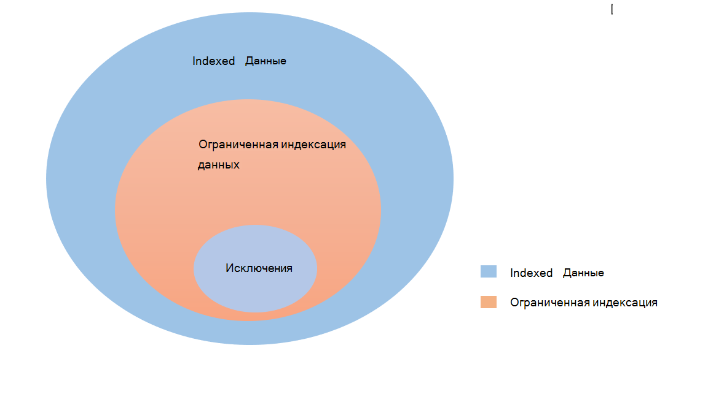

<!---Previous ms.author: rusamai --->

# Соедините Graph файла

Соединители Graph файла позволяют пользователям в организации искать локальное Windows файл.

> [!NOTE]
> Ознакомьтесь [**с статьей Установка Graph,**](configure-connector.md) чтобы понять общий Graph соединители.

## Перед началом работы

### Установка агента Graph соединителя

Чтобы индексировать Windows файл, необходимо установить и зарегистрировать агент Graph соединителя. Дополнительные [Graph](graph-connector-agent.md) см. в Graph агенте соединителя.  

### Требования к контенту

### Типы файлов

Содержимое следующих форматов можно индексировать и искать: DOC, DOCM, DOCX, DOT, DOTX, EML, GIF, HTML, JPEG, MHT, MHTML, MSG, NWS, OBD, OBT, ODP, ODT, ONE, PDF, POT, PPS, PPT, PPTM, PPTM, TXT, XLB, XLC, XLSB, XLSB, XLSX, XLT, XLXM, XML, XPS, and ZIP. Индексация только текстового контента этих форматов. Все мультимедийные материалы игнорируются. Для любого файла, который не относится к этому формату, индексация только метаданных.

### Ограничения на размер файлов

Максимальный размер поддерживаемых файлов — 100 МБ. Файлы, которые превышают 100 МБ, не индексироваться. Максимальное ограничение размера после обработки — 4 МБ. Обработка прекращается, когда размер файла достигает 4 МБ. Поэтому некоторые фразы, присутствующие в файле, могут не работать для поиска.

## Шаг 1. Добавление соединителю Graph в Центр администрирования Microsoft 365

Следуйте общим [инструкциям установки](./configure-connector.md).
<!---If the above phrase does not apply, delete it and insert specific details for your data source that are different from general setup instructions.-->

## Шаг 2. Имя подключения

Следуйте общим [инструкциям установки](./configure-connector.md).
<!---If the above phrase does not apply, delete it and insert specific details for your data source that are different from general setup instructions.-->

## Шаг 3. Настройка параметров подключения

На странице **Подключение** для источника данных  выберите файл и укай имя, код подключения и описание. На следующей странице укажете путь к файлу и выберите ранее установленный агент Graph соединители. Введите учетные данные для [учетной](https://microsoft.com/windows) записи Windows Microsoft с доступом к всем файлам в файле.

### Сохранение последнего времени доступа

При попытке подключения обхода файла обновляется поле "время последнего доступа" в метаданных. Если вы зависите от этого поля для любых решений архивации и резервного копирования и не хотите обновлять его при доступе к нему соединителя, вы можете настроить этот параметр на странице **Расширенные параметры.**

## Шаг 4. Ограничения для индексации файлов

При настройке соединения с файлами у администратора будет возможность ограничить индексацию файлов и папок. Это можно сделать несколькими способами:

#### На основе типов файлов

Индексация только текстового контента этих форматов: DOC, DOCM, DOCX, DOTX, EML, HTML, MHT, MHTML, MSG, NWS, OBD, OBT, ODP, ODS, ODT, ONE, PDF, POT, PPS, PPT, PPTM, PPTM, TPTX, TXT, XLB, XLC, XLSB, XLS, XLSX, XLXM, XML, XPS. Для мультимедийных файлов и файлов, которые не относятся к этому формату, индексация только метаданных.

#### На основе последней измененной даты или числа дней с момента последней модификации

#### Полный сетевой путь файла/папки или регулярного выражения для ограничения индексации 

В сетевом пути используйте символ побега \\ () перед специальными символами, как \\ . Пример. Для пути CONTOSO FILE SHAREDFOLDER правильный способ ввода \\ \\ \\ \\ — \\ \\ \\ \\ CONTOSO \\ \\ FILE \\ \\ SHAREDFOLDER

Правила написания регулярных выражений можно найти [здесь](https://docs.microsoft.com/dotnet/standard/base-types/regular-expression-language-quick-reference)

Администратор также будет иметь возможность сделать исключение из правила ограничения. Приоритет правила исключения будет вытеметь правила ограничения. Аналогичным образом исключение можно определить путем предоставления пути папки и файла для элементов, которые мы хотим включить в индексацию.

## Шаг 5. Управление разрешениями на поиск

Вы можете ограничить разрешение на поиск любого файла на основе списков управления доступом к share или списков управления доступом к новой системе доступа NTFS, выбрав нужный вариант на странице Управление разрешениями на **поиск.** Учетные записи и группы пользователей, указанные в этих списках управления доступом, должны управляться службой Active Directory (AD). Если вы используете любую другую систему управления учетными записями пользователей, вы можете выбрать параметр "все", который позволяет пользователям искать все файлы без каких-либо ограничений доступа. Однако, когда пользователи пытаются открыть файл, применяются элементы управления доступом, установленные в источнике.

Обратите внимание, что windows по умолчанию предоставляет разрешение "Чтение" на "Все" в share ACLs при совместном доступе папки в сети. Кроме того, если вы выбираете share ACLs в **Управлении** разрешениями на поиск, пользователи смогут искать все файлы. Если вы хотите ограничить доступ, удалите доступ "Чтение" для "Все" в файлах и предограничите доступ только нужным пользователям и группам. Соединительные данные считываю эти ограничения доступа и применяем их для поиска.

Вы можете выбрать ALS share только в том случае, если предоставленный путь к совместной информации следует формату пути UNC. Вы можете создать путь в формате UNC, переехав в раздел "Расширенный общий доступ" в разделе "Общий доступ".

## Шаг 6. Назначение меток свойств

Следуйте общим [инструкциям установки](./configure-connector.md).
<!---If the above phrase does not apply, delete it and insert specific details for your data source that are different from general setup instructions.-->

## Шаг 7. Управление схемой

Следуйте общим [инструкциям установки](./configure-connector.md).
<!---If the above phrase does not apply, delete it and insert specific details for your data source that are different from general setup instructions.-->

## Шаг 8. Выбор параметров обновления

Следуйте общим [инструкциям установки](./configure-connector.md).
<!---If the above phrase does not apply, delete it and insert specific details for your data source that are different from general setup instructions.-->

## Шаг 9. Просмотр подключения

Следуйте общим [инструкциям установки](./configure-connector.md).
<!---If the above phrase does not apply, delete it and insert specific details for your data source that are different from general setup 
instructions.-->

<!---## Troubleshooting-->
<!---Insert troubleshooting recommendations for this data source-->

<!---## Limitations-->
<!---Insert limitations for this data source-->
