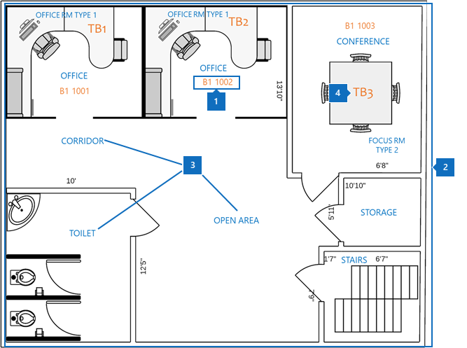
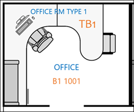
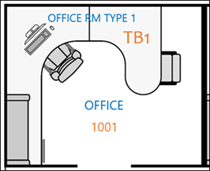
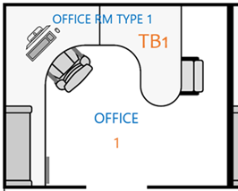

# РекомендацииBest practices

Для успешной реализации планов этажей Microsoft Search необходимо координировать три части данных:To successfully implement Microsoft Search floor plans, you need to coordinate three pieces of data:

- **Построение данных о расположении**: какой формат и как добавить?**Building location data**: What format and how to add?
- **Карта плана этажа в формате DWG**: как просматривать и какие данные должны содержаться для достижения максимального успеха?**Floor plan map in DWG format**: How to view and what data should it contain for maximum success?
- **Местонахождение сотрудника в [Azure Active Directory (Azure AD)](https://azure.microsoft.com/services/active-directory/)**: какой формат использовать и как добавить?**Employee office location in [Azure Active Directory (Azure AD)](https://azure.microsoft.com/services/active-directory/)**: What format to use and how to add?  

Рекомендации по развертыванию планов на основания поиска Майкрософт также описаны в следующих разделах.The best practices for deploying Microsoft Search floor plans are also described in the following sections.

## Построение данных о расположенииBuilding location data
Перед добавлением планов этажей необходимо добавить здания в расположения поиска Майкрософт.Before you add floor plans, you need to add your buildings to Microsoft Search locations. Предоставьте следующие необходимые данные для построения:Provide the following required building data:

|Необходимые данные для построенияRequired building data  |ПримерExample  |
|---------|---------|
|ИмяName     |    Здание 1, Нью — городBuilding 1, New York City     |
|Адрес (улица, дом)Street address     |     123 любой способ, Нью Йорк, Россия 10118123 Any Avenue, New York, NY 10118  |
|Широта-Долгота (необязательно)Latitude-longitude  (optional)   |    40,760539, 73,97534140.760539, -73.975341      |
|Ключевые словаKeywords     |    Нью-Йорк Office, здание 1, главный офис, штаб-квартираNew York Office, Building 1, main office, headquarters     |

Вы можете добавить несколько зданий за раз, используя функцию **импорта** на вкладке " **расположения** " вместо того, чтобы добавлять расположения по одному.You can add many buildings at a time by using the **Import** feature in the **Locations** tab instead of adding locations one at a time. С помощью функции **импорта** вы можете указать широту и долготу.With the **Import** feature, you can specify the latitude-longitude. Более подробную информацию можно узнать в статье [Manage Locations](manage-locations.md).For more information, see [Manage locations](manage-locations.md).

## Схема плана этажа в формате DWGFloor plan map in DWG format
Для создания карт в Microsoft Search необходимо загрузить планы этажей в формате DWG с определенными сведениями.To build maps in Microsoft Search, you need to upload floor plans in DWG format with specific information. Сведения о том, как создавать и просматривать файлы в формате DWG, можно найти в разделе [читатели DWG](https://www.autodesk.in/products/dwg).To learn how to create and view DWG-formatted files, see [DWG Viewers](https://www.autodesk.in/products/dwg). 

Карты плана этажей отображают четыре элемента:Floor plan maps display four elements:

1. **Номера комнат**: в приведенном ниже примере номера комнат задаются как **B1 1001** и **B1 1002**.**Room numbers**: In the following example, room numbers are defined as **B1 1001** and **B1 1002**. **B1** — это код здания, а 1001 содержит пол с номером **1** и номером для Office **001**.**B1** is the building code, and 1001 contains the floor number **1** and the office number **001**.
1. **Макеты помещений.**: для уточнения сведений о совместном использовании нескольких пользователей несколькими пользователями можно определять макеты, такие как стулья и стол.**Room layouts.**: To help clarify details when multiple users share an office, you can define layouts like chairs and desk.
1. **Типы помещений**: некоторые примеры включают Office, корридор, область открытия и туалет.**Room types**: Some examples include office, corridor, open area, and toilet.
1. **Сведения об активе**: Если пользователи находятся в открытом пространстве, вы можете обозначить, на каких рабочих столах они располагаются.**Asset info**: If users are in an open space, you can denote which desk they sit at. В этом примере рабочие столы обозначаются **TB1** и **TB2**.In this example, the desks are denoted by **TB1** and **TB2**.

На этой схеме номера комнат являются наиболее важными элементами.In this diagram, room numbers are the most important item. Они сопоставлены с местом комнаты пользователя в учетной записи пользователя, как показано на следующем рисунке.They're mapped to a person’s office location on their user account as shown in the following image.

Эти сведения хранятся в Azure AD в свойстве **фисикалделиверйоффиценаме** .This information is stored in Azure AD in the **PhysicalDeliveryOfficeName** property. В [центре администрирования](https://admin.microsoft.com)Microsoft 365 он называется свойством **Office** и может быть добавлен в поле **Активные пользователи**.In the Microsoft 365 [admin center](https://admin.microsoft.com), it’s called the **Office** property and can be added in **Active users**.

### Файлы DWGDWG files
Microsoft Search требует файлы плана этажа в DWG, который форматирует формат чертежа AutoCAD.Microsoft Search requires floor plan files in DWG, which is format an AutoCAD drawing format. Файлы должны содержать **Макет** и данные **меток** .The files must contain **layout** and **label** data. **Номера комнат** — это наиболее важные метки для планов этажей.**Room numbers** are the most important labels for floor plans.

Рекомендуется создать систему нумерации Office с помощью метода точного совпадения, показанного в следующей таблице.We recommend that you create your office numbering system with the exact match method shown in the following table. Но вы не ограничены этими метками.But you aren't limited to that labeling. Например, если расположение Office пользователя в Azure AD — **B1 1001**, можно добавить номер комнаты в файл DWG с любым из приведенных ниже вариантов.For example, if the user's office location in Azure AD is **B1 1001**, you can label the room number in the DWG file with any of the options that follow.

|ПОИСКПОЗMatch  |СтруктураLayout  |
|---------|---------|
|Точное совпадение с расположением в офисе (рекомендуется)Exact match to office location (Recommended)   **B1 1001****B1 1001**   Построение кода: B1Building code: B1 Пол: 1Floor: 1  Номер комнаты: 001Room number: 001    |         |
|Сравнение основания и номера комнатыMatch floor and room number   **1001****1001** Пол: 1Floor: 1  Номер комнаты: 001Room number: 001    |      |
|Только номер комнатыMatch room number only   **1,1****1** Номер комнаты: 1Room number: 1        |         |

## Местоположение Office для учетной записи пользователяUser account office location
Чтобы сопоставить местонахождение сотрудника, Номера комнат в файлах DWG сопоставляются с расположениями Office в учетной записи пользователя в Azure AD.To map an employee’s location, the room numbers in DWG files are mapped to office locations in the user’s account in Azure AD. Свойство **Location в офисе** должно сопоставлено с информацией о расположении комнаты в файле DWG.The **Office location** property needs to match the office location information in the DWG file.

В следующей таблице приводятся рекомендации по сопоставлению данных о расположении:The following table explains best practices for mapping location data:

|РекомендацияBest practice  |ОбъяснениеExplanation |
|---------|---------|
|Включать код здания, этаж и номер комнаты.Include building code, floor, and room number.     |   Эти данные дают вам лучший шанс выполнить точное совпадение.This data gives you the best chance to make exact matches.     |
|Добавить разделитель после построения кодов и этажей.Include a separator after building codes and floors.     |  Разделяйте коды здания с помощью разделителей и пробелов, как показано в следующих примерах:Separate building codes from floor and room numbers with a separator or a space, as in these examples:  B1 1001B1 1001  B1/1001B1/1001   B1 – 1001B1-1001   |
|Номер комнаты всегда следует за сведениями о создании кода, крыло и пола.Room number always follows building code, wing, and floor information.     |  Если номер комнаты равен **1001**, установите для расположения Office значение **B1 1001**, **B1/1001**или **B1-1001**.If room number is **1001**, then set the office location to **B1 1001**, **B1/1001**, or **B1-1001**.   Если номер комнаты — **F1-001**, установите для расположения Office значение **B1 F1-001** или **B1/F1-001**.If the room number is **F1-001**, then set the office location to **B1 F1-001** or **B1/F1-001**.   Если номер комнаты равен **1**, установите для расположения Azure AD значение **B1 1001**, **B1/1001**или **B1-F1-001**.If the room number is **1**, then set the Azure AD location to **B1 1001**, **B1/1001**, or **B1-F1-001**.       |
|

## Дальнейшие действияNext steps
[Управление расположениямиManage locations](manage-locations.md) 
[Управление планами этажейManage floor plans](manage-floorplans.md)