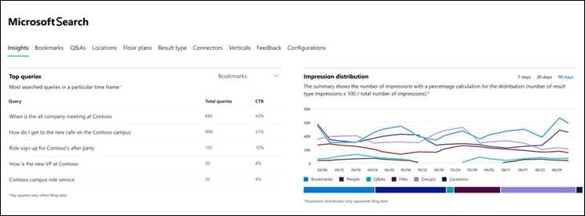
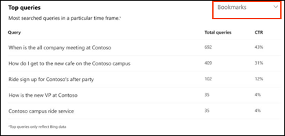
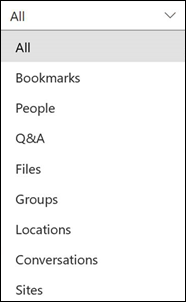
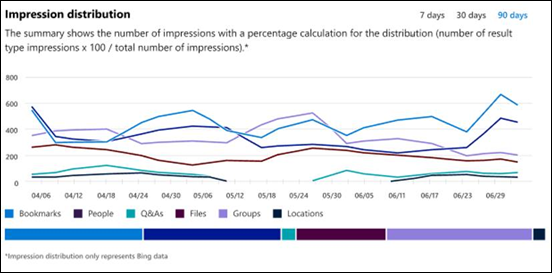

# Отчеты Аналитики Microsoft Search на информационной панелиMicrosoft Search Insights dashboard reports

Вы можете использовать панель мониторинга Microsoft Search Insights, чтобы управлять данными [Bing](https://Bing.com) для ваших опубликованных ответов.You can use the Microsoft Search Insights dashboard to manage [Bing](https://Bing.com) data for your published answers. Это всего лишь одно из действий, необходимых для [упрощения поиска контента](make-content-easy-to-find.md) для пользователей.This is just one of the steps needed to [make content easy to find](make-content-easy-to-find.md) for your users.

При первом переходе в Microsoft Search в [центре администрирования microsoft 365](https://admin.microsoft.com)вы можете указать на панели мониторинга Insights.When you first go to Microsoft Search in the [Microsoft 365 admin center](https://admin.microsoft.com), you enter on the Insights dashboard.

В панели мониторинга Insights доступны следующие отчеты.The following reports are available on the Insights dashboard.

> [!NOTE]
> Данные в отчетах представляют только данные [Bing](https://Bing.com) .The data in the reports only represents [Bing](https://Bing.com) data.

## Самые популярные запросыTop queries

В этом отчете приводятся подробные сведения о первых 2000 запросах поиска [Bing](https://Bing.com) , которые запускаются пользователями.This report gives details about the top 2000 [Bing](https://Bing.com) search queries that users run. Чтобы запрос отображался в **самых популярных запросах**, запрос должен получить по крайней мере три щелчка мыши.For a query to appear in **Top queries**, the query must get at least three clicks.

Минимальная частота прокрутки означает, что пользователи не смогут найти то, что вам нужно.A low click-through rate (CTR) means that users aren’t finding what they’re looking for.

Вы можете выбрать различные представления отчета, выполнив фильтрацию по типу ответа.You can choose different views of the report by filtering on the type of answer. Например, если нужно только просмотреть самые популярные запросы для закладок, выберите раскрывающийся список в правом верхнем углу отчета, а затем выберите **закладки**.For example, if you just want to view the top queries for Bookmarks, select the drop-down in the upper-right corner of the report, and then select **Bookmarks**. По умолчанию отображаются **все** типы ответов.By default, **All** answer types are shown.

## Распространение впечатленияImpression distribution

В этом отчете показано распределение выдачи в [Bing](https://Bing.com) с течением времени для различных ответов.This report shows impression distribution in [Bing](https://Bing.com) over time for various answers. Примеры: закладки, люди, Q&A, файлы, расположения, файловые сайты, группы и беседы.Examples are bookmarks, people, Q&A, files, locations, file sites, groups, and conversations.

Распределение впечатления помогает администраторам определить, какие пользователи ищут в течение указанного периода.Impression distribution can help admins understand what users look for during a specified period.
