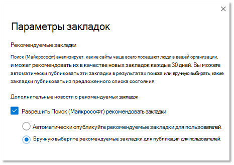

# Управление закладками

Закладки помогают людям быстро находить важные сайты и средства только с помощью поиска. Каждая закладка включает в себя заголовок, URL-адрес, набор ключевых слов, которые могут быть удобными для пользователя, чтобы вызвать закладки, и категорию.

## Что делает большую закладку

Большая закладка имеет четыре ключевых элемента:

1. Сильное, информативное **название**. Цель не более восьми слов или около 60 символов максимум. Вы хотите, чтобы пользователи щелкнули название и просмотрели содержимое, но избегали очевидных кликбайт:
    - Хорошо. Попробуйте вкусные избранное на этой неделе из меню кафетерий. Заголовок понятен, лаконичен и интересен, но может быть перепроизводство.
    - Лучше: меню кафетерий на этой неделе. Не перепроизводит и не звучит, как в качестве ad.
    - Избегайте. Вы не поверите, что придет в меню кафетерий на этой неделе. Использует клише clickbait, которые звучат как ad.
2. Краткое описание **,** около 300 символов, которое суммирует назначение или функциональность связанного ресурса.
3. Коллекция ключевых **слов,** которые помогут людям найти закладки при поиске. Мы предлагаем минимум пять ключевых слов. Кроме того, включите варианты, которые люди в вашей организации могут использовать, например, обеденное меню, меню обедов и меню кафе, которые могут быть вариациями для меню кафетериев.
4. Полезный набор **категорий,** упрощает сортировку и фильтрацию закладки в центре администрирования. Пользователи никогда не видят заданной категории.

## Создание ответов на закладки

В [Центр администрирования Microsoft 365](https://admin.microsoft.com/)перейдите [к](https://admin.microsoft.com/Adminportal/Home#/MicrosoftSearch/bookmarks) закладки и выберите, как создать новые закладки:

- Добавление закладок
- Результаты SharePoint импорта
- Добавление закладки по умолчанию и предлагаемых закладок
- Импорт закладок
- Публикация или обзор рекомендуемых закладок

### Добавление закладок

Администраторы и редакторы поиска могут добавлять закладки в Центр администрирования Microsoft 365 и публиковать или сохранять их для разработки. Публикация закладки немедленно обновляет индекс поиска, что сразу же делает его обнаруживаемым для пользователей. Вы также можете запланировать закладку, указав дату и время ее публикации.

- **Опубликовано.** Закладки доступны пользователям организации через Поиск (Майкрософт).
- **Проект.** Закладки, сохраненные в качестве черновиков, недоступны для пользователей. Используйте этот статус, если вы или другие заинтересованные стороны хотите просмотреть или обновить закладки перед их публикацией.
- **Запланированные**: закладки, которые будут опубликованы в указанную дату и время.

Вы можете использовать расширение браузера Поиск (Майкрософт) создателя контента, чтобы легко добавлять закладки. Просто перейдите на сайт, который нужно добавить в качестве закладки, и нажмите кнопку Добавить в расширении. Чтобы установить расширение для Microsoft Edge Или Google Chrome, перейдите в веб-магазин [Chrome](https://chrome.google.com/webstore/detail/microsoft-search-content/nocnablpaoeecfmfnjoheefkogmleipm) и добавьте его в браузер.

### Результаты SharePoint импорта

Если ваша организация настроит в SharePoint повышенную результативность, можно импортировать названия, URL-адреса и описания из продвигаемого результата для клиента в Поиск (Майкрософт) и сделать импортируемый контент доступным для пользователей. В большинстве случаев импорт SharePoint результатов занимает всего несколько минут. При импорте большого количества результатов может потребоваться до 48 часов. Это простой способ быстро заполнить результаты поиска и сделать его более эффективным для пользователей. Мы рекомендуем использовать продвигаемые результаты из SharePoint в качестве ссылки, чтобы понять, как назвать и создать соответствующие результаты поиска.

### Добавление закладки по умолчанию и предлагаемых закладок

Мы включили некоторые закладки по умолчанию, которые могут оказаться полезными для пользователей, включая закладки для отдела кадров, преимущества, ИТ-поддержку, управление паролями и другие. Просмотрите, обновите и опубликуйте эти предложенные закладки, чтобы сразу предоставить пользователям высококачественные результаты.

Пользователи также могут предложить закладки, которые хотели бы видеть добавленные с помощью ссылок обратной связи в Поиск (Майкрософт). Их рекомендации будут отображаться в качестве закладки.

### Импорт закладок

Используйте функцию Import, чтобы сделать добавление или редактирование большого количества закладок быстрее и проще. Используйте его для:

- Массовое добавление закладок: добавьте сведения в файл шаблона закладок и импортируете его.
- Массовые закладки для редактирования: экспорт закладок в файл .csv, изменение сведений о закладки в экспортируемом файле, а затем импортируем измененный файл.

Несколько важных моментов в файле шаблона:

- Никогда не редактировать данные в этих полях: *ID,* *Last Modified* и Last *Modified By*
- Если вы включаете *ID* существующей закладки, она будет заменена сведениями в файле импорта.
- Для существующих закладок с одинаковым названием или URL-адресом закладки будут обновлены сведениями в файле импорта.
- В файле шаблона требуются не все поля, а обязательные поля различаются в зависимости от состояния закладки.
- На основе *поля состояния* закладки будут сохранены в качестве черновика, предложенного, запланированного, исключенного или будут опубликованы автоматически.
- Для партнеров, которые управляют несколькими организациями, вы можете экспортировать закладки из одной организации и импортировать их в другую. Но перед импортом необходимо удалить данные в столбце *ID.*

### Предотвращение ошибок импорта

Если любые обязательные данные отсутствуют или являются недопустимыми, возникает ошибка и создается файл журнала с дополнительной информацией о строках и столбцах, подлежащих исправлению. Внесите необходимые изменения и повторите импорт файла. Вы не можете импортировать или сохранять закладки до тех пор, пока не будут устранены все ошибки.

Чтобы избежать ошибок, убедитесь, что файл импорта правильно отформатирован и:

- содержит строку заголовка и все столбцы из шаблона импорта;
- порядок столбцов совпадает с шаблоном импорта;
- Все столбцы имеют значения, за исключением трех, которые могут быть пустыми: *ID,* *Last Modified* и Last *Modified By*
- Столбец *State* не пустой, это необходимые сведения
- При импорте опубликованных, предложенных, запланированных или черновиков закладки  требуются столбцы *Title,* *URL-адрес* и ключевые слова
- При импорте исключенных закладок требуется столбец *URL-адреса*

Чтобы предотвратить ошибки дублирования закладок к закладке:

- Не используйте дубликаты URL-адресов для разных закладок. Если URL-адрес назначен другому закладки и вы пытаетесь добавить его снова из импортного файла, вы получите ошибку. Это также относится к дублированию URL-адресов для других типов ответов.
- При обновлении существующих закладок используйте столбец *ID закладки.* Вы можете обновить любое другое свойство существующей закладки, например ключевое  слово или описание, но убедитесь, что закладки есть в соответствующем столбце импортного файла. Если *закладки есть,* он не будет рассматриваться как новое добавление и не будет обрабатываться как ошибка.

### Публикация или обзор рекомендуемых закладок

Чтобы уменьшить усилия вручную, необходимые для добавления закладок, Поиск (Майкрософт) можете оценить ссылки SharePoint организации и рекомендовать закладки. Вы можете просмотреть их перед публикацией или установить их для автоматической публикации. Для рекомендуемых закладок не требуется настройка, они включены и задаются для автоопубликовки по умолчанию. Чтобы изменить эти параметры в любое время, выберите **Управление** закладки, чтобы открыть панель параметров закладки.

Если включены рекомендуемые закладки, то в движке рекомендаций SharePoint сайтов в организации для определения ссылок с высоким трафиком. После начального периода оценки рекомендуемые закладки будут либо автоматически опубликованы, либо добавлены в список предлагаемых закладок. Затем начнется следующий цикл — 30-дневный период оценки, за которым следует автообнабжание или добавление предложенных закладок.

Мы рекомендуем администраторам поиска или редакторам регулярно проверять эти автообналищенные или предложенные закладки. Кроме того, рекомендуемые закладки никогда не будут включать URL-адреса, найденные в существующих опубликованных, предложенных, запланированных или исключенных закладок.

Чтобы убедиться, что только пользователи с доступом увидят рекомендуемую закладки в результатах работы, для всех рекомендуемых закладки включена функция проверки доступа. Пользователи никогда не увидят рекомендуемую закладки для SharePoint сайта, к который они не могут получить доступ. Эта проверка доступа контролируется параметром **Только** люди с доступом к этой ссылке в параметре Группы для каждой рекомендуемой закладки.

Проверка доступа остановится, если URL-адрес в рекомендуемой закладке или параметре Группы изменен.

Чтобы предотвратить публикацию или предложение закладки на определенном сайте, можно добавить URL-адрес в исключенный список. Движок рекомендаций никогда не публикует и не предлагает закладку для исключенного сайта или страницы на исключенном сайте.

## Ключевые слова и зарезервированные ключевые слова

Закладки могут иметь несколько ключевых слов и использовать одно и то же ключевое слово, но зарезервированное ключевое слово не может быть общим. Зарезервированное ключевое слово — это уникальный термин или фраза, которые запускают одну определенную закладку. Зарезервированное ключевое слово может быть связано только с одним ответом. Используйте зарезервированные ключевые слова экономно.

## Вопросы и ответы

**В. Сколько времени нужно для того, чтобы закладки были видны в Поиск (Майкрософт) после публикации?**

**A:**  Закладка доступна в Поиск (Майкрософт) сразу после публикации.

**В. Сколько времени нужно для появления рекомендуемой закладки?**

**A:**  Рекомендуемые закладки будут отображаться в Поиск (Майкрософт) только в том случае, если включены как рекомендуемые закладки, так и автообнабжание. В течение начального периода оценки в механизме рекомендаций будет оцениваться SharePoint трафика для определения подходящих закладок, а затем их автообназначения. После публикации они сразу становятся доступными в Поиск (Майкрософт).

**Вопрос: Сколько времени займет удаление удаленной закладки из результатов Поиск (Майкрософт)?**

**A.** Удаленные закладки немедленно удаляются из результатов работы.

**В. Будет Поиск (Майкрософт) закладки с сайтов на всех языках?**

**A.** Да, Поиск (Майкрософт) могут рекомендовать закладки с любого SharePoint сайта, независимо от языка.

**В. Можно ли перестать показывать рекомендуемые закладки в результатах поиска?**

**A:** Чтобы перестать показывать рекомендуемые закладки, отключите автообнаводку в центре администрирования. Рекомендуемые закладки будут добавлены в список предлагаемых закладок.

**В. Как определить рекомендуемую закладки в результатах поиска или центре администрирования?**

**A:** В результатах поиска рекомендуемые закладки включают фразу "Предложено для вас" перед URL-адресом. В центре администрирования рекомендуемые закладки будут иметь значение Owner "SYSTEM".

**В. Как управлять доступом к рекомендуемой закладке?**

**A.** Движок доступа, спроектированный корпорацией Майкрософт, определяет, доступен ли URL-адрес закладки конкретному пользователю и будет показывать рекомендуемый закладки только правильной аудитории. Однако, если URL-адрес изменен или параметр Группы изменен, инженерный двигатель доступа будет отключен.

**Вопрос: Что произойдет, если в рекомендуемые закладки, добавленные в предложенный список, не будут приняты меры?**

**A.** Чтобы избежать большого объема закладок в предлагаемом списке, рекомендуемая закладка (владелец = SYSTEM) будет стерта через 180 дней.

**В. Где найти код приложения для power App?**

**A.** Перейдите Power Apps веб-сайт и просмотреть области Подробные сведения для приложения. Узнайте больше о [получении ID приложения.](/powerapps/maker/canvas-apps/get-sessionid#get-an-app-id)