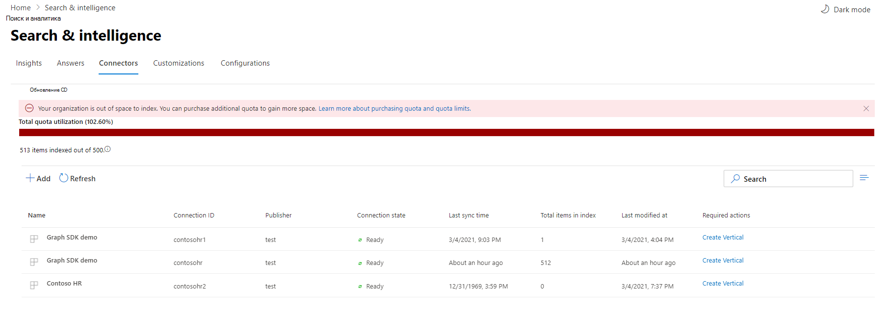

<!-- markdownlint-disable no-inline-html -->

# Мониторинг подключенийMonitor your connections

Чтобы получить доступ к соединитетелям и управлять ими, необходимо назначить вас администратором поиска для клиента.To access and manage your connectors, you must be designated as a search administrator for your tenant. Обратитесь к администратору клиента для предоставления вам роли администратора поиска.Contact your tenant administrator to provision you for the search administrator role.

## Операции подключенияConnection Operations

Перейдите на [вкладку Соединители](https://admin.microsoft.com/Adminportal/Home#/MicrosoftSearch/Connectors) в центре администрирования [Microsoft 365.](https://admin.microsoft.com)Navigate to the [Connectors tab](https://admin.microsoft.com/Adminportal/Home#/MicrosoftSearch/Connectors) in the [Microsoft 365 admin center](https://admin.microsoft.com).

Для каждого типа соединители центр администрирования [Microsoft 365](https://admin.microsoft.com) поддерживает операции, показанные в следующей таблице:For each connector type, the [Microsoft 365 admin center](https://admin.microsoft.com) supports the operations shown in the following table:

OperationOperation | Соединители Graph от МайкрософтGraph connectors by Microsoft | Соединители партнер или графPartner or Graph connectors
--- | --- | ---
Добавление подключенияAdd a connection | :heavy_check_mark: (См. [обзор установки)](configure-connector.md)(See [Setup overview](configure-connector.md)) | :x: (Обратитесь к партнеру или настраиваемой соединители администратора UX)(Refer to your partner or custom-built connector admin UX)
Удаление подключенияDelete a connection | :heavy_check_mark: | :heavy_check_mark:
Изменение опубликованного подключенияEdit a published connection | :heavy_check_mark: имя и описаниеName and Description   :heavy_check_mark: параметры подключенияConnection settings   :heavy_check_mark: метки свойствProperty labels   :heavy_check_mark: схемаSchema   :heavy_check_mark: расписание обновленияRefresh schedule   | :heavy_check_mark: ИмяName   :heavy_check_mark: ОписаниеDescription
Изменение подключения к проектуEdit a draft connection | :heavy_check_mark: | :x:

## Мониторинг состояния подключенияMonitor your connection state

После создания подключения количество обработанных элементов отображается на вкладке **Соединители** на странице **Microsoft Search.**After you create a connection, the number of processed items shows on the **Connectors** tab on the **Microsoft Search** page. После успешного завершения начального полного обхода отображается прогресс для периодического инкрементного обхода.After the initial full crawl completes successfully, the progress for periodic incremental crawls displays. На этой странице представлена информация о ежедневной работе соединиттеля и обзор журналов и истории ошибок.This page provides information about the connector's day-to-day operations and an overview of the logs and error history.

Четыре состояния показываются в **столбце Состояние** для каждого подключения:Four states show up in the **State** column against each connection:

* **Синхронизация**.**Syncing**. Соединители обхода данных из источника, чтобы индексировать существующие элементы и делать какие-либо обновления.The connector is crawling the data from the source to index the existing items and make any updates.

* **Готово.** Подключение готово, и не существует активного обхода, запущенного против него.**Ready**: The connection is ready, and there's no active crawl running against it. **Последнее время синхронизации** указывает, когда был последний успешный обход.**Last sync time** indicates when the last successful crawl happened. Подключение свежо, как и время последней синхронизации.The connection is as fresh as the last sync time.

* **Приостановлено**.**Paused**. Обходы приостановлены администраторами с помощью параметра паузы.The crawls are paused by the admins through the pause option. Следующий обход выполняется только при возобновлении вручную.The next crawl runs only when it's manually resumed. Однако данные из этого подключения по-прежнему можно искать.However, the data from this connection continues to be searchable.

* **Не удалось**.**Failed**. При подключении был критический сбой.The connection had a critical failure. Эта ошибка требует ручного вмешательства.This error requires manual intervention. Администратору необходимо принять соответствующие меры на основе показанного сообщения об ошибке.The admin needs to take appropriate action based on the error message shown. Данные, индексируемые до момента ошибки, можно найти.Data that was indexed until the error occurred is searchable.

## Мониторинг использования квот индексаMonitor your index quota utilization

Доступная квота индекса и потребление отображаются на странице посадки соединителов.The available index quota and consumption is displayed on the connectors landing page.

 
>[!NOTE]
>В период предварительного просмотра каждая организация, пробуя соединители Graph, была предоставлена бесплатная фиксированная квота до 2 миллионов элементов во всех подключениях.During the preview period, every organization trying out Graph connectors was provided a free fixed quota of up to 2 million items across all connections. При общем доступе соединителов Graph бесплатная квота истекает 1 апреля 2021 г. для тех организаций, которые использовали соединители Graph в предварительном просмотре.With Graph connectors being generally available, the free quota will expire on April 1st, 2021 for those organizations who have been using Graph connectors in preview.
>Соединители графа, построенные Корпорацией Майкрософт, помеченные как ["Preview",](connectors-preview.md) не будут включены в общую квоту заряженных индексов для вашей организации.Microsoft-built Graph connectors labeled as ["Preview"](connectors-preview.md) will not be included in the total charged index quota for your organization. Однако он будет учитывать максимальное число из 10 подключений, которые можно настроить для организации, и максимальное число 7 миллионов элементов, которые организация может индексировать по подключениям; каждое подключение ограничено 700 000 элементов.However, it will count towards the max number of 10 connections you can configure for your organization and the max number of 7 million items your organization can index across connections; each connection is limited 700,000 items. 

В панели использования квот будут указаны различные состояния, основанные на потреблении квот вашей организацией:The quota utilization bar will indicate various states based on consumption of quota by your organization:

СостояниеState | Уровни использования квотQuota utilization levels
--- | --- 
NormalNormal | 0-79%0-79%
ВысокаяHigh | 80-89%80-89%
КритическийCritical | 90%-99%90%-99%
FullFull | 100 %100%

<!-- 

-->

Кроме того, с каждым подключением будет отображаться количество индексных элементов.The number of items indexed will also be displayed with each connection. Количество элементов, индекс которых индексироваться каждым подключением, вносит вклад в общую квоту, доступную для вашей организации.The number of items indexed by each connection contributes to the total quota available for your organization.

Когда квота индексов будет превышена для вашей организации, все активные подключения будут влиять, и эти подключения будут работать в **пределе, превышаемом** состоянии.When index quota is exceeded for your organization, all active connections will be impacted, and those connections will operate in **limit exceeded** state. В этом состоянии активные подключенияIn this state, your active connections  

* Не удастся добавить новые элементы.Will not be able to add new items.

* Сможет обновлять или удалять существующие элементы.Will be able to update or delete existing items.

Чтобы исправить это, вы можете сделать любой из следующих ниже.To fix this, you can do any of the following:

* Узнайте, как приобрести квоту индекса для организации в рамках [требований к лицензированию и ценообразования.](licensing.md)Learn how to purchase index quota for your organization at [Licensing requirements and pricing](licensing.md).

* Определение подключений, в которых слишком много контента передается, и обнови их, чтобы индексировать меньше элементов, чтобы у них было место для квоты.Identify connections which have too much content being ingested and update them to index fewer items to make room for quota. Чтобы обновить подключение, необходимо удалить и создать новое подключение с новым фильтром ingestion, который приносит меньше элементов.To update the connection, you must delete and create a new connection with a new ingestion filter which brings in fewer items.

* Постоянное удаление одного или более подключенийPermanently delete one or more connections
