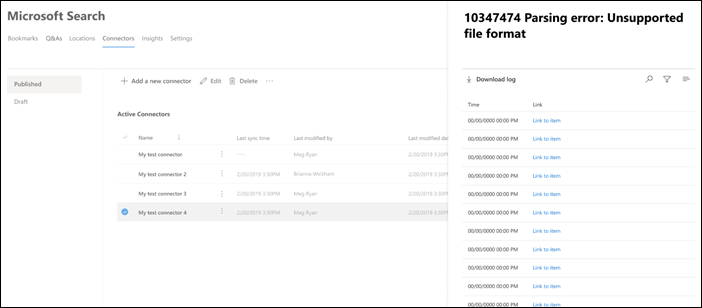

<!-- markdownlint-disable no-inline-html -->
# Управление соединителем для поиска МайкрософтManage your connector for Microsoft Search

Для доступа к соединителям и управления ими их необходимо назначить администратором поиска для вашего клиента.To access and manage your connectors, you must be designated as a search administrator for your tenant. Обратитесь к администратору клиента, чтобы подготовиться к работе для роли администратора поиска.Contact your tenant administrator to provision you for the search administrator role.

## Начало работыGet started

Перейдите на [вкладку Соединители](https://admin.microsoft.com/Adminportal/Home#/MicrosoftSearch/Connectors) в [центре администрирования Microsoft 365](https://admin.microsoft.com).Navigate to the [Connectors tab](https://admin.microsoft.com/Adminportal/Home#/MicrosoftSearch/Connectors) in the [Microsoft 365 admin center](https://admin.microsoft.com).

Для каждого типа соединителя [центр администрирования Microsoft 365](https://admin.microsoft.com) поддерживает операции, показанные в следующей таблице:For each connector type, the [Microsoft 365 admin center](https://admin.microsoft.com) supports the operations shown in the following table:

OperationOperation | Соединитель, созданный корпорацией МайкрософтMicrosoft-built connector | Партнер или настраиваемый соединительPartner or custom-built connector
--- | --- | ---
Добавление подключенияAdd a connection | : heavy_check_mark: (см. раздел [Настройка соединителя, созданного корпорацией Майкрософт](configure-connector.md)):heavy_check_mark: (See [Configure your Microsoft-built connector](configure-connector.md)) | : x: (обратитесь к своему партнеру или к пользовательскому администратору соединителя):x: (Refer to your partner or custom-built connector admin UX)
Удаление подключенияDelete a connection | : heavy_check_mark::heavy_check_mark: | : heavy_check_mark::heavy_check_mark:
Изменение опубликованного подключенияEdit a published connection | : heavy_check_mark: имя:heavy_check_mark: Name   : heavy_check_mark: описание:heavy_check_mark: Description   : heavy_check_mark: учетные данные для проверки подлинности для внешнего источника данных:heavy_check_mark: Authentication credentials for your external data source   : heavy_check_mark: учетные данные шлюза для локального источника данных:heavy_check_mark: Gateway credentials for your on-premises data source   : heavy_check_mark: расписание обновления:heavy_check_mark: Refresh schedule   | : heavy_check_mark: имя:heavy_check_mark: Name   : heavy_check_mark: описание:heavy_check_mark: Description
Изменение черновика подключенияEdit a draft connection | : heavy_check_mark::heavy_check_mark: | x:x:

## Отслеживание состояния подключенияMonitor your connection status

После создания подключения отображается количество обработанных элементов на вкладке **соединители** на странице **Microsoft Search** .After you create a connection, the number of processed items shows on the **Connectors** tab on the **Microsoft Search** page. После успешного выполнения начального полного обхода отображается ход выполнения для периодического добавочного обхода контента.After the initial full crawl completes successfully, the progress for periodic incremental crawls displays. На этой странице представлены сведения о повседневных операциях соединителя и обзор журналов ошибок и журналов ошибок.This page provides information about the connector's day-to-day operations and an overview of the logs and error history.

В столбце **состояние** для каждого подключения отображается четыре состояния:Four states show up in the **Status** column against each connection:

* **Синхронизация**.**Syncing**. Соединитель обходит данные из источника, чтобы индексировать существующие элементы и выполнял все обновления.The connector is crawling the data from the source to index the existing items and make any updates.

* **Enabled**: подключение включено, и для него не выполняется активный обход контента.**Enabled**: The connection is enabled, and there's no active crawl running against it. **Время последней успешной синхронизации** указывает, что произошло Последнее успешное выполнение обхода.**Last sync time** indicates when the last successful crawl happened. Подключение будет обновляться так же, как время последней синхронизации.The connection is as fresh as the last sync time.

* **Приостановлено**.**Paused**. Эти обходы приостанавливаются администраторами с помощью параметра Pause.The crawls are paused by the admins through the pause option. Следующий обход контента выполняется только при возобновлении его вручную.The next crawl runs only when it's manually resumed. Однако данные из этого подключения продолжают выполняться поиском.However, the data from this connection continues to be searchable.

* **Не удалось выполнить**.**Failed**. Критическая ошибка подключения.The connection had a critical failure. Для этой ошибки требуется ручное вмешательство.This error requires manual intervention. Администратор должен выполнить соответствующее действие в соответствии с отображаемым сообщением об ошибке.The admin needs to take appropriate action based on the error message shown. Данные, проиндексированные до тех пор, пока не возникнет ошибка, не удается найти.Data that was indexed until the error occurred is searchable.

### Отслеживание ошибокMonitor errors

Для каждого **активного соединителя** на вкладке **соединители** все существующие ошибки обхода отображаются на вкладке **Ошибка** . На вкладке перечислены коды ошибок, их количество и параметры загрузки журналов ошибок.For each **Active Connector** on the **Connectors** tab, any existing crawl errors show under the **Error** tab. The tab lists error codes, the count of each, and error log download options. Посмотрите пример на следующем изображении.See the example in the following image. Выберите **код ошибки** , чтобы просмотреть сведения об ошибке.Select an **error code** to view the error's details.

Чтобы просмотреть сведения об ошибке, выберите код ошибки.To view an error's specific details, select its error code. Откроется экран со сведениями об ошибке и ссылкой.A screen appears with error details and a link. В верхней части отображаются последние ошибки.The most recent errors appear at the top. В приведенной ниже таблице представлены примеры.See the example in the following table.

Ниже приведен список различных ошибок, которые могут отображаться для любого подключения.Below is the list of different errors that can appear against any connection. Если эти решения не работают, обратитесь в службу поддержки или отправьте нам [отзыв](connectors-feedback.md).If these solutions don’t work, contact support or send us [feedback](connectors-feedback.md).

Код ошибкиError code | Сообщение об ошибкеError message | РешениеSolution
--- | --- | ---
10001000 | Источник данных недоступен.The data source isn't available. Проверьте подключение к Интернету или убедитесь, что доступ к источнику данных по-прежнему доступен соединителю.Check your internet connection or make sure the data source is still accessible by the connector. | Эта ошибка возникает, когда источник данных недостижим из-за проблемы в сети или при удалении, перемещении или переименовании источника данных.This error occurs when the data source is not reachable due to a network issue or when the data source itself is deleted, moved, or renamed. Проверьте правильность указанных сведений об источнике данных.Check if the data source details provided are still valid.
10011001 | Не удается обновить данные, так как источником данных является регулирование соединителя.Can't update the data, because the data source is throttling the connector. | Чтобы расрегулировать источник данных, убедитесь, что ограничения на размер можно увеличить или подождать, пока не будет меньше времени, интенсивно исходящего трафика.To unthrottle the data source, check if its scale limits can be increased or wait until a less traffic-heavy time of the day.
10021002 | Не удается выполнить проверку подлинности в источнике данных.Can't authenticate with the data source. Убедитесь, что учетные данные, связанные с этим источником данных, указаны правильно.Verify that the credentials associated with this data source are correct. | Нажмите кнопку **изменить** , чтобы обновить учетные данные проверки подлинности.Click **Edit** to update the authentication credentials.
10031003 | Учетная запись, связанная с соединителем, не имеет разрешения на доступ к элементу.The account associated with the connector doesn't have permission to access the item. |  Убедитесь, что у правильной учетной записи есть доступ к элементу, который нужно индексировать.Ensure the proper account has access to the item you want indexed.
10041004 | Не удается подключиться к локальному шлюзу данных.Unable to reach the on-premises data gateway. Убедитесь, что служба шлюза запущена и сведения о шлюзе обновлены в конфигурации подключения.Make sure the gateway service is running and the gateway details are updated in the connection configuration. | Проверьте компьютер с помощью шлюза, откройте приложение Power BI Gateway и убедитесь, что шлюз работает.Check the computer with the gateway, open the Power BI Gateway application and make sure the gateway is running. Убедитесь, что шлюз использует ту же учетную запись администратора, что и служба поиска Microsoft, и убедитесь, что все сведения о шлюзе обновлены в конфигурации подключения.Verify that the gateway is using the same admin account as Microsoft Search, then make sure all the gateway details are all updated in the connection configuration.
10051005 | Срок действия учетных данных, связанных с этим источником данных, истек.Credentials associated with this data source have expired. Обновите учетные данные и обновите подключение.Renew the credentials and update the connection. | Нажмите кнопку **изменить** , чтобы обновить учетные данные проверки подлинности.Click **Edit** to update the authentication credentials.
10061006 | Версия шлюза устарела и больше не поддерживает этот соединитель.Your gateway version is out of date and doesn’t support this connector anymore. Вам потребуется обновить шлюз.You will need to update the gateway. | Посетите страницу [Установка локального шлюза данных](https://docs.microsoft.com/data-integration/gateway/service-gateway-install) , чтобы скачать и установить последнюю версию шлюза Power BI на компьютере, содержащем шлюз.Please visit [Install an on-premises data gateway](https://docs.microsoft.com/data-integration/gateway/service-gateway-install) to download  and install the latest version of the Power BI gateway on the machine containing the gateway.
10071007 | Действующая лицензия Power BI не обнаружена.No valid Power BI license detected. Для выполнения этого обхода вам необходима действительная лицензия Power BI.You need a valid Power BI license to perform this crawl. | Для выполнения этого обхода вам необходима действительная лицензия Power BI.You need a valid Power BI license to perform this crawl. Убедитесь, что у вашей организации есть действительная лицензия.Check that your organization has a valid license. Если это так, повторите попытку.If it does, try again. Если это не так, получите лицензию и повторите попытку.If it doesn’t, obtain a license and then try again.
10081008 | Достигнуто максимальное количество использованных квот клиента.The total quota utilization of your tenant has reached its limit. Попробуйте удалить подключение, чтобы освободить некоторую квоту или настроить фильтры приема, чтобы сократить объем данных.Try deleting a connection to free up some of your quota or adjusting your ingestion filters to bring in less data. | Попробуйте удалить подключение, чтобы освободить некоторую квоту или настроить фильтры приема, чтобы сократить объем данных.Try deleting a connection to free up some of your quota or adjusting your ingestion filters to bring in less data. Если они не помогли устранить проблему, обратитесь в службу поддержки Майкрософт.If these don't solve the issue, contact Microsoft support.
20012001 | Индексирование регулируется в связи с большим количеством обновлений в очереди.Indexing is throttled because of a large number of updates in the queue. В зависимости от очереди для завершения обновления может потребоваться некоторое время.Depending on the queue, it can take some time for the updates to complete. | Подождите, пока не будет очищена очередь.Please wait until the queue gets cleared.
20022002 | Не удалось выполнить индексирование из-за неподдерживаемого форматирования элемента.Indexing failed due to unsupported item formatting. | Дополнительную информацию можно узнать в документации по соединителю.See connector-specific documentation for more information.
20032003 | Не удалось выполнить индексирование из-за неподдерживаемого содержимого элемента.Indexing failed due to unsupported item content. | Дополнительную информацию можно узнать в документации по соединителю.See connector-specific documentation for more information.
50005000 | Что-то пошло не так.Something went wrong. Если это будет повторяться, обратитесь в службу поддержки.If this continues, contact support. |

## Отслеживание использования квоты индексаMonitor your index quota utilization

В течение периода предварительного просмотра каждая организация имеет фиксированную квоту до 2 000 000 элементов для индексации контента из внешних систем по всем подключениям.During the preview period, every organization has a fixed quota of up to 2 million items for indexing content from external systems across all connections.

> [!NOTE]
> Квота Graph Connectors доступна бесплатно в течение предварительной версии.Graph Connectors quota is available for free for the duration of the preview. Это будет изменяться в общем доступе.This will change at general availability.

Доступная квота индекса и потребление будут отображаться на целевой странице "соединители".The available index quota and consumption will be displayed on the Connectors landing page.

Панель использования квот указывает различные состояния на основе потребления квоты вашей организацией:The quota utilization bar will indicate various states based on consumption of quota by your organization:

СостояниеState | Использование квотыQuota consumption
--- | ---
NormalNormal | 1-69%1-69%
ВысокаяHigh | 70-89%70-89%
КритическийCritical | 90% – 99%90%-99%
FullFull | 100 %100%

Число индексируемых элементов также будет отображаться с каждым подключением.The number of items indexed will also be displayed with each connection. Количество элементов, индексируемых каждым подключением, влияет на общую квоту, доступную для Организации.The number of items indexed by each connection contributes to the total quota available for your organization.

Если для Организации превышена квота индекса, все активные подключения будут затронуты и эти подключения перестанут принимать контент.When index quota is exceeded for your organization, all active connections will be impacted and those connections will stop ingesting content. Чтобы устранить эту проблему, можно выполнить одно из следующих действий.To fix this, you can do any of the following:

* Определите подключения, которые содержат слишком много контента и обновляют их для индексирования меньшего количества элементов, чтобы сделать место для квоты.Identify connections which have too much content being ingested and update them to index fewer items to make room for quota. Для обновления подключения необходимо удалить и создать новое подключение с использованием нового фильтра приема, в котором меньше элементов.To update the connection, you must delete and create a new connection with a new ingestion filter which brings in fewer items.

* Окончательное удаление одного или нескольких подключенийPermanently delete one or more connections

* Обратитесь в корпорацию Майкрософт, если вам нужно увеличить квоту индекса для вашей организации.Contact Microsoft if you need to increase the index quota limit for your organization.

## Ограничения на предварительный просмотрPreview limitations

* При **публикации** соединителя, созданного корпорацией Майкрософт, для создания подключения может потребоваться несколько минут.When you **publish** a Microsoft-built connector, it might take a few minutes for the connection to be created. В это время состояние подключения отображается как ожидание.During that time, the connection shows its status as pending. Кроме того, отсутствует автоматическое обновление, поэтому необходимо обновить его вручную.Also, there's no auto-refresh, so you need to refresh manually.

* [Центр администрирования Microsoft 365](https://admin.microsoft.com) не поддерживает просмотр и редактирование **схемы поиска** после публикации подключения.The [Microsoft 365 admin center](https://admin.microsoft.com) doesn't support viewing and editing the **search schema** after a connection is published. Чтобы изменить схему поиска, удалите подключение, а затем создайте новое.To edit the search schema, delete your connection and then create a new one.

* При управлении **расписанием обновления**подключения отображается количество элементов, которые синхронизируются во время каждого сеанса.When you manage your connection's **refresh schedule**, the number of items that sync during each session are displayed. Однако журнал синхронизации недоступен.However, the sync history isn't available.

* Если при использовании квот для вашей организации имеются критические или более высокие ограничения, вы **не** будете получать уведомления через центр сообщений.When quota utilization for your organization hits critical or higher limits, you will **not** be notified via Message Center.  Периодически проверяйте страницу управления соединителями, чтобы убедиться в том, что для настроенных подключений не превышены общие ограничения квоты для Организации.Periodically check the Connectors management page to ensure the configured connections have not exceeded the overall quota limits for your organization.
