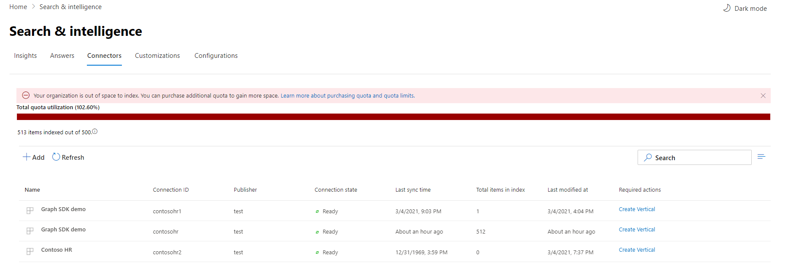

<!-- markdownlint-disable no-inline-html -->

# Управление подключениями для поиска Майкрософт

Для доступа к соединителям и управления ими их необходимо назначить администратором поиска для вашего клиента. Обратитесь к администратору клиента, чтобы подготовиться к работе для роли администратора поиска.

## Начало работы

Перейдите на [вкладку Соединители](https://admin.microsoft.com/Adminportal/Home#/MicrosoftSearch/Connectors) в [центре администрирования Microsoft 365](https://admin.microsoft.com).

Для каждого типа соединителя [центр администрирования Microsoft 365](https://admin.microsoft.com) поддерживает операции, показанные в следующей таблице:

Operation | Соединитель, созданный корпорацией Майкрософт | Партнер или настраиваемый соединитель
--- | --- | ---
Добавление подключения | : heavy_check_mark: (см. раздел [Настройка соединителя, созданного корпорацией Майкрософт](configure-connector.md)) | : x: (обратитесь к своему партнеру или к пользовательскому администратору соединителя)
Удаление подключения | :heavy_check_mark: | :heavy_check_mark:
Изменение опубликованного подключения | : heavy_check_mark: имя   : heavy_check_mark: описание   : heavy_check_mark: учетные данные для проверки подлинности для внешнего источника данных   : heavy_check_mark: учетные данные шлюза для локального источника данных   : heavy_check_mark: расписание обновления   | : heavy_check_mark: имя   : heavy_check_mark: описание
Изменение черновика подключения | :heavy_check_mark: | :x:

## Отслеживание состояния подключения

После создания подключения отображается количество обработанных элементов на вкладке **соединители** на странице **Microsoft Search** . После успешного выполнения начального полного обхода отображается ход выполнения для периодического добавочного обхода контента. На этой странице представлены сведения о повседневных операциях соединителя и обзор журналов ошибок и журналов ошибок.

В столбце **состояние** для каждого подключения отображается четыре состояния:

* **Синхронизация**. Соединитель обходит данные из источника, чтобы индексировать существующие элементы и выполнял все обновления.

* **Enabled**: подключение включено, и для него не выполняется активный обход контента. **Время последней успешной синхронизации** указывает, что произошло Последнее успешное выполнение обхода. Подключение будет обновляться так же, как время последней синхронизации.

* **Приостановлено**. Эти обходы приостанавливаются администраторами с помощью параметра Pause. Следующий обход контента выполняется только при возобновлении его вручную. Однако данные из этого подключения продолжают выполняться поиском.

* **Не удалось выполнить**. Критическая ошибка подключения. Для этой ошибки требуется ручное вмешательство. Администратор должен выполнить соответствующее действие в соответствии с отображаемым сообщением об ошибке. Данные, проиндексированные до тех пор, пока не возникнет ошибка, не удается найти.

### Просмотр сведений о последних обходах контента

После успешного выполнения первого инкремента или полного обхода контента последние значения данных обхода отображаются в заголовке последнего обхода в области сведений. Если последний обход не выполнялся, в заголовке последнего обхода не будут отображаться никакие сведения. Эти сведения о последнем обходе контента помогут получить подробные сведения о том, как выполнен обход, и выполнить необходимые действия в зависимости от необходимости.

Для каждого подключения будут доступны следующие последние значения обхода:

Значение | Описание
--- | ---
Завершено | Дата и время завершения последнего обхода контента
Type | Добавочный или полный обход контента
Длительность | время, в течение которого был выполнен последний обход контента
Успешные операции | Количество элементов, которые были успешно применены при последнем обходе
Ошибки | Количество элементов, которые произошли ошибки при последнем обходе

### Отслеживание ошибок

Для каждого **активного соединителя** на вкладке **соединители** все существующие ошибки обхода отображаются на вкладке **Ошибка** . На вкладке перечислены коды ошибок, их количество и параметры загрузки журналов ошибок. Посмотрите пример на следующем изображении. Выберите **код ошибки** , чтобы просмотреть сведения об ошибке.

Чтобы просмотреть сведения об ошибке, выберите код ошибки. Откроется экран со сведениями об ошибке и ссылкой. В верхней части отображаются последние ошибки. В приведенной ниже таблице представлены примеры.

Ниже приведен список различных ошибок, которые могут отображаться для любого подключения. Если эти решения не работают, обратитесь в службу поддержки или отправьте нам [отзыв](connectors-feedback.md).

Код ошибки | Сообщение об ошибке | Решение
--- | --- | ---
1000 | Источник данных недоступен. Проверьте подключение к Интернету или убедитесь, что доступ к источнику данных по-прежнему доступен соединителю. | Эта ошибка возникает, когда источник данных недостижим из-за проблемы в сети или при удалении, перемещении или переименовании источника данных. Проверьте правильность указанных сведений об источнике данных.
1001 | Не удается обновить данные, так как источником данных является регулирование соединителя. | Чтобы расрегулировать источник данных, убедитесь, что ограничения на размер можно увеличить или подождать, пока не будет меньше времени, интенсивно исходящего трафика.
1002 | Не удается выполнить проверку подлинности в источнике данных. Убедитесь, что учетные данные, связанные с этим источником данных, указаны правильно. | Нажмите кнопку **изменить** , чтобы обновить учетные данные проверки подлинности.
1003 | Учетная запись, связанная с соединителем, не имеет разрешения на доступ к элементу. |  Убедитесь, что у правильной учетной записи есть доступ к элементу, который нужно индексировать.
1004 | Не удается подключиться к локальному шлюзу данных. Убедитесь, что служба шлюза запущена и сведения о шлюзе обновлены в конфигурации подключения. | Проверьте компьютер с помощью шлюза, откройте приложение Power BI Gateway и убедитесь, что шлюз работает. Убедитесь, что шлюз использует ту же учетную запись администратора, что и служба поиска Microsoft, и убедитесь, что все сведения о шлюзе обновлены в конфигурации подключения.
1005 | Срок действия учетных данных, связанных с этим источником данных, истек. Обновите учетные данные и обновите подключение. | Нажмите кнопку **изменить** , чтобы обновить учетные данные проверки подлинности.
1006 | Версия шлюза устарела и больше не поддерживает этот соединитель. Вам потребуется обновить шлюз. | Посетите страницу [Установка локального шлюза данных](https://docs.microsoft.com/data-integration/gateway/service-gateway-install) , чтобы скачать и установить последнюю версию шлюза Power BI на компьютере, содержащем шлюз.
1007 | Действующая лицензия Power BI не обнаружена. Для выполнения этого обхода вам необходима действительная лицензия Power BI. | Для выполнения этого обхода вам необходима действительная лицензия Power BI. Убедитесь, что у вашей организации есть действительная лицензия. Если это так, повторите попытку. Если это не так, получите лицензию и повторите попытку.
1008 | Достигнуто максимальное количество использованных квот клиента. Попробуйте удалить подключение, чтобы освободить некоторую квоту или настроить фильтры приема, чтобы сократить объем данных. | Попробуйте удалить подключение, чтобы освободить некоторую квоту или настроить фильтры приема, чтобы сократить объем данных. Если они не помогли устранить проблему, обратитесь в службу поддержки Майкрософт.
2001 | Индексирование регулируется в связи с большим количеством обновлений в очереди. В зависимости от очереди для завершения обновления может потребоваться некоторое время. | Подождите, пока не будет очищена очередь.
2002 | Не удалось выполнить индексирование из-за неподдерживаемого форматирования элемента. | Дополнительную информацию можно узнать в документации по соединителю.
2003 | Не удалось выполнить индексирование из-за неподдерживаемого содержимого элемента. | Дополнительную информацию можно узнать в документации по соединителю.
2010 | Это подключение больше не является допустимым из-за обновления, выполненного корпорацией Майкрософт. Удалите подключение и создайте новое. | Удалите подключение и создайте новое.
5000 | Что-то пошло не так. Если это будет повторяться, обратитесь в службу поддержки. |

## Отслеживание использования квоты индекса

Доступная квота индекса и потребление отображаются на целевой странице "соединители".

>[!NOTE]
>В течение периода предварительного просмотра каждая организация, пытающаяся попытаться попытаться отобразить соединители Graph, предоставила бесплатную фиксированную квоту до 2 000 000 элементов во всех подключениях. При общем доступе к соединителям Graph срок действия бесплатной квоты истекает в Фев 1 февраля, 2021 для тех организаций, в которых используются соединители Graph в предварительной версии.
>Встроенные соединители Microsoft Graph, помеченные как ["предварительный просмотр"](connectors-preview.md) , не будут включены в общую квоту индекса для Организации. Тем не менее, он будет подсчитывать максимальное число подключений, которые можно настроить для Организации, и максимальное количество 7 000 000 элементов, которые Организация может индексировать для нескольких подключений.

Панель использования квот указывает различные состояния на основе потребления квоты вашей организацией:

Состояние | Использование квоты
--- | ---
Normal | 1-69%
Высокие | 70-89%
Критический | 90% – 99%
Full | 100 %

Число индексируемых элементов также будет отображаться с каждым подключением. Количество элементов, индексируемых каждым подключением, влияет на общую квоту, доступную для Организации.

При превышении квоты индекса для организации будут затронуты все активные подключения, и эти подключения будут работать в **ограниченном** состоянии. В этом состоянии активные подключения  

* Не сможет добавлять новые элементы.

* Смогут обновлять или удалять существующие элементы.

Чтобы устранить эту проблему, можно выполнить одно из следующих действий.

* Сведения о том, как приобрести квоту индекса для вашей организации в [лицензионных требованиях и ценах](licensing.md).

* Определите подключения, которые содержат слишком много контента и обновляют их для индексирования меньшего количества элементов, чтобы сделать место для квоты. Для обновления подключения необходимо удалить и создать новое подключение с использованием нового фильтра приема, в котором меньше элементов.

* Окончательное удаление одного или нескольких подключений

## Ограничения

* При **публикации** соединителя, созданного корпорацией Майкрософт, для создания подключения может потребоваться несколько минут. В этот раз состояние подключения будет отображаться как ожидание.

* [Центр администрирования Microsoft 365](https://admin.microsoft.com) не поддерживает редактирование **схемы поиска** после публикации подключения. Чтобы изменить схему поиска, удалите подключение, а затем создайте новое.

* Пропускная способность приема регулируется около четырех элементов в секунду.

* Обновления схемы не поддерживаются. После создания настройки подключения невозможно обновить схему. Вы можете удалить и повторно создать подключение.

* Превышено максимальное число подключений. Каждый клиент может создать до 10 подключений.

* Изменение поддержки для подключения недоступно. После создания подключения его нельзя изменить или изменить. Если вам нужно изменить какие бы то ни было сведения, необходимо удалить и повторно создать подключение.
