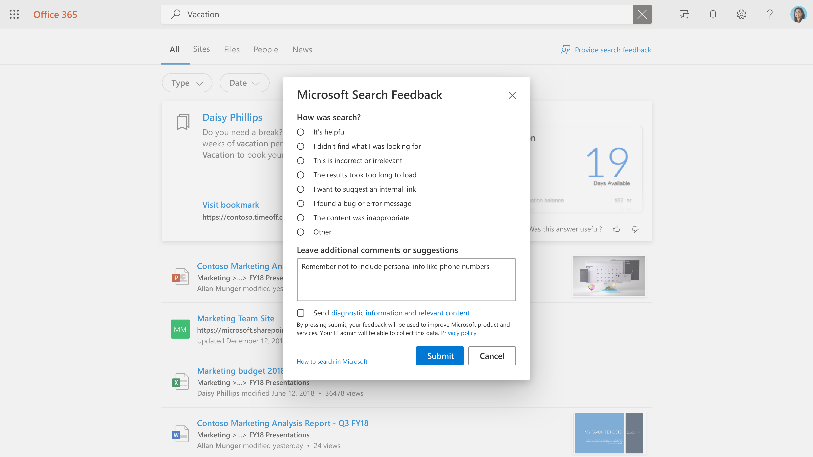

# Управление отзывами пользователейManaging user feedback

Создание привлекательного интерфейса поиска для пользователей является партнерством между корпорацией Майкрософт и администратором поиска.Creating a great search experience for your users is a partnership between Microsoft and the search administrator. Обратная связь пользователей позволяет нам непрерывно оценить продукт и настроить его для достижения оптимальной работы.Feedback from your users allows us to continuously evaluate the product and tune it for the best experience. Тем не менее, некоторые отзывы лучше всего устранять.Some feedback, however, is best addressed by you.

Теперь мы предлагаем средства, позволяющие просматривать Отзывы пользователей и управлять ими.We are now offering tools that will allow you to review and manage the feedback your users are providing on the search experience.

## Отправка отзыва пользователямHow users submit feedback

По мере того, как пользователи в вашей организации используют Microsoft Search, они могут получить отзыв о работе.As people in your organization use Microsoft Search, they may have feedback on the experience. При щелчке ссылки отзыва на странице результатов они могут классифицировать свой отзыв и включить дополнительные комментарии.When they click a feedback link on the results page, they can categorize their feedback and include additional comments.

Кроме того, у пользователей есть возможность отправить свои запросы и другие диагностические сведения вместе с категорией и комментариями в корпорацию Майкрософт.Users also have the option to send their query and other diagnostic info, along with the category and comments, to Microsoft. [Узнайте больше](https://privacy.microsoft.com/en-US/privacystatement) о конфиденциальности и о том, как защитить эти данные.[Learn more](https://privacy.microsoft.com/en-US/privacystatement) about privacy and how we protect this data. Диагностические данные содержат наиболее важные сведения, необходимые корпорации Майкрософт для использования элемента отзывов для улучшения продукта.The diagnostic data contains the most critical information that Microsoft needs to use the feedback item for product improvement.

Большинство отправок отзыва отображается в разделе [Отзывы и предложения](https://admin.microsoft.com/Adminportal/Home#/MicrosoftSearch/feedback) центра администрирования поиска Майкрософт.Most feedback submissions appear in the [Feedback](https://admin.microsoft.com/Adminportal/Home#/MicrosoftSearch/feedback) section of the Microsoft Search admin center. Обратная связь, отправляемая с сообщением о том, что **требуется категория внутренней ссылки** , отображается как Рекомендуемая закладка в разделе " [закладки](https://admin-ignite.microsoft.com/Adminportal/Home#/MicrosoftSearch/bookmarks) " и может отображаться с помощью фильтрации по **предложенному** состоянию.Feedback sent with the **I want to suggest an internal link** category appears as a suggested bookmark in the [Bookmarks](https://admin-ignite.microsoft.com/Adminportal/Home#/MicrosoftSearch/bookmarks) section and can be seen by filtering on **Suggested** status.

## Обзор отзывовReview Feedback

На странице [обратная связь](https://admin.microsoft.com/Adminportal/Home#/MicrosoftSearch/feedback) вы можете просмотреть и экспортировать Отзывы пользователей в вашей организации за прошедшие 30 дней.On the [Feedback](https://admin.microsoft.com/Adminportal/Home#/MicrosoftSearch/feedback) page, you can review and export feedback that people in your organization have sent during the past 30 days. После того как пользователь отправит отзыв, он будет отображаться в этом списке в течение 20 минут.Once a user submits feedback it will appear in this list within 20 minutes. Вы можете использовать кнопку обновить, чтобы проверить актуальность данныхYou can use the refresh button to ensure you are looking at the most current data

С помощью фильтра вы можете просмотреть отзывы для определенных типов ответа.By using a filter, you can see feedback for specific answer types. Кроме того, можно выполнить фильтрацию по исходному диапазону и диапазону дат.You can also filter by source and date range.

Вы можете использовать поле поиска над списком отзывов для поиска отзывов по определенному запросу.You can use the search box above the feedback list to search for feedback on a specific query.

В списке буквальных отзывов в столбце буквальные содержатся сведения о том, какие отзывы пользователей также содержат комментарий или предложение.In the feedback list, the Verbatim column indicates what user's feedback also includes a comment or suggestion. Чтобы открыть панель **сведений** , щелкните запрос.To read it, click the query to open the **Detail** panel.

## Состояние обратной связи при обновленииUpdate feedback state

Так как обратная связь поступает, она будет находиться в *новом* состоянии и останется там, пока она не будет изменена на " *разрешено* " или " *дублировать* ".As feedback comes in, it will be in a *New* state and will remain there until you change it to *Resolved* or *Duplicate*.

Чтобы изменить это состояние, выполните указанные ниже действия.To change this state:

1. Рядом с запросом выберите пункт **Дополнительные параметры** (три вертикальные точки).Next to the query, select **More Options** (three vertical dots).
1. В меню выберите пункт **Пометить как разрешенный** или **Пометить как дубликат.**On the menu, select **Mark as resolved** or **Mark as duplicate.**
1. Список обновится и отобразит обновленное состояние.The list will refresh and show the updated state.

Вы также можете обновить состояние для нескольких элементов, просто выбрав их, а затем выбрав дополнительные параметры рядом с этими элементами.You can also update the state for multiple items, just select them, then select More Options next any of those items.

## Экспорт отзывовExport feedback

Если вы хотите поделиться отзывом поиска с другими пользователями или хранить их дольше, чем 30 дней, нажмите кнопку **экспорт.**If you want to share search feedback with others or retain them for longer than 30 days, click **Export.** CSV-файл с именем feedbacks с датой, например "Feedbacks_10_31_2020.csv", будет автоматически загружен.A .csv file named Feedbacks with the date, like "Feedbacks_10_31_2020.csv", will be automatically downloaded.

## Отправка отзывов пользователей в корпорацию МайкрософтSend user feedback to Microsoft

По умолчанию все отзывы пользователей отправляются в корпорацию Майкрософт и дополняют вас.By default, all user feedback is sent to Microsoft and addition to you. Чтобы прекратить отправку отзывов в корпорацию Майкрософт, щелкните **Управление параметрами** и снимите флажок **автоматически отправлять отзывы пользователей в корпорацию Майкрософт** .To stop sending feedback to Microsoft, click **Manage settings** , and clear the **Automatically send user feedback to Microsoft** check box. Чтобы это изменение вступило в силу, может потребоваться до 24 часов.It can take up to 24 hours for this change to take effect.

Если вы решили не отправлять отзывы корпорации Майкрософт автоматически, вы по-прежнему можете отправлять свои отзывы в корпорацию Майкрософт.If you've decided to not send feedback to Microsoft automatically, you can still send individual pieces of feedback to Microsoft.

1. Выберите отзыв, к которому вы хотите предоставить общий доступ.Select the feedback that you want to share.
1. В строке действий выберите больше (три точки) и щелкните **Отправить отзыв в корпорацию Майкрософт**.In the action bar, select More (three dots), and click **Send feedback to Microsoft**.

1. Состояние в столбце Отправлено Майкрософт изменится на "ожидание".The status in the Sent to Microsoft column will change to Pending. При отправке обратной связи она изменится на "Да".When the feedback is sent, it will change to Yes.

Если вы делитесь отзывами автоматически или вручную, он никогда не включает запросы и другие диагностические сведения для пользователей, которые не включают эти сведения.If you share feedback automatically or manually, it never includes queries and other diagnostic info for users that opted to not include this information.

## Предложения по использованию отзывовSuggestions on how to use feedback

Администратор поиска должен изучить основные персонажи в Организации и типы контента, с которыми обычно взаимодействуют и где выполняется поиск.As a search administrator you should understand the major personas in your organization and what types of content those people typically interact with and search for. Имея это представление, вы можете использовать обратную связь, чтобы внести требуемые улучшения в интерфейсе поиска пользователей.With this understanding, you can use feedback to make targeted improvements to your users' search experience.

1. "Я не нашел то, что искали", и подобный отзыв можно использовать для определения нужных пользователям контента, но в данный момент не включен в индекс поиска.“I did not find what I was looking for” and similar feedback can be used to identify content users want, but is not currently included in the search index. Определение этого зачастую занимается анализом и выводом на основе понимания пользователей.Determining this often takes investigation and inference based on understanding your users. После того как вы найдете найденные, определите, какие методы включают это содержимое наиболее подходящим:Once found, decide which methods of including that content would be most appropriate:
    1. Закладки удобно использовать для источников контента с высококачественной начальной страницей и ограниченным разнообразием терминов поиска, чтобы сообщество пользователей получило высококачественный результат из закладки, а затем может эффективно находить то, что нужно.Bookmarks are useful for content sources having a high-quality landing page and a limited variety of search terms, so that the user community gets a high-quality result from the bookmark and can then efficiently find what they are looking for.
    1. Q&A полезен для отдельных ответов, которые являются частыми, но не меняются.Q&A are useful for individual answers that are fairly frequent, yet do not change.
    1. Соединители удобно использовать для источников контента с широким спектром контента и широким спектром терминов поиска.Connectors are useful for content sources with a wide variety of content and wide variety of search terms.
1. "Не удается загрузить" & "обнаружена проблема" могут быть индикаторы более широкой проблемы.“The results took too long to load” & “I found a problem” may be indicators of a broader problem. Вы можете найти эту обратную связь и, если появятся несколько обращений, вы можете проверить работу службы поиска и при необходимости открыть обращение в службу поддержки Майкрософт.Looking for this feedback daily may help and if multiple cases appear, you can verify the search experience for yourself and open a support case with Microsoft if needed. Этот тип отзыва также важен для Майкрософт и является прекрасным основанием для обработки всех отзывов Майкрософт.This type of feedback is also important to Microsoft and is an excellent reason to flow all feedback to us.
1. "Я хочу предложить внутреннюю ссылку" можно оценить для добавления в качестве закладок или подключенного контента.“I want to suggest an internal link” can be evaluated for being added as bookmarks or connected content. Первая мысль должна быть закладками; Если закладка имеет высокую степень использования, вы можете присоединяться к содержимому через соединитель, чтобы обеспечить более широкие возможности поиска.Your first thought should be a bookmark; if the bookmark gets high usage, you can consider bringing in content through a connector to enable an even richer search experience.
