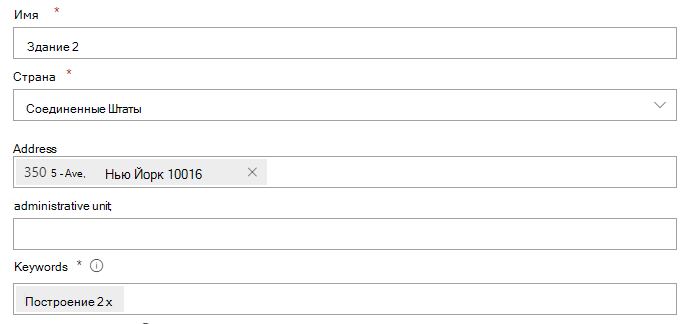
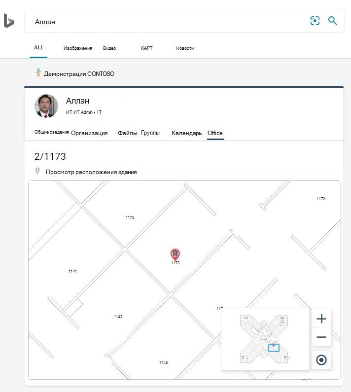
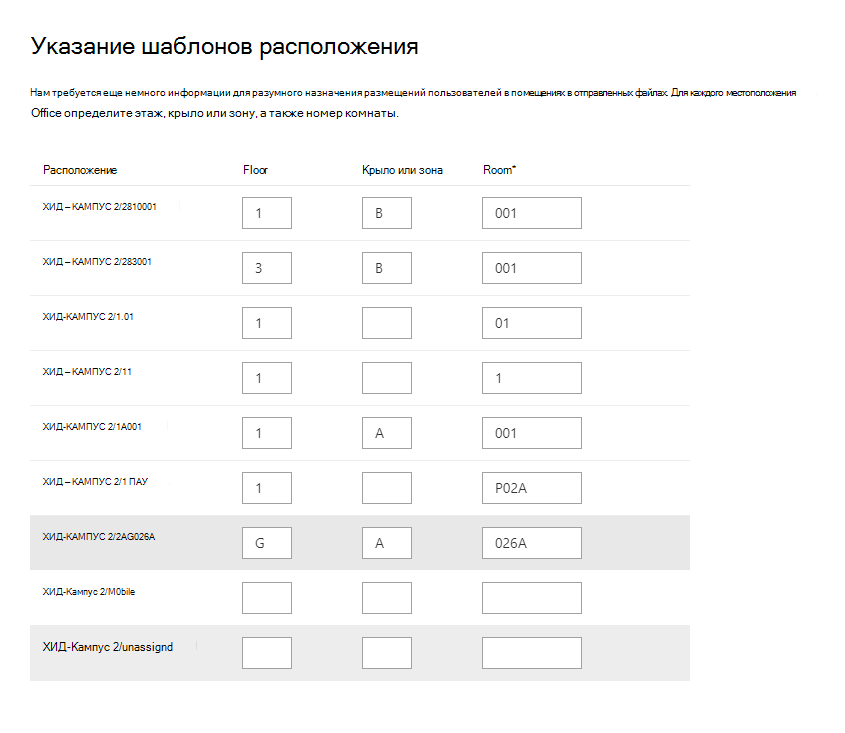

# Управление планами этажей

Планы этажей **в Поиск (Майкрософт)** помогают пользователям находить людей и комнаты собраний в здании. Планы этажей отвечают на следующие вопросы:

- Где офис Allan Deyoung?
- Здание 2 этаж 3
- Поиск 2/11173

## Добавление планов этажей

Следуйте этим шагам, чтобы настроить ответы на Поиск (Майкрософт) **.**

### Шаг 1. Определение строительных кодов

Строительные коды используются в качестве части расположения офиса пользователя. Эти коды будут применяться при обновлении профилей пользователей. Предположим, что в вашей организации есть здание в этом расположении: *Здание 2, 350 5th Avenue, Нью-Йорк, NY 10016*

Вот несколько примеров кода этого здания: 2, B2, Building2, Building 2 или NYCB2. Каждое здание должно иметь уникальный код.

### Шаг 2. Просмотрите планы этажей

Файлы планов этажей должны быть в формате DWG; Файлы DWG могут содержать текстовые метки. Когда текстовая метка пометит комнату, она называется меткой комнаты. Файл DWG должен иметь не менее **10 комнат** с меткой. Вот несколько примеров DWG-файлов с различными типами меток:

|**Текстовые метки, включая метки комнат**|**Текстовые метки, но без меток комнат**|**Нет текстовых меток**|
|:-----:|:-----:|:-----:|
||||

Сведения о просмотре и обновлении файлов DWG см. в разделе [FaQ.](#frequently-asked-questions)

### Шаг 3. Обновление расположения офисов в профилях пользователей

Расположение офиса пользователя — это сочетание кода здания и метки комнаты. Например, если код здания *2,* а метка номера *— 1173,* расположение офиса будет *2/1173*.

Добавление или обновление расположения офисов для каждого пользователя в организации. Вы можете изменить расположение офиса в  профиле пользователя в Центр администрирования Microsoft 365 или изменить в локальном Active Directory, чтобы синхронизироваться с Azure Active Directory. *PhysicalDeliveryOfficeName* — это поле, которое используется для расположения офиса. Если метки комнаты не включают номера этажей, см. в faq для советов.

В этом примере офис Allan находится в комнате 1173 на этаже 1 здания 2.

> [!NOTE]
> Чтобы увидеть обновленные расположения офисов при поиске планов этажей, необходимо обновить расположения офисов не менее **чем для 10 человек** на каждом этаже.

### Шаг 4. Проверка расположения офиса

Используйте **Поиск (Майкрософт),** чтобы найти пользователя и убедиться, что его расположение в офисе отображаются правильно. Если вы только что обновили расположения, может потребоваться до **72** часов, пока обновления будут отображаться в результатах поиска.

### Шаг 5. Добавление расположения зданий

Для определения зданий [в планах floor](manage-locations.md) используются "Расположения". В [Центр администрирования Microsoft 365](https://admin.microsoft.com)перейдите в [**Пункты**](https://admin.microsoft.com/Adminportal/Home#/MicrosoftSearch/locations)расположения, а затем выберите **Добавить**. Введите имя, адрес и ключевые слова для здания. Добавьте столько зданий, сколько вам нужно.

Дополнительные сведения о расположениях см. в [материале Управление расположениями](manage-locations.md)

### Шаг 6. Сбор и организация расположения офисов

Прежде чем использовать планы этажей, необходимо проиндексировать расположения офисов. Это разовая операция, которая может занять до 48 часов. Общее время будет зависеть от размера организации.

В [центре администрирования](https://admin.microsoft.com)перейдите к [**планам Floor**](https://admin.microsoft.com/Adminportal/Home#/MicrosoftSearch/floorplans)и выберите Начало **работы.** Если вы не видите это уведомление, этот шаг уже завершен для вашей организации

### Шаг 7: Upload планы этажей

1. В центре [администрирования](https://admin.microsoft.com)перейдите к [**планам Floor**](https://admin.microsoft.com/Adminportal/Home#/MicrosoftSearch/floorplans).
2. Выберите здание в выпадаемом списке и выберите **Далее**. Если здание не включено в список, возвращайтесь и [добавляйте расположения зданий.](#step-5-add-building-locations)
3. Выберите **Upload файлы,** а затем выберите план этажа, который вы загружаете.
4. После завершения загрузки необходимо ввести номер пола, который представлен в файле плана этажа. Нажмите кнопку **Далее**.
5. (Необязательный) Если на полу есть крылья или зоны, введите эту деталь.
6. Вы увидите экран обзора с перечислением того, сколько офисных местоположений было относялось к планам этажей. Выберите **Подробные** сведения, чтобы убедиться, что сопоставление правильно.
    - Если нет сопоставления пользователей или вы не удовлетворены сопоставлением, выберите **Продолжить сопоставление.** Чтобы опубликовать, выберите **Пропустить и опубликовать**.
7. Введите код здания для этого плана этажа. Код здания можно найти в свойстве расположения офиса пользователей. Например, если местоположение офиса пользователя **2/1173,** то код здания **— 2**.
8. На экране обзора повторите шаг 6, чтобы убедиться, что сопоставление правильно.
9. (Необязательный) Просмотрите и определите шаблоны расположения для всех загруженных планов этажей, а затем выберите **Далее**.
10. На экране обзора повторите шаг 6, чтобы убедиться, что сопоставление правильно.
11. Когда вы будете готовы, выберите **Опубликовать,** чтобы сделать план этажа доступным в **Поиск (Майкрософт).**

> [!NOTE]
> **Публикация планов этажа занимает 48 часов.** После этого пользователи увидят результаты плана этажа, аналогичные ниже, при поиске офиса сотрудника.

### Шаг 8. (Необязательный) Укажите шаблоны расположения

После отправки плана этажа текстовые метки будут сравниваться с расположениями офисов в профилях пользователей. Если совпадений меньше 10, появится экран **Шаблоны расположения.** Шаблоны расположения используются для извлечения информации о полу, крыле и помещении из расположения офиса.

Требуется только помещение, пол и крыло необязательны, и вы можете пропустить расположение по мере необходимости.

## Изменение планов этажей

Чтобы обновить существующую план этажа, выберите план этажа, который необходимо изменить, а затем **измените.** Внести изменения и сохранить их.

## Устранение неполадок

|**Этап**|**Сообщение об ошибке**|**Тип**|**Действие**|
|:-----|:-----|:-----|:-----|
|Upload планы этажей|Не удается прочитать CC_1.dwg. Пожалуйста, повторно загрузите или удалите план этажа.|Ошибка|Попробуйте снова загрузить файл. Если это не работает, удалите файл и попробуйте еще раз.|
|Upload планы этажей|Есть два файла с именем CC_1.dwg. Удалите один из них или повторно загрузите с другим именем.|Ошибка|Если имя файла неверно, сделайте имя файла уникальным, добавив сведения о этаже или крыле, а затем снова загрузите файл. Если вы случайно добавили один и тот же файл дважды, просто удалите его.|
|Upload планы этажей|Данных не обнаружено.|Ошибка|Проверьте файл, чтобы убедиться, что он правильный, а затем загрузить его снова или удалить его.|
|Upload планы этажей|Внешние ссылки отсутствуют в этом файле. Либо загрузите CC_1_furniture.dwg, либо удалите этот файл.|Предупреждение|Upload внешние справочные файлы или удалить.|
|Upload планы этажей|Не удалось прочитать номера комнат или теги в файле DWG. Удалите этот файл.|Предупреждение|Проверьте файл DWG, чтобы убедиться, что данные включены, а затем удалите файл и попробуйте еще раз.|
|Ссылки расположения офисов|В Azure Active Directory нет расположения Azure Active Directory. Добавьте данные о расположении в Azure Active Directory перед настройкой планов этажа.|Ошибка|[Обновление расположения офисов в профилях пользователей](#step-3-update-office-locations-on-user-profiles) |

## Вопросы и ответы

**Вопрос:** Как просматривать и редактировать DWG-файлы?

**A:** Используйте все эти параметры для просмотра DWG-файлов:

- Upload файл SharePoint и открыть его.
- Откройте файл в [Microsoft Visio](https://support.office.com/article/Open-insert-convert-and-save-DWG-and-DXF-AutoCAD-drawings-60cab691-0f4c-4fc9-b775-583273c8dac5) [или Autodesk DWG TrueView](https://www.autodesk.com/products/dwg).
- Upload файл в [Online Viewer Autodesk.](https://viewer.autodesk.com/)

**Вопрос:** Как добавить текстовые метки в номера без опознавательных знаков?

**A:** Откройте файл DWG в редакторе и [добавьте метки комнат.](https://knowledge.autodesk.com/support/autocad-map-3d/learn-explore/caas/CloudHelp/cloudhelp/2019/ENU/MAP3D-Learn/files/GUID-4854F184-6279-4E0C-9487-34A4759017F6-htm.html)

**Вопрос:** Как создать или изменить DWG-файлы для тестирования?

**A:** Создайте файл DWG в Microsoft Visio, Autodesk AutoCAD или любом другом редакторе DWG. Убедитесь, что в файле помечены 10 или более комнат.

**Вопрос:** Каков оптимальный формат для текстовых меток в DWG-файлах?

**A:** Для наилучших результатов текстовые метки должны содержать номера этажей и номера комнат. В примерах ниже используется 2 или SC для кода здания.
<!-- markdownlint-disable no-inline-html -->
|Типы меток комнат|Floor|Room|Пример текстовой метки|Office (код здания/текстовая метка)|
|:-----|:-----|:-----|:-----|:-----|
|Имеет пол и номер комнаты|1|173|1173|2/1173|
||21|45|21045|2/21045|
||23|100K|23-100K|2/23-100K|
||1|G06-07|1G06-07|2/1G06-07|
||2|1024A|02.1024A|2/02.1024A|
||2|1024A|02.1024A|2/02.1024A|
||2|105.01|2105.01|2/2105.01|
|Имеет код здания, пол и номер комнаты|0|X-11-M-12|2-0-X-11-M-12|2/2-0-X-11-M-12 2-0-X-11-M-12|
||2|128A|22128A|2/22128A 22128A|
||1|B2-11|21-B2-11|2/21-B2-11 21-B2-11|
||2|45|SC2045|SC/SC2045 SC2045|

**Вопрос:** Можно ли использовать DWG-файл, в который не включены номера этажей?

**A:** Да, Вы можете. При обновлении расположения офиса в профиле Azure Active Directory пользователя включаем номер пола в номер комнаты, даже если он отсутствует в файле DWG. После отправки файла появится экран Шаблоны расположения, и вы можете указать оба значения.

Например, файл DWG, который включает номера комнат, но не номера этажей, может выглядеть примерно так:

Расположение офиса в профиле пользователя должно быть 2/1175, где "2" является строительным кодом, "1" — это номер пола, а номер комнаты — "175".
