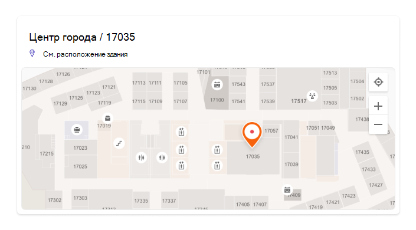

# Управление планами этажей

Планы этажей в Поиск (Майкрософт) помогают пользователям находить людей, комнаты и пространства в здании. Шаблоны запросов, которые включают полное имя, имя, имя комнаты или расположение комнаты, например эти примеры, возвращают план этажа:

- Где офис Allan Deyoung?
- Где офис Дейзи?
- Здание 2 этаж 3
- Workspace-1
- B1/1.20

## Что пользователи испытывают

Пользователи могут видеть ответы на [Bing,](https://bing.com) [SharePoint](http://sharepoint.com/)и [Office 365](https://office.com). Поддерживаются и другие точки входа, Bing результаты, в том числе Windows поиска и Microsoft Edge адресной панели. При поиске имени или расположения комнаты пользователи увидят интересную точку, отмеченную в ответе на план этажа.

> [!div class="mx-imgBorder"]
> 

При поиске офиса пользователя они увидят аналогичный ответ, на маркере которого будет изображение профиля человека.

> [!div class="mx-imgBorder"]
> 

## Добавление планов этажей

Следуйте этим шагам, чтобы настроить ответы на планы этажей в Поиск (Майкрософт).

### Шаг 1. Определение строительных кодов

Строительные коды используются в качестве части расположения офиса пользователя. Эти коды будут применяться при обновлении профилей пользователей. Предположим, что в вашей организации есть здание по этому адресу: *building 2, 350 5th Avenue, New York City, NY 10016*

Вот несколько примеров кода здания: 2, B2, Building2, Building 2 или NYCB2. Каждое здание должно иметь уникальный код.

### Шаг 2. Просмотрите планы этажей

Файлы планов этажей должны быть в формате DWG, который поддерживает текстовые метки. Когда текстовая метка пометит комнату, она называется меткой комнаты. Вот несколько примеров DWG-файлов с различными типами меток:

| Текстовые метки, включая метки комнат | Текстовые метки, но без меток комнат | Нет текстовых меток |
|:-----:|:-----:|:-----:|
||||

В качестве наилучшей практики текстовые метки DWG должны содержать номера этажей, номера крыла (если это необходимо) и номера комнат в этом порядке. Дополнительные [примеры](#frequently-asked-questions) форматов текстовых меток и сведения о просмотре и обновлении DWG-файлов см. в faqs.ru.

### Шаг 3. Обновление расположения офисов в профилях пользователей

Расположение офиса пользователя — это сочетание кода здания и метки комнаты. Например, если код здания *2,* а метка номера *— 1173,* расположение офиса будет *2/1173*.

Добавление или обновление расположения офисов для пользователей с присвоенным расположением работы. Это можно сделать из профиля  пользователя в центрах администрирования Microsoft 365 [Azure Active Directory](https://portal.azure.com/) или локальном Active Directory (синхронизируется с Azure Active Directory). *PhysicalDeliveryOfficeName* — это поле, используемая для расположения офиса. Если метки комнаты не включают номера этажей, см. в [faqs](#frequently-asked-questions) for tips.

В этом примере офис Allan находится в комнате 1173 на этаже 1 здания 2.

> [!div class="mx-imgBorder"]
> 

Чтобы настроить планы этажей для комнат собраний, добавьте для них расположения офисов в разделе [&](https://admin.microsoft.com/Adminportal/Home#/ResourceMailbox) оборудования Центр администрирования Microsoft 365. Дополнительные сведения см. в [списке Настройка почтовых](/microsoft-365/admin/manage/room-and-equipment-mailboxes#set-up-room-and-equipment-mailboxes)ящиков комнат и оборудования. Если люди в организации могут запланировать помещение или ресурс для собрания или события, см. статью Изменение обработки запросов на собрания почтовым ящиком [комнаты.](/Exchange/recipients/room-mailboxes#change-how-a-room-mailbox-handles-meeting-requests) Сведения о настройке рабочего пространства, включая настройку почтовых ящиков комнат, см. в публикации о Книге рабочего пространства [в Outlook.](https://techcommunity.microsoft.com/t5/exchange-team-blog/book-a-workspace-in-outlook/ba-p/1524560)

### Шаг 4. Проверка расположения офиса

Используйте Поиск (Майкрософт), чтобы найти пользователя и убедиться, что его расположение в офисе отображаются правильно. Для появления обновлений в результатах поиска может потребоваться до **72** часов.

> [!div class="mx-imgBorder"]
> 

### Шаг 5. Добавление расположения зданий

В планах [этажей для](manage-locations.md) определения зданий используются пункты Расположения. В [Центр администрирования Microsoft 365](https://admin.microsoft.com)перейдите в [**Пункты**](https://admin.microsoft.com/Adminportal/Home#/MicrosoftSearch/locations)расположения, а затем выберите **Добавить**. Введите имя, адрес и ключевые слова для здания. Добавьте столько зданий, сколько вам нужно.

> [!div class="mx-imgBorder"]
> 

Дополнительные сведения о расположениях см. в [пункте Управление расположениями](manage-locations.md)

### Шаг 6. Сбор и организация расположения офисов

Прежде чем вы сможете загрузить планы этажей, необходимо проиндексировать расположения офисов. Эта разовая операция может занять до 48 часов. Общее время будет зависеть от размера организации.

В [центре администрирования](https://admin.microsoft.com)перейдите к [**планам Floor**](https://admin.microsoft.com/Adminportal/Home#/MicrosoftSearch/floorplans)и выберите Начало **индексации.** Если вы не видите это уведомление, этот шаг уже завершен для вашей организации

### Шаг 7: Upload планы этажей

1. В центре [администрирования](https://admin.microsoft.com)перейдите к [**планам Floor**](https://admin.microsoft.com/Adminportal/Home#/MicrosoftSearch/floorplans).

2. Выберите здание в выпадаемом списке и выберите **Далее**. Если здание не включено в список, возвращайтесь и [добавляйте расположения зданий.](#step-5-add-building-locations)

3. Выберите **Upload файлы,** а затем выберите план этажа, который необходимо загрузить.

4. После завершения загрузки необходимо ввести номер пола, который представлен в файле плана этажа. Нажмите кнопку **Далее**.

5. (Необязательный) Если на полу есть крылья или зоны, введите эту деталь.

6. Вы увидите экран обзора с перечислением того, сколько офисных местоположений было относялось к планам этажа. Выберите **Подробные** сведения, чтобы убедиться, что сопоставление правильно.
    - Если нет сопоставления пользователей или вы не удовлетворены сопоставлением, выберите **Продолжить сопоставление.**
    - Чтобы опубликовать, выберите **Пропустить и опубликовать**.

1. Введите код здания для этого плана этажа. Код здания можно найти в свойстве расположения офиса пользователей. Например, если местоположение офиса пользователя **2/1173,** то код здания **— 2**.

1. На экране обзора повторите шаг 6, чтобы убедиться, что сопоставление правильно. Если вы удовлетворены сопоставлением, выберите **Продолжить** сопоставление и **пропустить и опубликовать**. Если нет, выберите **продолжить сопоставление** и перейдите на экран Шаблоны определения расположения.

1. (Необязательный) Просмотрите и определите логику именования для всех уникальных шаблонов расположения для этого здания в каталоге Azure, а затем выберите **Далее**.

1. На экране обзора повторите шаг 6, чтобы убедиться, что сопоставление правильно.

1. Когда вы будете готовы, выберите **Опубликовать,** чтобы сделать план этажа доступным в Поиск (Майкрософт).

> [!NOTE]
> **Публикация планов этажа занимает 48 часов.** После этого пользователи увидят результаты плана этажа, аналогичные ниже, при поиске офиса сотрудника.

> [!div class="mx-imgBorder"]
> 

### Шаг 8. (Необязательный) Укажите шаблоны расположения

После отправки плана этажа текстовые метки комнат сравниваются с расположениями офисов в профилях пользователей. Если расположения офисов или текстовые метки не последовательно следуют рекомендуемым шаблонам именования в [шаге 2](#step-2-review-your-floor-plans) и шаг [3,](#step-3-update-office-locations-on-user-profiles)используйте экран **Шаблоны** определения расположения, чтобы добавить дополнительные сведения для завершения сопоставления. Шаблоны расположения используются для извлечения информации о полу, крыле и помещении из расположения офиса AAD.

> [!div class="mx-imgBorder"]
> 

Пол и крыло необязательны, требуется только комната, и вы можете пропустить расположение по мере необходимости.

## Планы по обновлению этажей

Прежде чем обновить существующую план этажа, убедитесь, что ваши офисные расположения AAD актуальны, и вы ждали 48 часов для обработки всех обновлений AAD. Чтобы обновить план этажа, перейдите к планам Floor, выберите здание для плана этажа и выберите **Изменить**. Если план этажа изменился структурно, например из-за реконструкции, удалите старый файл, а затем загрузите и опубликуете новый DWG-файл.

> [!NOTE]
> Вам не нужно обновлять планы этажей при переходе пользователей на уже составленный этаж. Просто обнови свой профиль пользователя, чтобы отразить новое расположение офиса:
>
> - В Центр администрирования Microsoft 365 (Активные пользователи > учетной записи > управление контактной информацией)
> - В центре администрирования Azure Active Director (Пользователи > профилей > изменить контактные данные)
> - В предварительном каталоге Active Directory (синхронизируется с Azure Active Directory)

## Удаление планов этажей

Чтобы удалить одноэтажный план, перейдите к [планам Floor и](https://admin.microsoft.com/Adminportal/Home#/MicrosoftSearch/floorplans) выберите здание. Далее выберите план этажа и выберите **Удалить**. Чтобы удалить все планы этажа для здания, перейдите в [Пункты](https://admin.microsoft.com/Adminportal/Home#/MicrosoftSearch/locations)расположения, выберите здание и выберите **Delete**.  

## Устранение неполадок

| Шаг | Сообщение об ошибке | Тип | Действие |
|:-----|:-----|:-----|:-----|
|Upload планы этажей|Не удается прочитать CC_1.dwg. Пожалуйста, повторно загрузите или удалите план этажа.|Error|Попробуйте снова загрузить файл. Если это не работает, удалите файл и попробуйте еще раз.|
|Upload планы этажей|Есть два файла с именем CC_1.dwg. Удалите один из них или повторно загрузите с другим именем.|Error|Если имя файла неверно, добавьте пол или номер крыла, чтобы создать уникальное имя файла и загрузить его снова. Если вы случайно добавили один и тот же файл дважды, просто удалите один из них.|
|Upload планы этажей|Данных не обнаружено.|Error|Проверьте файл, чтобы убедиться, что он правильный, а затем загрузить его снова или удалить его.|
|Upload планы этажей|Внешние ссылки отсутствуют в этом файле. Либо загрузите CC_1_furniture.dwg, либо удалите этот файл.|Предупреждение|Upload внешние справочные файлы или удалить.|
|Upload планы этажей|Не удалось прочитать номера комнат или теги в файле DWG. Удалите этот файл.|Предупреждение|Проверьте файл DWG, чтобы убедиться, что данные включены, а затем удалите файл и попробуйте еще раз.|
|Ссылки расположения офисов|В Azure Active Directory нет расположения Azure Active Directory. Добавьте данные о расположении в Azure Active Directory перед настройкой планов этажа.|Error|[Обновление расположения офисов в профилях пользователей](#step-3-update-office-locations-on-user-profiles) |

## Вопросы и ответы

**Вопрос:** Как просматривать и редактировать DWG-файлы?

**A:** Используйте все эти параметры для просмотра DWG-файлов:

- Upload файл SharePoint и открыть его.
- Откройте файл в [Microsoft Visio](https://support.office.com/article/Open-insert-convert-and-save-DWG-and-DXF-AutoCAD-drawings-60cab691-0f4c-4fc9-b775-583273c8dac5) [или Autodesk DWG TrueView](https://www.autodesk.com/products/dwg).
- Upload файл в [Online Viewer Autodesk.](https://viewer.autodesk.com/)

Вы можете создавать или редактировать DWG-файл в любом редакторе DWG, включая Visio или Autodesk AutoCAD. Чтобы использовать Visio, [см. в поле Создать план этажа](https://support.microsoft.com/office/create-a-floor-plan-ec17da08-64aa-4ead-9b9b-35e821645791). Максимальный размер файла для одного DWG-файла — 16 МБ.

**Вопрос:** Как добавить текстовые метки в номера без опознавательных знаков?

**A:** Откройте файл DWG в редакторе и [добавьте метки комнат.](https://knowledge.autodesk.com/support/autocad-map-3d/learn-explore/caas/CloudHelp/cloudhelp/2019/ENU/MAP3D-Learn/files/GUID-4854F184-6279-4E0C-9487-34A4759017F6-htm.html)

**Вопрос:** Каков оптимальный формат для текстовых меток в DWG-файлах?

**A:** Для наилучших результатов текстовые метки DWG должны быть одной строкой, содержаной номера этажей, номеров крыла (если это необходимо) и номеров комнат в этом порядке. В примерах ниже используется 2 или CITY CENTER для кода здания.
<!-- markdownlint-disable no-inline-html -->
|Типы меток комнат|Floor|Wing/Zone|Room|Пример текстовой метки|Office (код здания/текстовая метка)|
|:-----|:-----|:-----|:-----|:-----|:-----|
|Имеет пол и номер комнаты|1| |173|1173|2/1173|
||21| |45|21045|2/21045|
||23| |100K|23-100K|2/23-100K|
||1| |G06-07|1G06-07|ЦЕНТР CITY/1G06-07|
||2| |1024A|02.1024A|ЦЕНТР ГОРОДА/02.1024A|
|Имеет пол, крыло и номер комнаты|1|A|173|1A173|2/1A173
||2|Z1|128b|2Z1128b|2/2Z1128b

Кроме того, в DWG-файле не содержатся дополнительные текстовые метки, например размеры комнаты или имя архитектора.

**Вопрос:** Существуют ли ограничения символов для текстовых меток?

**A:** Текстовые метки должны быть одной строкой. Специальные символы можно использовать для строительных кодов или меток комнат, но не для значений пола или крыла.

**Вопрос:** Можно ли использовать DWG-файл, в который не включены номера этажей?

**A:** Рекомендуется, чтобы текстовые метки DWG включали номера этажей, но они не требуются, см. в шаге 2 шаблоны [имен.](#step-2-review-your-floor-plans) Кроме того, необходимо включить номер пола в качестве части расположения офиса в контактную информацию пользователя. После отправки файла DWG вам потребуется использовать  необязательный экран Шаблоны расположения, чтобы завершить процесс сопоставления для этих нестандартных меток.

Например, файл DWG, который включает номера комнат, но не номера этажей, может выглядеть примерно так:

> [!div class="mx-imgBorder"]
> 

Расположение офиса в профиле пользователя будет 2/1175, где "2" — это код здания, "1" — это номер этажа, а номер "175" — номер комнаты.

**Вопрос:** Я добавил расположение здания, почему бы не увидеть возможность добавить план этажа?

**A:** Недавно добавленные или обновленные расположения зданий могут еще не быть в индексе поиска. Для появления новых или измененных местоположений в результатах поиска может занять несколько часов. Кроме того, если в здании имеется проект или опубликованный план этажа, выберите имя здания и добавьте дополнительные планы.

**Вопрос:** Почему в списке Select a building нет полного списка расположения?

**A:** В списке Select a building отображаются только здания без планов этажей. Для зданий с по крайней мере одним проектом или опубликованными планами этажей добавьте дополнительные планы этажей, выбрав здание в списке, а затем загрузите.

**Вопрос:** Существуют ли ограничения на количество планов этажей, которые я могу загрузить?

**A:** Нет. Не существует максимума, ни для одного здания, ни для организации.

**Вопрос:** Можно ли использовать DWG-файл, содержащий планы для нескольких крыльев/зон на одном этаже?

**A:** До тех пор, пока все планы для одного этажа, вы можете загрузить DWG-файл, содержащий планы этажей для нескольких крыльев/зон. Убедитесь, что текстовые метки и расположения офисов следуют лучшим практикам именования в [шаге 2](#step-2-review-your-floor-plans) и [шаге 3.](#step-3-update-office-locations-on-user-profiles)

Если файл DWG содержит данные для нескольких крыльев, оставьте поле крыла пустым при загрузке.

**Вопрос:** Могу ли я загрузить два DWG-файла для одного этажа, один из них только с определенным полом, а другой с определенным полом и крылом?

**A:** Вы можете загрузить несколько DWG-файлов для одного этажа, но для каждого файла необходимо указать флажок или зону. В приведенном ниже примере необходимо ввести значение Wing или zone для файла FloorPlan1.dwg, прежде чем перейти на следующий экран. Если в файле плана этажа нет крыла или несколько крыльев, введите значение 0 или X в поле Крыло или зона для продолжения.

> [!div class="mx-imgBorder"]
> 

**Вопрос:** Могу ли я одновременно загружать и обновлять несколько планов этажей?

**A:** Вы можете загружать несколько планов этажей для одного здания одновременно. Массовые операции, например импорт напольных планов для нескольких зданий, недоступны.

**Вопрос:** В моей организации сотни пользователей. Нужно ли указать шаблоны расположения для каждого из них?

**A:** Нет. Если вы следовали рекомендациям форматирования для меток и расположения офисов в шаге [2](#step-2-review-your-floor-plans) и [шаге 3](#step-3-update-office-locations-on-user-profiles)и завершили элементы 1-8 в шаге [7,](#step-7-upload-floor-plans)не следует указывать шаблоны расположения.

Но если пользователи по-прежнему не сопоставлены или вы не удовлетворены сопоставлением, выполните необязательный [шаг 8](#step-8-optional-specify-location-patterns). В шаге 8 необходимо  определить каждый уникальный шаблон расположения, найденный в Azure AD для этого кода создания. Например, вы загружаете план этажа для создания A, который имеет 1000 офисов. Пять различных шаблонов расположения используются для офисов в здании A. При указании шаблонов расположения необходимо определить пять шаблонов, которые отображаются в Azure AD для здания.

**Вопрос:** Могу ли я создавать ответы по плану этажей для конференц-залов, конференц-залов или помещений, в которых нет назначенного им лица?

**A:** Да, Вы можете. Просто добавьте комнату собраний в список комнат и оборудования. Дополнительные сведения см. в [списке Настройка почтовых](/microsoft-365/admin/manage/room-and-equipment-mailboxes#set-up-room-and-equipment-mailboxes)ящиков комнат и оборудования. Если люди в организации могут запланировать помещение или ресурс для собрания или события, см. статью Изменение обработки запросов на собрания почтовым ящиком [комнаты.](/Exchange/recipients/room-mailboxes#change-how-a-room-mailbox-handles-meeting-requests) Чтобы настроить рабочее пространство, включая настройку почтовых ящиков комнат, см. в публикации о Книге рабочего пространства [в Outlook.](https://techcommunity.microsoft.com/t5/exchange-team-blog/book-a-workspace-in-outlook/ba-p/1524560) Для планов этажей следуйте рекомендациям для меток номеров DWG в [шаге 2](#step-2-review-your-floor-plans) и расположения профиля в [шаге 3](#step-3-update-office-locations-on-user-profiles). После добавления комнаты или рабочего пространства необходимо подождать 72 часа для обновления индекса перед отправкой плана этажа.

**Вопрос:** Я выполнил все действия по добавлению плана этажа. Почему они не отображаются в Поиск (Майкрософт) результатах?

**A:** Ссылка на ответ на план этажа может отображаться в середине страницы результатов поиска. Этот тип ранжирования может происходить, когда меньше уверенности в том, что ответ совпадает с намерением поиска. Если на странице результатов нет сведений, убедитесь, что поиск выполняется по поддерживаемой схеме запроса: имени офиса, имени пользователя или расположению офиса, как это отображается в AAD. Частичные или нечеткие совпадения слов не поддерживаются для поиска по плану этажа.

**Вопрос:** Добавлены планы этажей для рабочего пространства моей организации. Почему они не отображаются при бронировании рабочего пространства в Outlook?

**A:** В настоящее время только Outlook Mobile поддерживает планы этажей рабочей области. Они недоступны в настольном или веб-приложении. Дополнительные сведения см. в публикации о Книге рабочего пространства [в Outlook.](https://techcommunity.microsoft.com/t5/exchange-team-blog/book-a-workspace-in-outlook/ba-p/1524560)

**Вопрос:** Могут ли мои пользователи бронировать зал собраний из ответа по плану этажа?

**A:** Ответы по плану этажа не включают возможность резервировать или бронировать комнату. Используйте помощник [по расписанию](https://support.microsoft.com/office/use-the-scheduling-assistant-and-room-finder-for-meetings-in-outlook-2e00ac07-cef1-47c8-9b99-77372434d3fa) или поиск комнаты в Outlook, чтобы заказать комнату собраний.

**Вопрос:** Можете ли вы описать сценарий, в котором необходимо указать шаблоны расположения?

**A:** Предположим, у вас есть здание с кодом "Design B" и вы пытаетесь добавить план для первого этажа, "F1". В расположениях офисов в профилях пользователей указаны эти значения, указывающие их номера кабины на полу:

- Пользователь 1. DesignB/F121
- Пользователь 2. DesignB/F122
- Пользователь 3. DesignB/F123
- Пользователь 4. DesignB/F124
- Пользователь 5. DesignB/F1-25
- Пользователь 6. DesignB/F1-26

Файл DWG для пола имеет эти текстовые метки для тех же кабинок:

- 21
- 22
- 23
- 24
- 25
- 26

Из-за различий между расположениями офисов, которые отображаются в профилях пользователей, и соответствующими текстовыми метами (DesignB/F121 и 21, DesignB/F1-25 и 25), Поиск (Майкрософт) не могут соответствовать им. После загрузки файла в первоначальном обзоре показаны нулевые расположения. Продолжить сопоставление и на этапе расположения офиса Link введите код здания DesignB.

На втором этапе Поиск (Майкрософт) игнорирует значение кода здания в офисах пользователей и пытается снова соответствовать расположениям офисов и текстовым меткам (F121 и 21, F1-25 и 25). Во втором обзоре показаны нулевые расположения. Вам потребуется продолжить сопоставление снова. На этом этапе вам будет предложено указать шаблоны расположения.

При указании шаблонов расположения не нужно добавлять сведения для каждого  офиса, только для уникальных шаблонов, которые отображаются в Azure AD. На этом этапе Поиск (Майкрософт) определяет все уникальные шаблоны расположения здания, но не ограничивается загруженным планом этажей. Для пользователей в этом сценарии существует два уникальных шаблона расположения. Вы увидите случайно выбранные расположения для каждого шаблона. Введите соответствующие значения пола и комнаты:

|Location|&nbsp;|Floor|Крыло или зона|Room|
|:-----|:-----|:-----|:-----|:-----|
|DesignB/F123| |F1 | |23|
|DesignB/F1-26| |F1| |-26|

Далее Поиск (Майкрософт) применяет логику совпадения ко всем расположениям в здании, где используются эти шаблоны, и проводит две проверки:

1. Для Rooms значения соответствуют любым текстовым меткам в файле DWG?
1. При одновременном совпадении значения пола, крыла и комнаты совпадают с любыми текстовыми метами в файле DWG?

Если проверка возвращает совпадение, сопоставление расположения для этого шаблона успешно, и вы перемещаетесь на завершаемую стадию. В готовом этапе вы увидите число пользователей, относясь к расположениям плана этажа. Чтобы проверить, перейдите на области Подробные сведения. В этом сценарии будут иметься только пользователи 1-4. Предпочтительным методом для карт пользователей 5 и 6 является обновление профиля пользователя, чтобы следовать указанному шаблону DesignB/F125. Вы также можете изменить текстовые метки в файле DWG, чтобы соответствовать уникальному шаблону - -25 вместо 25.
