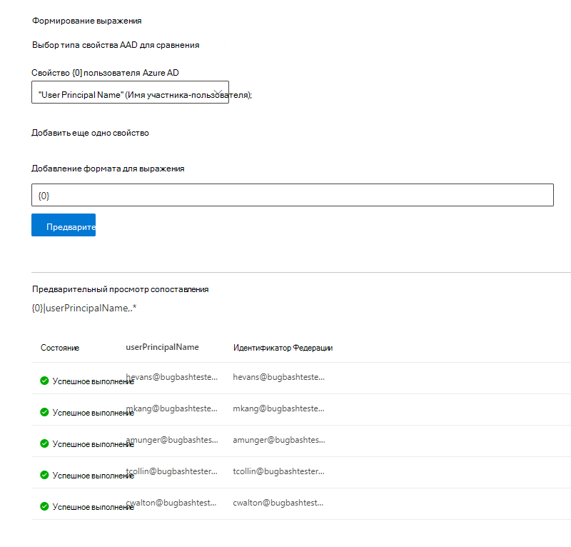

# Сопоставление удостоверений Azure AD  

В этой статье описано, как выполнить сопоставление удостоверений Azure AD с уникальным идентификатором для источника данных (не Azure AD Identity), чтобы пользователи в списке управления доступом (ACL) с удостоверениями, не являющимися Azure AD, могли видеть область результатов поиска в соединителе.

Эти действия относятся только к администраторам поиска, которые настраивают соединитель [Salesforce](salesforce-connector.md) корпорации Майкрософт с разрешениями поиска "только для пользователей с доступом к этому источнику данных" и типом удостоверения "AAD". Следующие действия покажут, как сопоставить свойства пользователя Azure AD с **идентификаторами Федерации** пользователей.

>[!NOTE]
>Если вы настраиваете [соединитель Salesforce](salesforce-connector.md) и выбираете **только пользователей с доступом к этому источнику данных** и типу удостоверения, **не являющемуся AAD** на экране "разрешения поиска", ознакомьтесь со статьей Сопоставление удостоверений, [не являющихся Azure AD](map-non-aad.md) , для указания способа СОПОСТАВЛЕНИЯ удостоверений, не являющихся Azure AD.  

## Действия по сопоставлению свойств Azure AD

### 1. Выберите свойства пользователя Azure AD для сопоставления

Вы можете выбрать свойства Azure AD, которые необходимо сопоставить с ИДЕНТИФИКАТОРом Федерации.

Вы можете выбрать свойство пользователя Azure AD из раскрывающегося списка. Вы также можете добавить столько свойств пользователя Azure AD, сколько необходимо, если эти свойства необходимы для создания сопоставления идентификатора Федерации для вашей организации.

### 2. Создание формулы для завершения сопоставления

Можно объединить значения свойств пользователя Azure AD, чтобы сформировать уникальный идентификатор Федерации.

В поле Формула " {0} " соответствует *первому* выбранному свойству Azure AD. " {1} " соответствует *второму* выбранному свойству Azure AD. " {2} " соответствует *третьему* свойству Azure AD и т. д.  

Ниже приведено несколько примеров формул с примерами выходов регулярных выражений и выводом формул:

| Пример формулы                  | Значение свойства {0} для примера пользователя                 | Значение свойства {1} для примера пользователя           | Выходные данные формулы                  |
| :------------------- | :------------------- |:---------------|:---------------|
| {0}.{1} @contoso. com  | имя | Фамили |firstname.lastname@contoso.com
| {0}@domain. com                 | UserID                 |             |userid@domain.com

После того как вы задаете формулу, вы можете нажать кнопку **Предварительный просмотр** , чтобы просмотреть 5 случайных пользователей из источника данных с применением соответствующих сопоставлений пользователей. В выходных данных предварительного просмотра содержатся значения пользовательских свойств Azure AD, выбранных на шаге 1 для этих пользователей, и выходные данные итоговой формулы, предоставленной на шаге 2 для этого пользователя. Кроме того, он указывает, можно ли разрешить выход формулы пользователю Azure AD в клиенте с помощью значка "Success" или "Failed".  

>[!NOTE]
>Вы по-прежнему можете продолжить создание подключения, если при нажатии кнопки **Предварительный просмотр** одно или несколько сопоставлений пользователей имеют состояние "ошибка". В предварительной версии отображаются 5 случайных пользователей и их сопоставления из источника данных. Если вы сопоставлению не удается сопоставить всех пользователей, может возникнуть такая ситуация.

## Пример сопоставления Azure AD

Ниже приведен моментальный снимок примера сопоставления Azure AD.

## Ограничения  

- Для всех пользователей поддерживается только одно сопоставление. Условные сопоставления не поддерживаются.  

- Вы не можете изменить сопоставление после публикации подключения.  

- Выражения на основе Regex для свойств пользователя Azure AD не поддерживаются для преобразования идентификатора Федерации Azure AD.