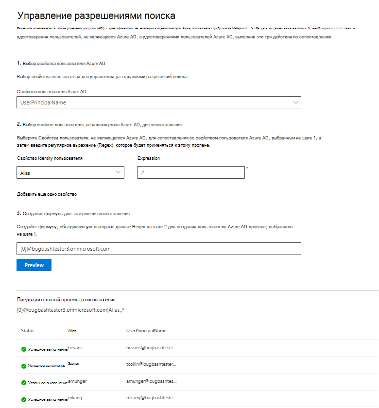

# Map your non-Azure AD Identities  

В этой статье вы сможете с помощью этапов сопоставления удостоверений не Azure AD с идентификаторами Azure AD, чтобы люди из списка управления доступом (ACL) с идентификаторами, не входив в Azure AD, могли видеть результаты поиска соединителя.

Эти действия имеют отношение только к администраторам поиска, которые настраивают соединители [ServiceNow](servicenow-connector.md) или [Salesforce](salesforce-connector.md) корпорацией Майкрософт с разрешениями на поиск для "Только люди с доступом к этому источнику данных" и типом удостоверений "Non-AAD".

>[!NOTE]
>Если вы устанавливаете соединители Salesforce и выбираете только людей с доступом к этому источнику данных и типу **AAD** удостоверений на экране разрешений поиска, обратитесь к статье [Map your Azure AD Identitys](map-aad.md) для действий по картографии удостоверений Azure AD.   

## Действия для сопоставления свойств, не относясь к Azure AD

### 1. Выберите свойство пользователя Azure AD  

Вы можете выбрать свойство пользователя Azure AD, для создания сопоставления. Это целевое свойство, с целью составить карту удостоверений, не относяющихся к Azure AD.  

Можно выбрать одно из следующих свойств Azure AD:

| Свойство Azure AD    | Определение           | Пример         |
| :------------------- | :------------------- |:--------------- |
| Имя участника-пользователя (UPN)  | UpN состоит из префикса UPN (имя учетной записи пользователя) и суффикса UPN (доменное имя DNS). Префикс присоединяется к суффиксу с помощью символа "@". | us1@contoso.onmicrosoft.com |
| Azure AD ID                 | ИД Azure AD для данного пользователя — уникальный GUID пользователя.                 | 58006c96-9e6e-45ea-8c88-4a56851eefad            |
| Active Directory Security ID (SID)                  | SID (Идентификатор безопасности) — уникальный идентификатор, который Active Directory использует для идентификации объектов в качестве основного объекта безопасности.                  | S-1-5-21-453406510-812318184-4183662089             |

### 2. Выберите свойства пользователей, не в Azure AD, для картографии

Для применения регулярных выражений можно выбрать свойства, которые не являются Azure AD, извлекаемые из источника данных. Дополнительные сведения о том, где найти эти свойства в источнике данных, см. на страницах [ServiceNow](servicenow-connector.md) и [Salesforce.](salesforce-connector.md)  

Вы можете выбрать свойство пользователя, не относяное к Azure AD, из отсеки и предоставить регулярное выражение, применяемого к этим значениям свойств пользователя. Дополнительные данные о регулярных выражениях см. в справке [о регулярных выражениях.]( https://docs.microsoft.com/dotnet/standard/base-types/regular-expression-language-quick-reference)  

Ниже приведены примеры регулярных выражений и их выходов, применяемых к примеру строки: 

| Пример строки                  | Регулярное выражение                 | Выход регулярного выражения в строке примера           |
| :------------------- | :------------------- |:---------------|
| Алексис Васкес  | .* | Алексис Васкес |
| Алексис Васкес                 | ..$                 | ez            |
| Алексис Васкес                  | (\w+)$                  | Васкес             |

Вы можете добавить столько свойств пользователей, не в Azure AD, сколько вам хотелось бы выражений. Вы можете применить различные регулярные выражения к одному свойству пользователя, если ваша окончательная формула этого требует.  

### 3. Создание формулы для завершения сопоставления

Вы можете объединить выходы регулярных выражений, применяемых к каждому из свойств пользователей, не в том числе Azure AD, для формирования свойства Azure AD, выбранного на шаге 1.

В поле формулы "" соответствует выходу обычного выражения, примененного к первому выбранному свойству, не {0} отображимому Azure AD.  " соответствует выходу регулярного выражения, примененного к второму выбранному свойству {1} Azure AD.  " соответствует выходу регулярного выражения, примененного к третьему свойству, не {2} относя к Azure AD, и так далее.   

Ниже приведены некоторые примеры формул с примерами регулярных выходов выражений и выходов формул: 

| Пример формулы                  | Значение для {0} примерного пользователя                 | Значение для {1} примерного пользователя           | Выход формулы                  |
| :------------------- | :------------------- |:---------------|:---------------|
| {0}.{1} @contoso.com  | firstname | lastname |firstname.lastname@contoso.com
| {0}@domain.com                 | userid                 |             |userid@domain.com

После предоставления формулы можно дополнительно  щелкнуть Предварительную версию, чтобы просмотреть 5 случайных пользователей из источника данных с соответствующими пользовательскими сопоставлениями. Выход предварительного просмотра включает в себя значение свойств пользователей, не в том числе Azure AD, выбранных в шаге 2 для этих пользователей, и выход конечной формулы, предоставленной в шаге 3 для этого пользователя. В нем также указывается, можно ли разрешить выход формулы пользователю Azure AD в клиенте с помощью значка "Успех" или "Failed".  

>[!NOTE]
>Вы по-прежнему можете приступить к созданию подключения, если один или несколько сопоставлений пользователей имеют состояние "Failed" после нажатия **предварительного просмотра**. Предварительный просмотр показывает 5 случайных пользователей и их сопоставления из источника данных. Если сопоставление, предоставляемая вами, не сопоставлено со всеми пользователями, вы можете испытать этот случай.

## Пример сопоставления без Azure AD

См. снимок ниже для примера сопоставления без Azure AD.

## Ограничения  

- Для всех пользователей поддерживается только одно сопоставление. Условные сопоставления не поддерживаются.  

- Вы не можете изменить сопоставление после публикации подключения.  

- В настоящее время для преобразования поддерживаются только выражения, основанные на регексе, в отношении свойств пользователей, не вступив в AAD.

- Существует только 3 идентификатора Azure AD, которые можно выбрать для карты (UPN, Azure AD ID и AD SID).