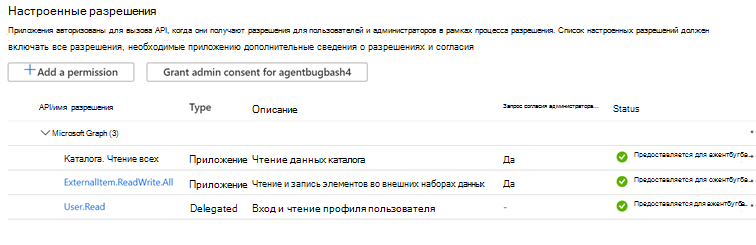
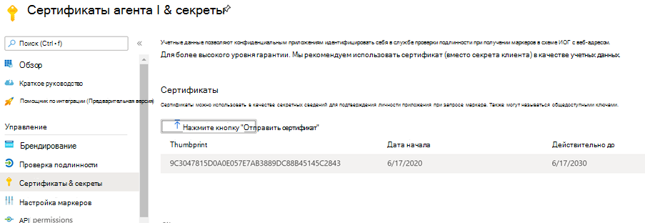

# <a name="graph-connector-agent"></a>Агент соединителя Graph

Использование локальных соединителей Graph требует установки программного обеспечения *агента Graph Connector* . Обеспечивает безопасную передачу данных между локальными данными и API соединителя Graph. В этой статье описывается установка и настройка агента.

## <a name="installation"></a>Установка

Скачайте последнюю [версию агента Graph](https://aka.ms/gcadownload) Connector Agent и установите программное обеспечение с помощью мастера установки. В соответствии с рекомендуемой конфигурацией компьютера, описанной ниже, программное обеспечение может обрабатывать до трех подключений. Все последующие подключения могут привести к снижению производительности всех подключений в агенте.

Рекомендуемая конфигурация:

* Windows 10, Windows Server 2016 R2 и более поздних версий
* [Среда выполнения .NET Core для настольных ПК 3,1 (x64)](https://dotnet.microsoft.com/download/dotnet-core/3.1)
* 8 ядер, 3 ГГц
* 16 ГБ ОЗУ, 2 ГБ дискового пространства
* Сетевой доступ к источнику данных и Интернету через 443

## <a name="create-and-configure-an-app-for-the-agent"></a>Создание и настройка приложения для агента  

Перед использованием агента необходимо создать приложение и настроить сведения о проверке подлинности.

### <a name="create-an-app"></a>Создание приложения

1. Перейдите на [портал Azure](https://portal.azure.com) и войдите в систему, используя учетные данные администратора для клиента.
2. Перейдите к разделу Регистрация приложений **Azure Active Directory** в  ->  **App registrations** области навигации и нажмите кнопку **создать регистрацию**.
3. Укажите имя приложения и нажмите кнопку **регистр**.
4. Запишите идентификатор приложения (клиента).
5. Откройте **разрешения на доступ к API** в области навигации и выберите **Добавить разрешение**.
6. Выберите **Microsoft Graph** , а затем — **разрешения приложений**.
7. Выполните поиск по запросу "Екстерналитем. ReadWrite. ALL" и "Directory. Read. ALL" в разделе разрешения и выберите команду **Добавить разрешения**.
8. Выберите параметр **предоставить согласие администратора для [TenantName]** и подтвердите, нажав **кнопку Да**.
9. Убедитесь, что разрешения находятся в состоянии "предоставлено".
     

### <a name="configure-authentication"></a>Настроить аутентификацию

Сведения о проверке подлинности можно предоставить с помощью секрета клиента или сертификата. Выполните указанные ниже действия.

#### <a name="configuring-the-client-secret-for-authentication"></a>Настройка секрета клиента для проверки подлинности

1. Перейдите на [портал Azure](https://portal.azure.com) и войдите в систему, используя учетные данные администратора для клиента.
2. Откройте **регистрацию приложений** в области навигации и перейдите к соответствующему приложению. В разделе **Управление** выберите **Сертификаты и секреты**.
3. Выберите **новый секрет клиента** и выберите срок действия секрета. Скопируйте созданный секрет и сохраните его, так как он больше не будет отображаться.
4. Используйте этот секрет клиента вместе с ИДЕНТИФИКАТОРом приложения, чтобы настроить агент. В поле **имя** агента нельзя использовать пробелы. Принимаются буквенно-цифровые символы.

#### <a name="using-a-certificate-for-authentication"></a>Использование сертификата для проверки подлинности

Использование проверки подлинности на основе сертификатов состоит из трех простых шагов:

1. Создание или получение сертификата
1. Отправка сертификата на портал Azure
1. Назначьте сертификат агенту

##### <a name="step-1-get-a-certificate"></a>Шаг 1: получение сертификата

Приведенный ниже скрипт можно использовать для создания самозаверяющего сертификата. Ваша организация может не разрешать самозаверяющие сертификаты. В этом случае используйте эти сведения для изучения требований и получения сертификата в соответствии с политиками вашей организации.

```Powershell
$dnsName = "<TenantDomain like agent.onmicrosoft.com>" # Your DNS name
$password = "<password>" # Certificate password
$folderPath = "D:\New folder\" # Where do you want the files to get saved to? The folder needs to exist.
$fileName = "agentcert" # What do you want to call the cert files? without the file extension
$yearsValid = 10 # Number of years until you need to renew the certificate
$certStoreLocation = "cert:\LocalMachine\My"
$expirationDate = (Get-Date).AddYears($yearsValid)
$certificate = New-SelfSignedCertificate -DnsName $dnsName -CertStoreLocation $certStoreLocation -NotAfter $expirationDate -KeyExportPolicy Exportable -KeySpec Signature
$certificatePath = $certStoreLocation + '\' + $certificate.Thumbprint
$filePath = $folderPath + '\' + $fileName
$securePassword = ConvertTo-SecureString -String $password -Force -AsPlainText
Export-Certificate -Cert $certificatePath -FilePath ($filePath + '.cer')
Export-PfxCertificate -Cert $certificatePath -FilePath ($filePath + '.pfx') -Password $securePassword
```

##### <a name="step-2-upload-the-certificate-in-the-azure-portal"></a>Шаг 2: отправка сертификата на портале Azure

1. Откройте приложение и перейдите к разделу сертификаты и секреты из левой области
1. Нажмите кнопку "отправить сертификат" и отправьте CER-файл.
1. Откройте **регистрацию приложения** и выберите **Сертификаты и секреты** в области навигации. Скопируйте отпечаток сертификата.



##### <a name="step-3-assign-the-certificate-to-the-agent"></a>Шаг 3: назначьте сертификат агенту

Если для создания сертификата использовался пример сценария, PFX-файл можно найти в расположении, указанном в сценарии.

1. Скачайте PFX-файл сертификата на компьютер агента.
1. Дважды щелкните PFX-файл, чтобы открыть диалоговое окно установки сертификата.
1. Выберите "локальный компьютер" для расположения хранилища при установке сертификата.
1. После установки сертификата откройте меню "Управление сертификатами компьютеров" в меню "Пуск".
1. Выберите новый сертификат в разделе "личные" — > "сертификаты"
1. Щелкните сертификат правой кнопкой мыши и выберите пункт "все задачи" — > "Управление закрытыми ключами...". Параметр
1. В диалоговом окне разрешения выберите команду Добавить параметр. В диалоговом окне Выбор пользователя введите: "NT Сервице\гкахостсервице" и нажмите кнопку ОК. Не нажимайте кнопку "проверить имена".
1. Нажмите кнопку ОК в диалоговом окне разрешения. Теперь на компьютере агента настроено создание маркеров с помощью сертификата.
