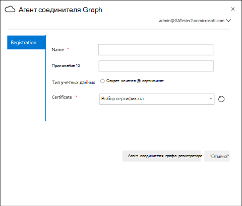

# Локальный агентOn-Prem Agent

## Агент соединителя GraphGraph connector agent

Локальные графические соединители требуют установки программного обеспечения *агента Graph Connector* .On-prem Graph connectors require you to install *Graph connector agent* software. Он обеспечивает быструю и безопасную передачу данных между локальными данными и облачными службами.It allows quick and secure data transfer between on-premises data and cloud services. В этой статье описывается процесс установки и настройки программного обеспечения.This article guides you through the steps of installing and configuring the software. После настройки он будет доступен для создания подключений к локальным источникам данных из [центра администрирования Microsoft 365](https://admin.microsoft.com).Once configured, it will be available for creating connections to your on-prem data sources from the [Microsoft 365 admin center](https://admin.microsoft.com).

## УстановкаInstallation

Скачайте последнюю версию агента Graph Connector с помощью [этой ссылки](https://download.microsoft.com/download/d/d/e/dde18236-9c67-437d-a864-894a0a888ef2/AgentPackage.msi) и установите программное обеспечение с помощью мастера установки.Download the latest version of Graph connector agent using [this link](https://download.microsoft.com/download/d/d/e/dde18236-9c67-437d-a864-894a0a888ef2/AgentPackage.msi) and install the software using the installation wizard. В соответствии с рекомендуемой конфигурацией компьютера это программное обеспечение может беспрепятственно обрабатывать до трех подключений.With the recommended configuration of the machine described below, the software can seamlessly handle up to three connections. Все последующие подключения могут привести к снижению производительности.Any connections beyond that might degrade the performance.

Рекомендуемая конфигурация:Recommended configuration:

* Windows 10, Windows Server 2012 R2 и более поздних версийWindows 10, Windows Server 2012 R2 and above
* 8 ядер, 3GHz8 cores, 3GHz
* 16 ГБ ОЗУ, 1 ГБ дискового пространства16GB RAM, 1GB Disk Space
* Сетевой доступ к источнику данных и Интернету через 443Network access to data source and internet through 443

## Создание приложения для агентаCreating App for the agent  

Перед созданием подключений экземпляру агента необходимо выполнить подачу нескольких критических параметров.The agent instance needs to be fed few critical parameters before you create connections. Эти параметры включают сведения о проверке подлинности, необходимые для использования API приема графа.These parameters include authentication details required for using Graph ingestion APIs.  

Действия по созданию приложения для агента.Steps for creating App for the agent.

1. Перейдите на [портал Azure](https://portal.azure.com) и войдите в систему, используя учетные данные администратора для клиента.Go to the [Azure portal](https://portal.azure.com) and sign in with admin credentials for the tenant.
2. Перейдите к разделу Регистрация приложений **Azure Active Directory** в  ->  **App registrations** области навигации и нажмите кнопку **создать регистрацию**.Navigate to **Azure Active Directory** -> **App registrations** from the navigation pane and select **New registration**.
3. Укажите имя приложения и нажмите кнопку **регистр**.Provide a name for the app and select **Register**.
4. Запишите идентификатор приложения (клиента).Make a note of the Application (client) ID.
5. Откройте **разрешения на доступ к API** в области навигации и выберите **Добавить разрешение**.Open **API permissions** from the navigation pane and select **Add a permission**.
6. Выберите **Microsoft Graph** , а затем — **разрешения приложений**.Select **Microsoft Graph** and then **Application permissions**.
7. Выполните поиск по запросу "Екстерналитем. ReadWrite. ALL" и "Directory. Read. ALL" в разделе разрешения и выберите команду **Добавить разрешения**.Search for "ExternalItem.ReadWrite.All" and "Directory.Read.All" from the permissions and select **Add permissions**.
8. Выберите параметр **предоставить согласие администратора для [TenantName]** и подтвердите, нажав **кнопку Да**.Select **Grant admin consent for [TenantName]** and confirm by selecting **Yes**.
9. Убедитесь, что разрешения находятся в состоянии "предоставлено".Check that the permissions are in the granted state.
     

## Настройка агента соединителя GraphConfiguring Graph connector agent

После создания приложения для агента необходимо настроить агент с использованием соответствующих сведений о проверке подлинности.Once you have created the App for the agent, you must configure the agent with appropriate authentication details.

Сведения о проверке подлинности могут быть предоставлены в одной из следующих форм.Authentication details can be provided in one of the following forms.

### Настройка секрета клиента для проверки подлинностиConfiguring the client secret for authentication

1. Перейдите на [портал Azure](https://portal.azure.com) и войдите в систему, используя учетные данные администратора для клиента.Go to the [Azure portal](https://portal.azure.com) and sign in with admin credentials for the tenant.
2. Откройте **регистрацию приложений** в области навигации и перейдите к соответствующему приложению.Open **App Registration** from the navigation pane and go to the appropriate App. В разделе **Управление** выберите **Сертификаты и секреты**.Under **Manage**, select **Certificates and secrets**.
3. Выберите **новый секрет клиента** и выберите срок действия секрета.Select **New Client secret** and select an expiry period for the secret. Скопируйте созданный секрет и сохраните его, так как он больше не будет отображаться.Copy the generated secret and save it because it will not be shown again.
4. Используйте этот секрет клиента вместе с ИДЕНТИФИКАТОРом приложения, чтобы настроить агент.Use this Client secret along with the Application ID to configure the agent. Не используйте в поле **имя** агента пробелы.Do not use any blank spaces in the **Name** field of the agent. Принимаются буквенно-цифровые символы.Alpha numeric characters are accepted.

## Использование сертификата отпечатков для проверки подлинностиUsing thumbprint certificate for authentication

Если вы уже настроили сведения для проверки подлинности, выполнив [настройку секрета клиента для проверки подлинности](#configuring-the-client-secret-for-authentication) , вы можете перейти непосредственно к [обзору программы установки](configure-connector.md).If you have already configured the authentication details by following [Configuring the client secret for authentication](#configuring-the-client-secret-for-authentication) , then you can jump directly to [Setup overview](configure-connector.md).

1. Откройте **регистрацию приложения** и выберите **Сертификаты и секреты** в области навигации.Open **App registration** and select **Certificates and secrets** from the navigation pane. Скопируйте отпечаток сертификата.Copy the certificate thumbprint.

2. Чтобы зарегистрировать агент соединителя Graph, используйте секрет клиента или отпечаток.Use either the client secret or thumbprint to register the Graph connector agent.

