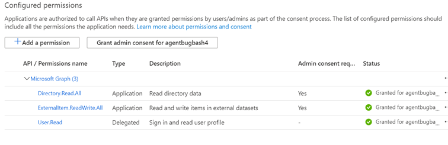

# Локальный агент

## Агент соединителя Graph

Локальные графические соединители требуют установки программного обеспечения *агента Graph Connector* . Он обеспечивает быструю и безопасную передачу данных между локальными данными и облачными службами. В этой статье описывается процесс установки и настройки программного обеспечения. После настройки он будет доступен для создания подключений к локальным источникам данных из [центра администрирования Microsoft 365](https://admin.microsoft.com).

## Установка

Скачайте последнюю версию агента Graph Connector с помощью [этой ссылки](https://download.microsoft.com/download/d/d/e/dde18236-9c67-437d-a864-894a0a888ef2/AgentPackage.msi) и установите программное обеспечение с помощью мастера установки. В соответствии с рекомендуемой конфигурацией компьютера это программное обеспечение может беспрепятственно обрабатывать до трех подключений. Все последующие подключения могут привести к снижению производительности.

Рекомендуемая конфигурация:

* Windows 10, Windows Server 2012 R2 и более поздних версий
* 8 ядер, 3GHz
* 16 ГБ ОЗУ, 1 ГБ дискового пространства
* Сетевой доступ к источнику данных и Интернету через 443

## Создание приложения для агента  

Перед созданием подключений экземпляру агента необходимо выполнить подачу нескольких критических параметров. Эти параметры включают сведения о проверке подлинности, необходимые для использования API приема графа.  

Действия по созданию приложения для агента.

1. Перейдите на [портал Azure](https://portal.azure.com) и войдите в систему, используя учетные данные администратора для клиента.
2. Перейдите к разделу Регистрация приложений **Azure Active Directory** в  ->  **App registrations** области навигации и нажмите кнопку **создать регистрацию**.
3. Укажите имя приложения и нажмите кнопку **регистр**.
4. Запишите идентификатор приложения (клиента).
5. Откройте **разрешения на доступ к API** в области навигации и выберите **Добавить разрешение**.
6. Выберите **Microsoft Graph** , а затем — **разрешения приложений**.
7. Выполните поиск по запросу "Екстерналитем. ReadWrite. ALL" и "Directory. Read. ALL" в разделе разрешения и выберите команду **Добавить разрешения**.
8. Выберите параметр **предоставить согласие администратора для [TenantName]** и подтвердите, нажав **кнопку Да**.
9. Убедитесь, что разрешения находятся в состоянии "предоставлено".
     

## Настройка агента соединителя Graph

После создания приложения для агента необходимо настроить агент с использованием соответствующих сведений о проверке подлинности.

Сведения о проверке подлинности могут быть предоставлены в одной из следующих форм.

### Настройка секрета клиента для проверки подлинности

1. Перейдите на [портал Azure](https://portal.azure.com) и войдите в систему, используя учетные данные администратора для клиента.
2. Откройте **регистрацию приложений** в области навигации и перейдите к соответствующему приложению. В разделе **Управление** выберите **Сертификаты и секреты**.
3. Выберите **новый секрет клиента** и выберите срок действия секрета. Скопируйте созданный секрет и сохраните его, так как он больше не будет отображаться.
4. Используйте этот секрет клиента вместе с ИДЕНТИФИКАТОРом приложения, чтобы настроить агент. Не используйте в поле **имя** агента пробелы. Принимаются буквенно-цифровые символы.

## Использование сертификата отпечатков для проверки подлинности

Если вы уже настроили сведения для проверки подлинности, выполнив [настройку секрета клиента для проверки подлинности](#configuring-the-client-secret-for-authentication) , вы можете перейти непосредственно к [обзору программы установки](configure-connector.md).

1. Откройте **регистрацию приложения** и выберите **Сертификаты и секреты** в области навигации. Скопируйте отпечаток сертификата.

2. Чтобы зарегистрировать агент соединителя Graph, используйте секрет клиента или отпечаток.

