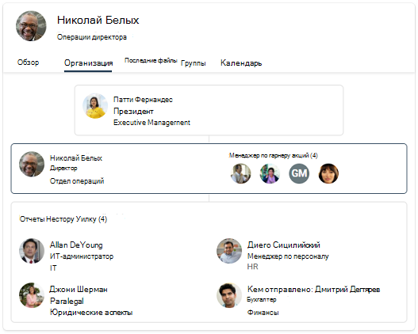

# Обзор Поиск (Майкрософт) в Bing

Поиск (Майкрософт) в Bing объединяет возможности Поиск (Майкрософт) и Bing веб-поиска. Он предоставляет знакомый опыт поиска, который помогает пользователям находить соответствующие результаты из вашей организации и в Интернете. Чтобы сохранить ваши пользователи и ваши данные закрытыми и безопасными, пользователи должны войти в свою работу или учетную запись в школе Bing, прежде чем они смогут найти внутренние результаты.

## Что видят пользователи

Когда люди в организации используют Поиск (Майкрософт) в Bing, есть два места, где они могут видеть результаты работы или школы:

- Страница все результаты: если есть соответствующие результаты работы или школы, она будет отображаться в верхней части страницы результатов поиска, а затем общедоступные веб-результаты.
- Страница результатов WORK или SCHOOL. На этой странице отображаются только результаты организации. Он никогда не включает общедоступные веб-результаты.

:::image type="content" alt-text="Все страницы результатов работы для страницы Contoso и результатов школы для средней школы Contoso." source="media/msb-overview/all-work-school-serps.gif" lightbox="media/msb-overview/all-work-school-serps.gif":::

Пользователи могут легко идентифицировать результаты работы или школы, ища логотип, имя или изображение профиля организации.

## Начало работы с Поиск (Майкрософт) в Bing

Поиск (Майкрософт) в Bing по умолчанию включен для всех в вашей организации. Если пользователь уже вписалась в свою работу или учетную запись учебного заведения на другой службе , например Outlook, Microsoft Teams или SharePoint, он будет автоматически входить в ту же учетную запись при Bing. Дополнительные сведения см. в статье [Безопасность и конфиденциальность для Поиска (Майкрософт) в Bing](security-for-search.md).

Если вы не знакомы с Поиск (Майкрософт) в Bing, мы предлагаем просмотреть руководство по Поиск (Майкрософт) в Bing [администратора](https://aka.ms/SearchAdminEssentials) для сведений о конфигурации и развертывании. Чтобы повысить осведомленность пользователей о Поиск (Майкрософт), наш набор принятия включает учебные и коммуникационные ресурсы. 

## Опыт поиска для работы и школы

Поиск (Майкрософт) в Bing предоставляет возможности поиска с учетом потребностей пользователей в работе и школе. В организациях с корпоративными планами обслуживания пользователи получат опыт поиска, предназначенный для работы, включая организационные диаграммы и Power BI ответы.

Пользователи в организациях с планами образовательных служб получат опыт, предназначенный для поиска учебного заведения, в том числе ответы о классах и предстоящих назначениях.

Если в организации есть планы образовательных и корпоративных служб, вы можете выбрать Поиск (Майкрософт) в Bing для пользователей, в школе или на работе. Дополнительные сведения см. в [подборе "Выбор учебного заведения" или "Поиск по работе".](/microsoftsearch/select-work-school-search-experience)

## Добавление Поиск (Майкрософт) в Bing в интрасети

Поиск (Майкрософт) предназначена для того, чтобы сделать внутреннюю информацию легкой для доступа везде, где ищут пользователи. Если люди в организации используют ваш сайт интрасети для начала работы или поиска в школе, рассмотрите возможность добавления встроенного окна поиска на ваш сайт.

С помощью простого сценария можно добавить настраиваемый поле поиска и даже направить его в настраиваемую вертикаль. Дополнительные дополнительные результаты [см. в добавлении окна поиска на сайт интрасети.](add-a-search-box-to-your-intranet-site.md)

## Настройка по умолчанию, чтобы упростить поиск работы или школы

Чтобы повысить уровень Поиск (Майкрософт) в Bing, рассмотрите способы сделать его легкой частью дня пользователя, установив по умолчанию.

**Браузер по** умолчанию. При Microsoft Edge браузере по умолчанию пользователи могут искать организацию и получать соответствующие предложения по поиску прямо из панели адресов. Поиск в панели адресов — это быстрое и легкое поиск сведений, и им не нужно Bing, чтобы начать поиск. Дополнительные сведения см. в [Microsoft Edge set Microsoft Edge браузере по умолчанию.](/deployedge/edge-default-browser)

**Поисковая система** по умолчанию. Если изменение браузера по умолчанию не является вариантом, вы можете включить рабочий или школьный поиск из панели адресов, Bing в качестве поисковой системы по умолчанию. Подробные сведения см. [в Bing поиска по умолчанию.](set-default-search-engine.md) Если в вашей организации Приложения Microsoft 365 для предприятий (ранее Office 365 профессиональный плюс) план службы, вы можете Bing в качестве поисковой системы Google Chrome по умолчанию, развернув Поиск (Майкрософт) в Bing расширении. Дополнительные сведения см. [в Поиск (Майкрософт) в Bing и Приложения Microsoft 365 для предприятий.](/deployoffice/microsoft-search-bing)

**Главная страницы** по умолчанию: настройка Bing как домашняя страницы организации по умолчанию не позволяет искать работу или школу из панели адресов, но это обеспечивает любой простой способ доступа к bing.com. Дополнительные сведения см. в [Bing.com на домашней странице по умолчанию.](set-default-homepage.md)

## Безопасность и конфиденциальность

Поиск (Майкрософт) в Bing для защиты данных организации и пользователей используются повышенные меры безопасности и конфиденциальности. Дополнительные сведения см. в Поиск (Майкрософт) в [Bing](security-for-search.md) и Поиск (Майкрософт) в [Bing](https://support.microsoft.com/office/how-microsoft-search-in-bing-helps-keep-your-info-secure-cbce46ae-bb1f-4d0e-86f1-5984f4589113)безопасности.

## См. также

- [Обзор Поиска (Майкрософт)](overview-microsoft-search.md)
- [Планирование содержимого](plan-your-content.md)
