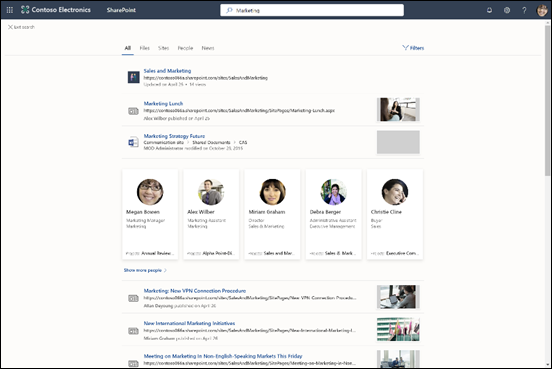
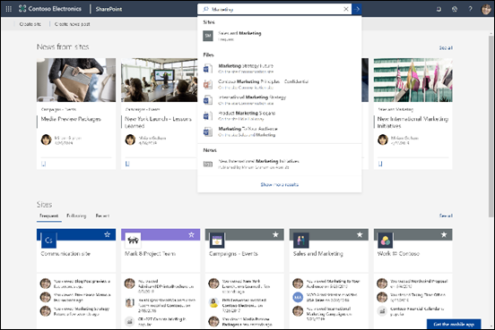

# Обзор Поиска (Майкрософт)Overview of Microsoft Search

Поиск (Майкрософт) — это единое средство поиска в приложениях для работы Microsoft 365 и экосистеме Майкрософт.Microsoft Search is the unified search capability in the Microsoft 365 productivity apps and the broader Microsoft ecosystem. Со временем доступность Поиска (Майкрософт) в приложениях Microsoft 365 расширяется.Over time Microsoft Search will be available in more and more apps across Microsoft 365.

Поиск (Майкрософт) помогает пользователям находить правильные ответы, людей и контент для выполнения задач в приложении, в котором они работают.Microsoft Search helps users find the right answers, people, and content to complete their tasks in the app they’re already working in.

- Пользователи получают результаты в соответствии с **контекстом** приложения, из которого выполняется поиск.Users get results that are relevant in the **context** of the app they search from. Например, при поиске в Outlook они находят электронные письма, а не сайты SharePoint.For example, when they search in Outlook, they find emails, not sites in SharePoint. При поиске в SharePoint они находят сайты, страницы и файлы.When they search in SharePoint, they find sites, pages, and files.
- Независимо от используемого пользователями приложения Поиск (Майкрософт) является **личным**.Whichever app users are working in; Microsoft Search is **personal**.  Поиск (Майкрософт) использует аналитические сведения из Microsoft Graph, чтобы отображать интересующие каждого пользователя результаты.Microsoft Search uses insights from the Microsoft Graph to show results that are relevant to each user. Для каждого пользователя могут отображаться разные результаты, даже если они выполняют поиск одинаковых фраз.Each user might see different results, even if they search for the same words. Пользователям видны только те результаты, к которым у них есть доступ. Поиск (Майкрософт) не изменяет разрешения.They only see results that they already have access to, Microsoft Search doesn’t change permissions.
- Пользователям не нужно запоминать место хранения сведений.Users don’t need to remember where the information is located. Например, пользователь работает в Word и хочет использовать сведения из презентации, которой другой сотрудник поделился из своего хранилища OneDrive.For example, a user is working in Word and wants to reuse information from a presentation that a colleague shared from their OneDrive. Нет необходимости переходить в OneDrive и искать эту презентацию, можно просто выполнить поиск в Word.There’s no need to switch to OneDrive and search for that presentation, they can simply search from Word.  
- При использовании [Bing](https://bing.com) пользователи получают результаты из своей организации в дополнение к результатам из Интернета.When in Bing, users get results from within their organization in addition to the public web results.

## Что видят пользователиWhat users see

В Bing пользователи используют то же поле поиска, что и для поиска в Интернете.In Bing, users use the same search box as for web searches. В приложениях Microsoft 365 поле Поиска (Майкрософт) отображается для пользователей в строке заголовкаIn the Microsoft 365 apps, users find the Microsoft Search box in the header bar. следующим образом:It looks like this:

Когда пользователь щелкает в поле поиска, служба поиска предлагает результаты с учетом предыдущих действий пользователя в Office 365 и с учетом популярного контента в организации.When users click in the search box, search suggests results based on their previous activity in Office 365 and based on content that’s trending in your organization. Примеры действий, учитываемых поиском: файлы, с которыми пользователи недавно работали, недавно использованные команды, а также люди, с которыми они совместно работали.Files they were working on recently, commands they’ve used recently as well as people they collaborate with are examples of activity that search considers. Когда пользователи начинают вводить запрос в поле поиска, выполняется обновление рекомендуемых результатов.As users start typing in the search box, the suggested results update. Пользователи могут открывать результаты прямо из поля поиска.Users can open search results right from the search box. Ниже приведен пример поиска в SharePoint.Here's an example of a search in SharePoint.

Если предложения в поле поиска не соответствуют цели поиска, клавиша **ВВОД** открывает полный список результатов.If the suggestions in the search box aren’t what they’re looking for, **Enter** opens the full list of results. Пользователи могут использовать метаданные, например время и автора последних изменений, место хранения элементов, а также предварительно просмотреть его, чтобы определить, нужный ли это элемент.They can use metadata such as who last modified the item and when, where the items is located, as well as preview it to determine if it’s what they’re looking for.

## Преимущества Поиска (Майкрософт)Benefits of Microsoft Search

**Поиск в Microsoft 365 из любого поля Поиска (Майкрософт)**. Пользователи могут выполнять поиск из любого поля Поиска (Майкрософт) и быстро возвращаться к своей работе.**Search across Microsoft 365 from any Microsoft Search box** – Users can search from any Microsoft Search box and get quickly back to what they were doing. Поиск (Майкрософт) объединяет результаты из источников данных в Office 365, включая SharePoint, OneDrive для бизнеса и Exchange.Microsoft Search brings together results from data sources in Office 365, including SharePoint, OneDrive for Business, and Exchange.

**Простой поиск**. Поиск (Майкрософт) предлагает результаты непосредственно в поле поиска с учетом предыдущей активности пользователей в Office 365.**Easy to search** – Microsoft Search suggests results based on users’ previous activity in Office 365, right in the search box.

**Поиск общих файлов**. Поиск (Майкрософт) поддерживает расширенные запросы, упрощающие поиск общих файлов.**Find shared files** – Microsoft Search uses advanced query understanding to make finding shared files simple. Пользователи могут легко находить файлы, над которыми они работают совместно.Users can easily find files they’re collaborating on.

**Отображение релевантного контента**. Продвигайте сведения и ответы, необходимые вашим пользователям для выполнения задач, например политики, сведения о льготах, ресурсы, инструменты и т. д.**Show relevant content** – Promote the information and answers your users need to complete tasks, for example policies, benefits, resources, tools, and more. Вы также можете выбирать целевые группы получателей, такие как новые сотрудники и удаленные работники.You can also target specific groups, like new hires or remote workers.

**Поиск (Майкрософт) развивается**. Набор типов результатов, которые могут искать пользователи, а также интеллектуальные функции поля поиска со временем расширяются.**Microsoft Search evolves** – The set of content types users can search for and the intelligence of the search box will grow over time.

**Администрирование во всех приложениях**. Поиск (Майкрософт) **включен** по умолчанию, и любые выполняемые административные действия применяются к Поиску (Майкрософт) во всех приложениях.**Administer across all apps** – Microsoft Search is **on** by default and any administration you do applies to Microsoft Search in all the apps.

## Приложения, поддерживающие в настоящее время Поиск (Майкрософт)Apps that currently have Microsoft Search

 Поиск (Майкрософт) включен по умолчанию для всех приложений Майкрософт, поддерживающих его.Microsoft Search is turned on by default for all Microsoft apps that support it. Пользователю нужно лишь войти с помощью рабочей или учебной учетной записи.All a user needs to do is to sign in with a work or school account.

Поиск (Майкрософт) в настоящее время предлагают следующие приложения:The following apps currently offer Microsoft Search:
- SharePoint OnlineSharePoint Online
- OneDrive для бизнесаOneDrive for Business
- Outlook в ИнтернетеOutlook on the web
- Приложения Office в WindowsOffice apps on Windows

Кроме того, вошедшим пользователям доступен Поиск (Майкрософт) в следующих расположениях:In addition, signed-in users find Microsoft Search in:

- Домашняя страница BingBing homepage
- Office.comOffice.com
- Начальные страницы для Word, Excel и PowerPoint OnlineThe starting pages for Word, Excel, and PowerPoint Online

Пользователи также могут запускать поиск в Bing из адресной строки Microsoft Edge, если они используют Bing в качестве поисковой системы по умолчанию.Users can also initiate a search in Bing from the Edge address bar, if they are using Bing as their default search engine.

## ТребованияRequirements

У вас должна быть одна из следующих подписок на Office 365 или Microsoft 365:You must have one of the following Office 365 or Microsoft 365 subscriptions:

- Office 365 бизнес базовый и бизнес премиумOffice 365 Business Essentials and Business Premium
- Office 365 A1/A3/A5Office 365 A1/A3/A5
- Office 365 для образования E1/E3Office 365 Education E1/E3
- Office 365 корпоративный E1/E3/E3 для разработчиков/E5Office 365 Enterprise E1/E3/E3 developer/E5
- Office 365 F1Office 365 F1
- Microsoft 365 бизнесMicrosoft 365 Business
- Microsoft 365 A3/A5Microsoft 365 A3/A5
- Microsoft 365 F1/E3/E5Microsoft 365 F1/E3/E5

Пользователям и администраторам поиска должна быть назначена одна из следующих лицензий:Both users and search admins must be assigned on of these licenses. Только пользователи с активными учетными записями могут использовать Поиск (Майкрософт), и они должны **выполнить вход**, так как Поиску (Майкрософт) требуется Azure Active DirectoryOnly users with active accounts can use Microsoft Search, and they must be **signed in**, because Microsoft Search requires Azure Active Directory

## Настройка Поиска (Майкрософт) для организацииTailoring Microsoft Search to your organization

В качестве администратора вы может упростить получение достоверных результатов, связанных с организацией, при выполнении пользователями поиска на начальной странице SharePoint, сайте Office.com или Bing.As an admin you can make it easy for your users to get good organization-specific results when they search from their SharePoint start page, Office.com, or Bing. Для этого нужно определить ответы, отображаемые в Поиске (Майкрософт) в качестве отклика на определенные ключевые слова в запросах.You do this by defining answers that Microsoft Search shows in response to certain keywords in queries. Существует несколько типов ответов, которые можно определить:There are several types of answer that you can define: 

**Отображайте полезный контент**. Помогайте пользователям находить важные средства и ресурсы в организации, создавая для них закладки.**Show useful content** – Help users find important tools and resources within your organization by bookmarking them. По аналогии с закладкой на общедоступной веб-странице вы можете создать закладку для любой внутренней веб-страницы, которую могут искать пользователи.Just as you can create a bookmark to a public webpage, you can create a bookmark for any internal webpage, which your users can search for. Вы также можете интегрировать приложение Power App в закладку, чтобы пользователи могли выполнять свои задачи непосредственно из закладки.You can also integrate a Power App in the bookmark so users can complete their task directly from the bookmark.

**Предлагайте ответы на часто задаваемые вопросы**. Предоставляйте лучшие ответы на наиболее часто задаваемые вопросы в организации.**Offer answers to common questions** – Give the best answer for the most frequently asked questions in your organization. Когда пользователь вводит распространенный вопрос в поле поиска, Поиск (Майкрософт) отображает в качестве результата ответ, а не просто ссылку на веб-страницу.When users enter a common question in the search box, Microsoft Search shows the answer as a result instead of just providing a link to the web page.

**Отображайте полезные расположения**. Показывайте на карте результаты и адреса для зданий, офисов и других рабочих пространств вашей организации.**Show useful locations** – Show map results and address information for your organization's buildings, offices, and other workspaces on a map. Пользователи могут использовать карты для построения маршрутов, просмотра окружения и многого другого.Users can use the maps to get directions, see what's nearby, and more.

Вы можете просматривать статистику использования, показывающую, как пользователи взаимодействуют с вашими ответами и находят ли они нужные данные.You can view usage statistics that show how users are engaging with your answers and whether users are finding what they were looking for. На основе этого вы можете уточнить ответы или добавить новые.Based on this you can fine-tune answers or add new answers.

Дополнительные сведения об использовании ключевых слов и зарезервированных ключевых слов см. в статье [Упрощение поиска контента](make-content-easy-to-find.md).For more information about using keywords and reserved keywords, see [Make content easy to find](make-content-easy-to-find.md).

## Поиск какого содержимого выполняется?What content is searched?

Служба Поиска (Майкрософт) выполняет поиск в контенте, сохраняемом организацией в SharePoint Online, OneDrive для бизнеса и Exchange, включая глобальный список адресов и группы Office 365.Microsoft Search searches in an the content that your organization has stored in SharePoint Online, OneDrive for Business, and Exchange, including the global address list and Office 365 groups. Служба Поиска (Майкрософт) не выполняет поиск в других клиентах и не отображает результаты из содержимого, предоставляемого организациями.Microsoft Search does not search across tenants or show results from content that's shared by organizations. Если в организации настроена гибридная среда SharePoint с использованием облачного гибридного поиска, Поиск (Майкрософт) возвращает результаты поиска из сетевого и локального контента SharePoint, включая любой внешний контент, подключенный к вашей среде SharePoint Server.If your organization has set up a hybrid SharePoint environment using cloud hybrid search, Microsoft Search returns search results from both online and on-premises SharePoint content, including any external content you’ve connected to your SharePoint Server environment. [Дополнительные сведения о гибридных средах поиска](https://docs.microsoft.com/sharepoint/hybrid/learn-about-cloud-hybrid-search-for-sharepoint).[Learn more about hybrid search environments](https://docs.microsoft.com/sharepoint/hybrid/learn-about-cloud-hybrid-search-for-sharepoint).

Когда пользователи выполняют поиск на начальной странице SharePoint или сайте Office.com, служба Поиска (Майкрософт) выполняет поиск во всем контенте организации и выводит результаты, разрешенные для просмотра пользователю.When users search from the SharePoint start page or Office.com, Microsoft Search searches across all the content in their organization and presents the results that the user has permission to see. Это называется **глобальной областью поиска**.This is known as the **global search scope**.

Когда пользователи выполняют поиск в Bing, они получают наиболее релевантные результаты из всего содержимого своей организации, встроенные в список результатов из **Интернета**.When users search from Bing, users get the most relevant results from all the content in their organization embedded in the list of results from the **web**. Если нужно просмотреть **все** результаты, связанные с организацией, глобальная область поиска доступна всего одним щелчком мыши.If they need to see **all** organizational results, the global search scope is only a click away.

## Какие типы результатов могут найти пользователи?What types of results can users find?
При поиске из соответствующих приложений пользователям выводятся следующие типы результатов:Users find the following types of results when they search from:

**SharePoint**: файлы, папки, люди в организации, организационные диаграммы, сайты, страницы сайтов, новости, списки и элементы списков.**SharePoint**: Files, folders, people in your organization, organization charts, sites, site pages, news, lists and list items. Если определено, ответы на часто задаваемые вопросы, закладки, ведущие к достоверной информации, расположения и инструменты.If defined, answers to common questions, bookmarks that lead to authoritative information, locations, and tools. [Узнайте, какие типы файлов можно найти](https://docs.microsoft.com/SharePoint/technical-reference/default-crawled-file-name-extensions-and-parsed-file-types).[Learn which types of files you can find](https://docs.microsoft.com/SharePoint/technical-reference/default-crawled-file-name-extensions-and-parsed-file-types).

**Office.com и начальные страницы Word, Excel и PowerPoint Online**: приложения, файлы, папки, люди, организационные диаграммы, сайты SharePoint, страницы сайтов, списки и элементы списков.**Office.com and Word, Excel, and PowerPoint Online start pages**: Apps, files, folders, people, organization charts, SharePoint sites, site pages, lists and list items. Если определено, ответы на часто задаваемые вопросы, закладки, ведущие к достоверной информации, расположения и инструменты.If defined, answers to common questions, bookmarks that lead to authoritative information, locations, and tools. Можно найти файлы того же типа, что и в SharePoint.Files of the same type as in SharePoint can be found.

**Bing**: контент в Интернете, файлы, группы Office 365, люди, беседы Yammer и Teams, организационные диаграммы, сайты SharePoint.**Bing**: Content on the public web, files, Office 365 groups, people, Yammer and Teams conversations, organization charts, SharePoint sites. Если определено, ответы на часто задаваемые вопросы, закладки, ведущие к достоверной информации, расположения и инструменты.If defined, answers to common questions, bookmarks that lead to authoritative information, locations, and tools.  Можно найти файлы Word, Excel, PowerPoint, Visio, OneNote и PDF.Word, Excel, PowerPoint, Visio, OneNote, and PDF files can be found.

**Outlook**: сообщения электронной почты, вложения и люди из организации.**Outlook**: Emails, attachments, and people in your organization.

**Приложения Office в Windows**: действия в приложении, люди в организации и Интернете, файлы, объяснения слов, совпадения для запроса в файле или содержимом справки, контент в Интернете.**Office apps on Windows**: Actions in the app, people in your organization and on the web, files, word explanations, matches for the query inside the file or in help content, content on the web. Можно найти файлы Word, Excel, PowerPoint, Visio и OneNote.Word, Excel, PowerPoint, Visio, and OneNote files can be found.

**OneDrive**: можно найти файлы того же типа, что и в SharePoint.**OneDrive**: Files of the same type as in SharePoint can be found.

## Как работает Поиск (Майкрософт)?How does Microsoft Search work?

Когда пользователь выполняет поиск, Поиск (Майкрософт) обрабатывает запрос и выделяет цель поиска из больших фраз, используя искусственный интеллект (ИИ) для изучения распространенных избыточных фраз, которые добавляются пользователями в запросы и не влияют на цель поиска.When a user searches, Microsoft Search processes the query and parses search intent from larger phrases, using Artificial Intelligence (AI) to learn common superfluous phrases users add to their queries that don't impact their search intent. Например, когда пользователь выполняет поиск по запросу "как изменить свой пароль", менее важные слова извлекаются из запроса, и вызов результата осуществляется с учетом релевантных слов, таких как "изменить пароль".For example, when a user searches for "how to change my password" we extract the less important words from the query and trigger based on the relevant ones like "change password".  

Служба Поиска (Майкрософт) не создает новый индекс, а выполняет поиск в существующем индексе контента SharePoint Online, OneDrive для бизнеса и Exchange.Microsoft Search does not create a new index, it searches the existing indexes of SharePoint Online, OneDrive for Business, and Exchange content.

Результаты поиска, **разрешенные** для просмотра пользователю, отображаются на странице результатов поиска.The search results that the user has **permission** to see are presented on the search results page. Поиск (Майкрософт) использует интеллектуальные алгоритмы ранжирования, чтобы упорядочить результаты на основе релевантности.Microsoft Search uses intelligent ranking algorithms to order results based on relevance.

## Поиск (Майкрософт) в SharePointMicrosoft Search in SharePoint

Поиск (Майкрософт) в SharePoint — это современный интерфейс поиска в SharePoint Online.Microsoft Search in SharePoint is the modern search experience in SharePoint Online. В SharePoint Online также доступен классический интерфейс поиска.SharePoint Online also offers a classic search experience. Оба интерфейса включены по умолчанию и оба выполняют поиск одинакового контента.Both experiences are on by default and both search the same content. Администратор поиска не может включить один из интерфейсов в SharePoint Online.As a search administrator you can’t turn on either experience in SharePoint Online. Предоставляемый пользователям интерфейс поиска зависит от места выполнения поиска:Which search experience your users get depends on where they search from:

- Пользователям доступно поле Поиска (Майкрософт) на начальной странице SharePoint, центральных сайтах, информационных сайтах и современных сайтах групп.Users get the Microsoft Search box on the SharePoint start page, hub sites, communication sites, and modern team sites.
- Пользователям предоставляется классическое поле поиска на сайтах публикации, классических сайтах групп и в центре поиска.Users get the classic search box on publishing sites, classic team sites, and in the Search Center.

Вы можете настраивать классический интерфейс поиска, например, добавляя пользовательские уточнения на страницу результатов поиска или отображая результаты определенных типов особым образом.You can customize the classic search experience, for example by adding custom refiners to the search results page or displaying a certain type of result differently. Вы не можете так настроить интерфейс Поиска (Майкрософт) в SharePoint.You can’t customize the Microsoft Search experience in SharePoint like that. Некоторые параметры, вносимые в классический интерфейс поиска, могут повлиять на Поиск (Майкрософт) в SharePoint.Some of the customizations you make for classic search might impact Microsoft Search in SharePoint. Если в вашей организации используются оба интерфейса поиска в SharePoint, [узнайте о различиях и о том, как избежать влияния на Поиск (Майкрософт) в SharePoint](https://docs.microsoft.com/sharepoint/differences-classic-modern-search).If your organization will use both search experiences in SharePoint, [learn about the differences and how to avoid impacting Microsoft Search in SharePoint](https://docs.microsoft.com/sharepoint/differences-classic-modern-search).

## Поиск (Майкрософт) в Bing защищает поисковые запросы в корпоративной средеMicrosoft Search in Bing protects enterprise searches 
Когда пользователь вводит корпоративный поисковый запрос в Поиске (Майкрософт), одновременно выполняются два запроса: (1) поиск во внутренних ресурсах предприятия и (2) отдельный поиск в общедоступных результатах на сайте Bing.com.When a user enters an enterprise search query in Microsoft Search, two simultaneous search requests occur: (1) a search of the enterprise’s internal resources, and (2) a separate search of public results from Bing.com. Так как поиск в корпоративной среде может быть конфиденциальным, в Поиске (Майкрософт) реализован набор мер доверия, определяющих способ обработки отдельного поискового запроса в общедоступных результатах Bing.com.Because enterprise searches might be sensitive, Microsoft Search has implemented a set of trust measures that describe how the separate search of public results from Bing.com is handled. 
-   **Ведение журнала****Logging**
    - Все журналы поиска, относящиеся к трафику Поиска (Майкрософт), отделяются от рабочего удостоверения.All search logs that pertain to Microsoft Search traffic are disassociated from your workplace identity.
    - Если соблюдены ограничения или пороговые значения частоты, обеспечивающие уверенность, что запрос не относится к конкретной организации, запрос обрабатывается согласно описанию в разделе служб Bing [заявления о конфиденциальности](https://privacy.microsoft.com/privacystatement).If a set of restrictions or frequency thresholds are met which give us confidence that the query is not specific to a particular organization, the query will be treated as described in the Bing services section of the [Privacy Statement](https://privacy.microsoft.com/privacystatement). Например, эти запросы будут использоваться для моделирования и отработки общедоступных функций, таких как автозаполнение или связанные поисковые запросы.For example, such queries will be used to model and train public features such as autosuggest or related searches. 
    - Запросы, не соответствующие набору ограничений или пороговых значений частоты, будут храниться отдельно от общедоступного трафика, не относящегося к Поиску (Майкрософт).Queries that do not meet the set of restrictions or frequency thresholds will be stored separately from public, non-Microsoft Search traffic.
-   **Реклама****Advertising**
    - Реклама, демонстрируемая на сайте Bing.com применительно к поиску в корпоративной среде, относится только к содержимому поисковых запросов.Advertising shown on Bing.com in connection with enterprise searches is solely related to the content of the search queries. Реклама никогда не направляется пользователям на основе их рабочих удостоверений.Ads are never targeted to a user based on their work identity or organization.

## См. такжеSee also

[Настройка Поиска (Майкрософт)Set up Microsoft Search](setup-microsoft-search.md)

[Упрощение поиска контентаMake content easy to find](make-content-easy-to-find.md)
