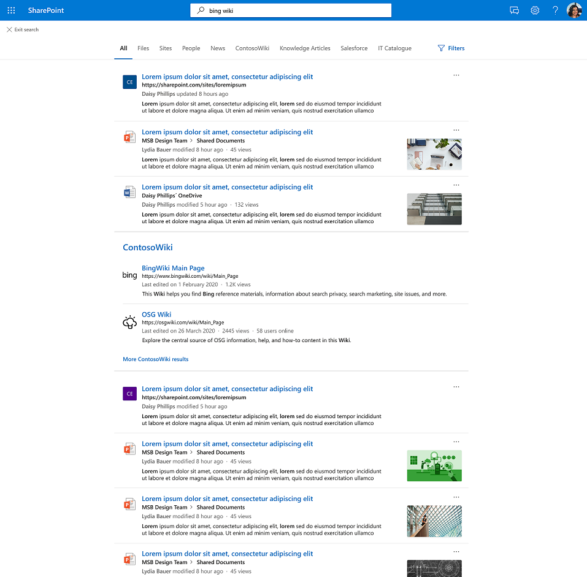

# Graph кластер результатов соединители

## Обзор кластера результатов Graph соединители  

С кластерами Graph результатов предприятия могут искать контент из сторонних источников данных  в представлении по умолчанию, вкладке All в SharePoint, Office.com и Поиск (Майкрософт) в Bing.

Кластеры результатов помогают пользователям открывать все сторонние контенты в одном месте. Результаты, показанные в кластере результатов, сгруппируются в зависимости от вертикальной конфигурации поиска.

## Выбор и отображение результатов соединители

Результаты соединителя, предоставляемые в кластере результатов, получены из отдельных вертикали поиска с содержимым соединителя. Каждая вертикаль поиска предоставляет набор соответствующих результатов, которые становятся кластером результатов кандидатов. Соответствующие результаты выбираются в зависимости от свойства "title" и "content" каждого элемента. Свойство контента помечено как *isContent=true* на схеме.

Чтобы обеспечить обнаружение контента из вертикали поиска, рекомендуется предоставить значимые заголовки для элементов. Это положительно влияет на арбитраж кандидатов кластера результатов и вероятность появления контента в кластере результатов. Например, не используйте ID в качестве значений для свойства "title", если только пользователи не будут использовать ID-объекты, чтобы искать контент.

Как часто отображается кластер результатов, зависит от таких факторов, как количество вертикали поиска, которые вы настраиваете, и тип контента. Взаимодействуя или игнорируя кластер результатов, пользователи будут неявно предоставлять подсказки, которые будут корректировать его запуск с течением времени.

В результате поиска элементов соединители,  показанных в кластере результатов, используются типы результатов, определенные вами. Если тип результатов не настроен, используется [схема, созданная](./customize-search-page.md#default-search-result-layout) системой.

Мы рекомендуем использовать свойство "title" в качестве заголовка результатов поиска, а свойство "контент" в качестве описания поиска. Это обеспечит наилучший опыт для пользователей путем точного запуска кластера результатов и наиболее релевантных результатов в кластере.

Кластеры результатов отображаются в середине страницы в вертикальной области All. Например, ниже отображается кластер результатов из вертикали MediaWiki.

## Параметры кластеров результатов по умолчанию
  
По умолчанию включено впечатление кластера результатов.  

Если вы хотите отключить его, выполните следующие действия, чтобы отключить опыт на уровне организации:

1. В [Центр администрирования Microsoft 365](https://admin.microsoft.com)перейдите к [**вертикалям**](https://admin.microsoft.com/Adminportal/Home#/MicrosoftSearch/verticals).
1. Выберите все **вертикали** и включении **результатов соединителя Hide.**

Выполните следующие действия, чтобы отключить опыт на SharePoint сайте:

1. Перейдите **Параметры** на SharePoint сайте
2. Перейдите **к сведениям о** > **сайте Просмотр всех параметров сайта.**
3. Перейдите в раздел Поиск (Майкрософт), а затем **выберите Настройка Поиск (Майкрософт) для этой коллекции сайтов.**
4. В области навигации перейдите к **настраиваемой области,** а затем выберите **Вертикали.**
5. Выберите все **вертикали** и включении **результатов соединителя Hide.**
