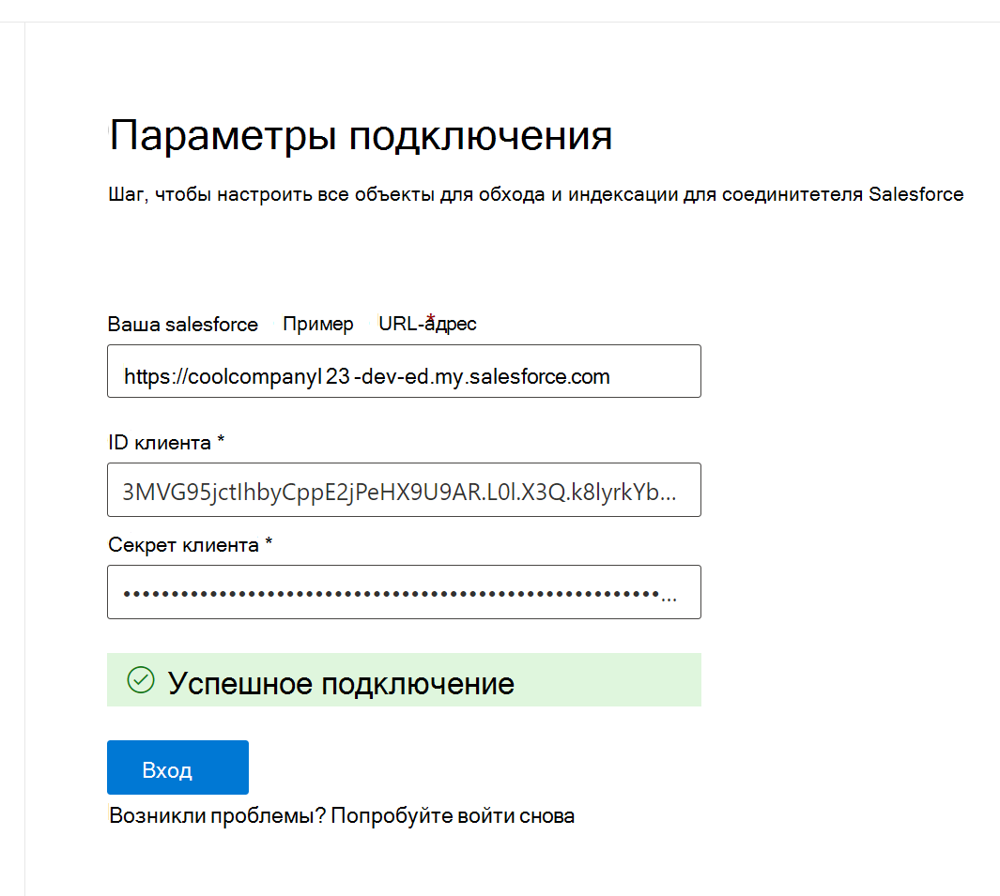

<!---Previous ms.author: rusamai --->

# Соединители Graph Salesforce

Соединитетельный Graph Salesforce позволяет организации индексировать объекты Contacts, Opportunities, Leads, Cases и Accounts в экземпляре Salesforce. После настройки соединители и индекса контента из Salesforce конечные пользователи могут искать эти элементы из любого Поиск (Майкрософт) клиента.

> [!NOTE]
> Ознакомьтесь [**с статьей Установка Graph,**](configure-connector.md) чтобы понять общие инструкции Graph соединители.

Эта статья для всех, кто настраивает, запускает и контролирует соединители Graph Salesforce. Он дополняет общий процесс установки и показывает инструкции, которые применяются только для соединитетеля Salesforce Graph. В этой статье также содержатся сведения об [ограничениях.](#limitations)

>[!IMPORTANT]
>Соединители salesforce Graph в настоящее время поддерживает лето '19 или более поздно.

## Перед началом работы

Чтобы подключиться к экземпляру Salesforce, вам потребуется URL-адрес экземпляра Salesforce, идентификация клиента и секрет клиента для проверки подлинности OAuth. В следующих действиях объясняется, как вы или администратор Salesforce можете получать эти сведения из учетной записи Salesforce:

- Войдите в экземпляр Salesforce и перейдите к установке

- Перейдите к Apps-> App Manager.

- Выберите **новое подключенного приложения.**

- Выполните раздел API следующим образом:

    - Выберите почтовый ящик **для включить Oauth Параметры**.

    - Укажите URL-адрес вызова в качестве: [https://gcs.office.com/v1.0/admin/oauth/callback](https://gcs.office.com/v1.0/admin/oauth/callback)

    - Выберите эти необходимые области OAuth.

        - Доступ и управление данными (aPI)

        - Выполнение запросов от вашего имени в любое время (refresh_token, offline_access)

    - Выберите почтовый ящик **для секрета Require для потока веб-сервера.**

    - Сохраните приложение.
    
      > [!div class="mx-imgBorder"]
      > 

- Скопируйте ключ потребителя и секрет потребителя. Эти сведения будут использоваться в качестве ИД клиента и секрета клиента при настройке Параметры подключения для Graph соединители на портале администрирования Microsoft 365.

  > [!div class="mx-imgBorder"]
  > 
  
- Перед закрытием экземпляра Salesforce выполните следующие действия, чтобы срок действия маркеров обновления не истек:
    - Перейдите в Apps -> App Manager
    - Найдите созданное приложение и выберите выпадаемую справа. Выберите **Управление**
    - Выбор **политик редактирования**
    - Для политики обновления маркеров выберите маркер **Обновления, допустимый до отзыва**

  > [!div class="mx-imgBorder"]
  > 

Теперь вы можете использовать [центр Microsoft 365 Admin](https://admin.microsoft.com/) для завершения остальной части процесса установки Graph соединители.

## Шаг 1. Добавление соединителю Graph в Центр администрирования Microsoft 365

Следуйте общим [инструкциям установки](./configure-connector.md).
<!---If the above phrase does not apply, delete it and insert specific details for your data source that are different from general setup instructions.-->

## Шаг 2. Имя подключения

Следуйте общим [инструкциям установки](./configure-connector.md).
<!---If the above phrase does not apply, delete it and insert specific details for your data source that are different from general setup instructions.-->

## Шаг 3. Настройка параметров подключения

Для URL-адреса экземпляра используйте https://[domain].my.salesforce.com, где доменом будет домен Salesforce для вашей организации.

Введите ИД клиента и секрет клиента, полученные из экземпляра Salesforce, и выберите Вход.

При первой попытке входа с этими настройками вы получите всплывающее всплывающее поле с просьбой войти в Salesforce с иным и иным и паролем администратора. На скриншоте ниже показано всплывающее всплывающее изображение. Введите учетные данные и выберите "Вход".

  

  >[!NOTE]
  >Если всплывающее не появится, оно может быть заблокировано в браузере, поэтому необходимо разрешить всплывающие окна и перенаправления.

Убедитесь, что подключение было успешным путем поиска зеленого баннера с надписью "Подключение успешно", как покажите на скриншоте ниже.

  > [!div class="mx-imgBorder"]
  > 

## Шаг 4. Выбор свойств

Выберите объекты Salesforce, которые необходимо обходить соединителе и включить в результаты поиска. Если выбран контакт, автоматически будет выбрана учетная запись.

>[!NOTE]
>Если для профиля установлено полевой уровень безопасности (FLS), соединителер не будет гнать это поле для профилей в этой организации Salesforce. В результате пользователи не смогут искать значения для этих полей и не будут показываться в результатах.

## Шаг 5. Управление разрешениями на поиск

Необходимо выбрать, какие пользователи будут видеть результаты поиска из этого источника данных. Если вы разрешаете видеть результаты поиска только определенным пользователям Azure Active Directory (Azure AD) или Non-Azure AD, убедитесь, что вы на карте удостоверений.

### Шаг 5.a. Выбор разрешений

Вы можете выбрать для получения списков управления доступом (ACLs) из экземпляра Salesforce или разрешить всем в вашей организации видеть результаты поиска из этого источника данных. AcLs могут включать Azure Active Directory (AAD) удостоверений (пользователей, которые являются федеративами от Azure AD до Salesforce), удостоверений нелазурной AD (местных пользователей Salesforce, которые имеют соответствующие удостоверения в Azure AD) или обоих.

>[!NOTE]
>Если используется сторонний поставщик удостоверений, например Ping ID или secureAuth, в качестве типа удостоверения следует выбрать "non-AAD".

> [!div class="mx-imgBorder"]
> 

Если вы решили гнать ACL из экземпляра Salesforce и выбрали "non-AAD" для типа удостоверений, см. в примере Map [your non-Azure AD Identitys](map-non-aad.md) для инструкций по сопоставлению удостоверений.

### Шаг 5.b. Идентификаторы map AAD

Если вы решили гнать ACL из экземпляра Salesforce и выбрали AAD для типа удостоверений, см. в примере Map [your Azure AD Identitys](map-aad.md) для инструкций по сопоставлению удостоверений. Подробнее о том, как настроить SSO Azure AD для Salesforce, см. в этом [руководстве.](/azure/active-directory/saas-apps/salesforce-tutorial)

### Применение сопоставления пользователей для синхронизации удостоверений Salesforce с удостоверениями Azure AD

В этом видео вы можете увидеть процесс проверки подлинности в экземпляре Salesforce, синхронизировать свои удостоверения Azure Active Directory с удостоверениями Azure Active Directory и применить соответствующие обрезки безопасности для элементов Salesforce.

> [!VIDEO https://www.youtube-nocookie.com/embed/SZYiFxZMKcM]

## Шаг 6. Назначение меток свойств

Вы можете назначить свойству источника для каждой метки, выбрав из меню параметры. Хотя этот шаг не является обязательным, наличие некоторых меток свойств повысит релевантность поиска и обеспечит лучшие результаты поиска для конечных пользователей. По умолчанию некоторые метки, такие как "Title", "URL", "CreatedBy" и "LastModifiedBy", уже назначены исходные свойства.

## Шаг 7. Управление схемой

Можно выбрать, какие исходные свойства следует проиндексировать, чтобы они были в результатах поиска. Мастер подключения по умолчанию выбирает схему поиска на основе набора исходных свойств. Вы можете изменить его, выбрав флажки для каждого свойства и атрибута на странице схемы поиска. Атрибуты схемы поиска включают поиск, запрос, извлечение и уточнение.
Уточнение позволяет определить свойства, которые впоследствии можно использовать в качестве настраиваемой переработчики или фильтры в опытом поиска.  

> [!div class="mx-imgBorder"]
> 

## Шаг 8. Установите расписание обновления

Соединители Salesforce поддерживает только расписание обновления для полного обхода в настоящее время.

>[!IMPORTANT]
>Полный обход находит удаленные объекты и пользователей, которые ранее синхронизировались с индексом Поиск (Майкрософт).

Рекомендуемое расписание — одна неделя для полного обхода.

## Шаг 9. Просмотр подключения

Следуйте общим [инструкциям установки](./configure-connector.md).

>[!TIP]
>**Тип результата по умолчанию**
>* Соединителю Salesforce автоматически регистрируется тип [результатов](./customize-search-page.md#step-2-create-result-types) после публикации соединителю. Тип результатов использует динамически созданный [макет результатов](./customize-results-layout.md) на основе полей, выбранных в шаге 3.
>* Вы можете управлять типом результатов, переходя на типы [**результатов**](https://admin.microsoft.com/Adminportal/Home#/MicrosoftSearch/resulttypes) в [Центр администрирования Microsoft 365.](https://admin.microsoft.com) Тип результатов по умолчанию будет называться `ConnectionId` "По умолчанию". Например, если у вас есть id подключения, макет результатов будет `Salesforce` назван: "SalesforceDefault"
>* Кроме того, при необходимости можно создать собственный тип результатов.
<!---If the above phrase does not apply, delete it and insert specific details for your data source that are different from general setup instructions.-->

<!---## Troubleshooting-->
<!---Insert troubleshooting recommendations for this data source-->

## Ограничения

- Соедините Graph в настоящее время не поддерживает совместное использование и совместное использование персональных групп из Salesforce на основе Apex.
- Существует известная ошибка в API Salesforce, Graph соединительщика, где частные значения по умолчанию для лид-клиентов в настоящее время не чтются.  
- Если для профиля установлено полевой уровень безопасности (FLS), соединителер Graph не будет гнать это поле для профилей в этой организации Salesforce. В результате пользователи не смогут искать значения для этих полей и не будут показываться в результатах.  
- В экране Управление схемой эти общие стандартные имена свойств перечислены один раз, параметры **запроса,** **поиска,** получения и уточнения **и** применяются к всем или нет.
    - Имя
    - Url
    - Описание
    - Fax
    - Phone
    - MobilePhone
    - Электронная почта
    - Тип
    - Название
    - AccountId
    - AccountName
    - AccountUrl
    - AccountOwner
    - AccountOwnerUrl
    - Владелец
    - OwnerUrl
    - CreatedBy
    - CreatedByUrl
    - LastModifiedBy
    - LastModifiedByUrl
    - LastModifiedDate
    - ObjectName
