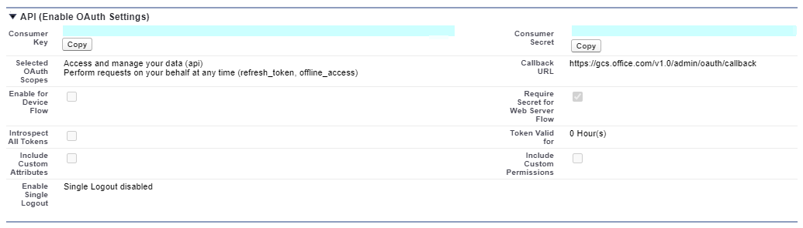
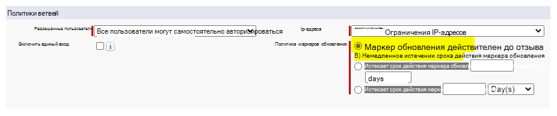
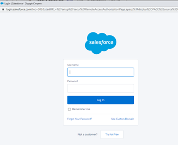
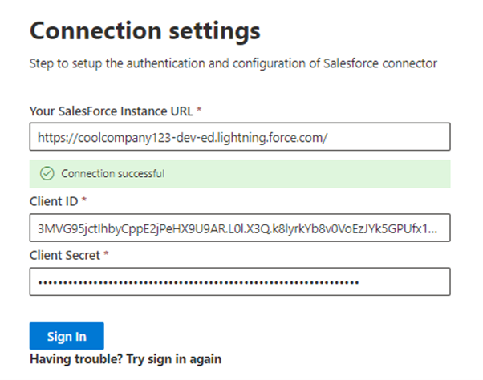
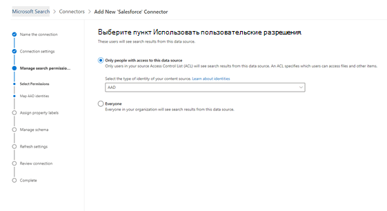
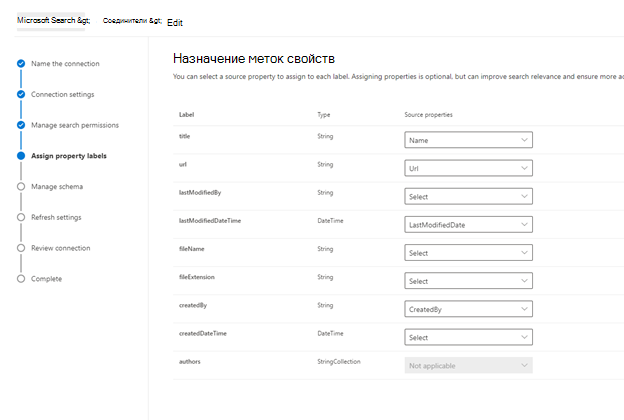
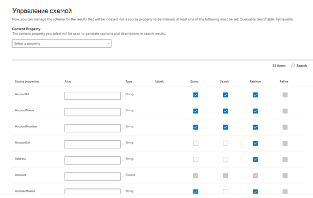

# Соединитель Salesforce (Предварительная версия)

С помощью соединителя диаграмм Salesforce организация может индексировать объекты Contacts, возможные сделки, интересы и Организации в экземпляре Salesforce. После настройки соединителя и индексирования содержимого из Salesforce пользователи могут выполнять поиск этих элементов в любом клиенте Microsoft Search.

Эта статья предназначена для администраторов [Microsoft 365](https://www.microsoft.com/microsoft-365) или пользователей, которые настраивают, запускают и отслеживают соединитель Salesforce. В этой статье объясняется, как настроить возможности соединителя и соединителя, ограничения и способы устранения неполадок.

>[!IMPORTANT]
>В настоящее время соединитель графа Salesforce поддерживает 19 или более поздней версии.

## Параметры подключения

Чтобы подключиться к экземпляру Salesforce, вам потребуются URL-адрес экземпляра Salesforce, идентификатор клиента и секрет клиента для проверки подлинности OAuth. В следующих шагах описывается, как вы или ваш администратор Salesforce может получить эту информацию из вашей учетной записи Salesforce:

- Выполните вход в экземпляр Salesforce и перейдите к разделу "Настройка".

- Перейдите в раздел Appss — > App Manager.

- Выберите **новое подключенное приложение**.

- Заполните раздел API следующим образом:

    - Установите флажок **включить параметры OAuth**.

    - Укажите URL-адрес обратного вызова как: [https://gcs.office.com/v1.0/admin/oauth/callback](https://gcs.office.com/v1.0/admin/oauth/callback)

    - Выберите необходимые области OAuth. 

        - Доступ к данным и управление ими (API) 

        - Выполнение запросов от вашего имени в любое время (refresh_token, offline_access) 

    - Установите флажок **требовать секрет для веб-сервера**.

    - Сохраните приложение.
    
      

- Скопируйте ключ потребителя и секрет клиента. Они будут использоваться в качестве идентификатора клиента и секрета клиента при настройке параметров подключения для графического соединителя на портале администрирования Microsoft 365.

  
- Перед закрытием экземпляра Salesforce выполните следующие действия, чтобы убедиться, что срок действия маркеров обновления не истек:
    - Переход в раздел Appss — > App Manager
    - Найдите только что созданное приложение и выберите раскрывающийся список справа. Выберите **Управление**
    - Выбор параметра " **изменить политики** "
    - Для политики маркеров обновления выберите **маркер обновления действителен до отзыва**

  

Теперь вы можете использовать [центр администрирования M365](https://admin.microsoft.com/) для завершения оставшейся части процесса установки для графического соединителя.  

Настройте параметры подключения для соединителя Graph следующим образом:

- В качестве URL-адреса экземпляра используйте HTTPS://[домен]. My. Salesforce. com, где Domain — это домен salesforce для вашей организации. 
- Введите идентификатор клиента и секрет клиента, полученные из экземпляра Salesforce, и нажмите кнопку войти.
- Если вы впервые попытались войти с помощью этих параметров, вы получите всплывающее окно с запросом на вход в SalesForce с помощью имени пользователя и пароля администратора. На снимке экрана ниже показано всплывающее окно. Введите свои учетные данные и нажмите кнопку войти.

  

  >[!NOTE]
  >Если всплывающее окно не отображается, оно может быть заблокировано в браузере, поэтому необходимо разрешить всплывающие окна и перенаправление.

  >[!NOTE]
  >Если в вашей организации используется единый вход (SSO), в нижнем правом углу интерфейса входа можно выбрать **использовать личный домен** . Введите домен и нажмите кнопку **продолжить**. Она будет переходить на страницу входа, относящуюся к конкретной организации, где у вас будет возможность входа с помощью единого входа.

- Убедитесь, что подключение было успешным, выполнив поиск зеленого баннера с текстом "подключение успешно", как показано на снимке экрана ниже.

  

## Управление разрешениями поиска
Вам потребуется выбрать, какие пользователи будут видеть результаты поиска из этого источника данных. Если вы разрешаете просматривать результаты поиска только определенным пользователям Azure Active Directory (Azure AD) или пользователям, не являющимся пользователями Azure AD, вам потребуется сопоставить удостоверения.

### Выбор разрешений
Вы можете использовать списки управления доступом (ACL) из экземпляра Salesforce или разрешить всем пользователям в организации просматривать результаты поиска из этого источника данных. Списки управления доступом могут включать удостоверения Azure Active Directory (AAD) (пользователи, Федеративные из Azure AD в Salesforce), идентификаторы, не относящиеся к Azure AD (собственные пользователи Salesforce, имеющие соответствующие удостоверения в Azure AD), или и то, и другое.

### Сопоставление удостоверений, не являющихся AAD 
Если вы решили присвоить список управления доступом из экземпляра Salesforce и выбрать "не AAD" для типа удостоверения, ознакомьтесь с инструкциями по сопоставлению удостоверений в статье [Map of Azure AD](map-non-aad.md) identitys.

### Сопоставление удостоверений AAD
Если вы решили присвоить список управления доступом из экземпляра Salesforce и выбрать "AAD" для типа удостоверения, ознакомьтесь со статьей Сопоставление удостоверений [Azure AD](map-aad.md) для получения инструкций по сопоставлению удостоверений. Сведения о том, как настроить единый вход Azure AD для Salesforce, можно найти в этом [руководстве](https://docs.microsoft.com/en-us/azure/active-directory/saas-apps/salesforce-tutorial).

## Назначение меток свойств 
Можно назначить свойство источника каждой метке, выбрав в меню пункт Параметры. Хотя это действие не является обязательным, наличие некоторых меток свойств повысит релевантность поиска и обеспечит более точные результаты поиска для конечных пользователей. По умолчанию для некоторых меток, таких как "Title", "URL", "CreatedBy" и "Ластмодифиедби", уже были назначены исходные свойства.

## Управление схемой
Вы можете выбрать, какие исходные свойства следует индексировать, чтобы они могли отображаться в результатах поиска. По умолчанию в мастере подключения выбирается схема поиска на основе набора свойств источника. Его можно изменить, установив флажки для каждого свойства и атрибута на странице схема поиска. Атрибуты схемы поиска включают поиск, запрос, получение и уточнение. Уточнение позволяет определить свойства, которые позднее можно использовать в качестве настраиваемых уточнений или фильтров в интерфейсе поиска.  

## Настройка расписания обновления

Соединитель Salesforce поддерживает только расписания обновления для полного обхода в текущий момент.

>[!IMPORTANT]
>Полный обход контента выполняет поиск удаленных объектов и пользователей, которые ранее были синхронизированы с индексом поиска Майкрософт.

Для полного обхода рекомендуется использовать расписание на одну неделю.

## Ограничения

- Соединитель Graph в настоящее время не поддерживает общий доступ к Апекс, основанный на территориях, и общий доступ с использованием личных групп Salesforce.
- В API Salesforce обнаружена известная ошибка, в которой соединитель Graph использует, где в настоящее время не поддерживаются частные географические параметры по умолчанию для интересов.  
- Если для профиля задана защита на уровне полей (ФЛС), соединитель Graph не будет использовать это поле для всех профилей в этой Организации Salesforce. Таким образом, пользователи не смогут выполнять поиск по значениям для этих полей, и они не будут отображаться в результатах.  
- В окне Управление схемой эти стандартные имена стандартных свойств указаны один раз, и выбранные элементы, позволяющие сделать их запросами, доступны для поиска и извлечения, применяются ко всем или нет.
    - Имя
    - Url 
    - Описание
    - Fax
    - Phone
    - MobilePhone
    - Электронный адрес
    - Тип
    - Название
    - AccountId
    - Имя_учетной_записи
    - аккаунтурл
    - аккаунтовнер
    - аккаунтовнерурл
    - Владелец
    - овнерурл
    - CreatedBy 
    - креатедбюрл 
    - LastModifiedBy 
    - ластмодифиедбюрл 
    - LastModifiedDate
    - ObjectName 
