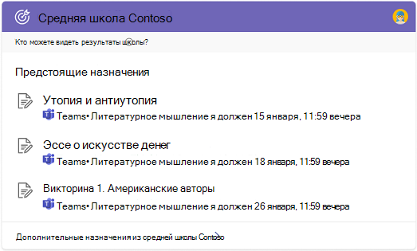
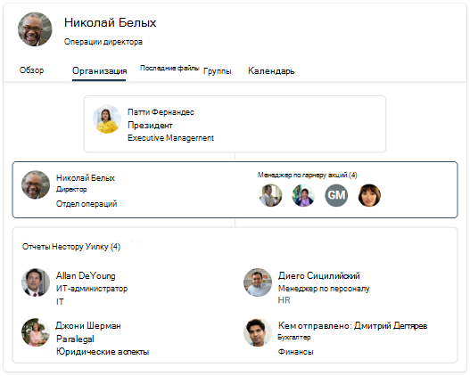

# Выбор учебного или работаного поиска (Предварительная версия)

Если в организации есть планы образовательных и корпоративных служб, вы можете выбрать Поиск (Майкрософт) в Bing для пользователей, в школе или на работе. Так как этот параметр будет применяться для всех пользователей, мы рекомендуем выбрать параметр, который совпадает с большинством пользователей в вашей организации.

1. В [Центр администрирования Microsoft 365](https://admin.microsoft.com)перейдите к [конфигурациям](https://admin.microsoft.com/Adminportal/Home#/MicrosoftSearch/configurations).
1. В Поиск (Майкрософт) в Bing для работы или школы выберите **параметры Изменения.**
1. На панели выберите опыт поиска, поиск в школе или поиск по работе. Для появления этого изменения в Bing может потребоваться до 72 Bing.

## Различия между поиском в школе и работой

По большей части, опыт поиска в школе и работе на Поиск (Майкрософт) в Bing похожи. Пользователи могут находить людей, файлы, сайты, ответы и другие. Но есть несколько ключевых отличий:

### Поиск в школе

Опыт поиска в школе включает два уникальных ответа, классы и назначения. В ответе классов учащиеся и преподаватели могут увидеть полный список своих классов и использовать ссылки, чтобы присоединиться к классу в Microsoft Teams. В ответе на назначения они могут увидеть список предстоящих назначений, отсортированную по срокам.

Школьные пользователи могут получить ответы на занятия и задания, введите эти запросы в поле поиска [Bing:](https://Bing.com)

- Мои классы
- Классы
- Мои назначения
- Домашнее задание

Кроме того, для пользователей школьного поиска значение SafeSearch по умолчанию строгое. Дополнительные сведения о SafeSearch см. в [материалах Block adult content with SafeSearch.](https://support.microsoft.com/topic/946059ed-992b-46a0-944a-28e8fb8f1814)

### Поиск работы

Опыт поиска работы включает в себя организационные диаграммы и Power BI ответы. Они недоступны в школьном поиске.

Сведения о Power BI см. в [Power BI.](manage-powerbi.md)
