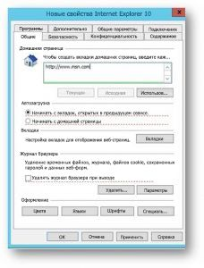

# Настройка Bing.com в качестве домашней страницы по умолчанию

В этой статье описывается, как настроить Bing.com в качестве домашней страницы по умолчанию для браузеров Microsoft Edge, Google Chrome и Internet Explorer. 
  
 
## Microsoft Edge в Windows 10 версии 1511 или более поздней

Пользователи не смогут изменить настройку после установки этой политики. 

1. Откройте консоль управления групповыми политиками (gpmc.msc) и перейдите к редактированию любой существующей политики или созданию новой. 
1. Перейдите к разделу **Administrative Templates\Windows Components\Microsoft Edge**.    
1. Дважды щелкните параметр **Configure Start pages** (Настройка начальных страниц), установите для него значение **Enabled** (Включено) и введите `https://www.bing.com/business`
1.  Примените полученный объект групповой политики, привязав его к нужному домену.

  
## Google Chrome в Windows XP с пакетом обновления 2 (SP2) или более поздней версии

Статью службы поддержки Майкрософт об управлении ADMX-файлами и последние версии ADMX-файлов для разных версий Windows можно найти [на сайте службы поддержки Майкрософт](https://support.microsoft.com/help/3087759/how-to-create-and-manage-the-central-store-for-group-policy-administra).

Вам также потребуется последняя версия файла политики Google, который можно найти на сайте [справки Google Chrome Enterprise](https://support.google.com/chrome/a/answer/187202).
  
Если в GPMC не удается найти параметры, описанные в этом разделе, скачайте соответствующие ADMX-файлы и скопируйте их в [центральное хранилище](https://docs.microsoft.com/previous-versions/windows/it-pro/windows-vista/cc748955%28v%3dws.10%29). Центральное хранилище на контроллере — это папка с указанными ниже правилами именования:
  
 **%systemroot%\sysvol\\<domain\>\policies\PolicyDefinitions**
  
Все домены, обслуживаемые контроллером, должны получить отдельную папку. Чтобы скопировать ADMX-файл из командной строки, можно использовать указанную ниже команду:
  
 `Copy <path_to_ADMX.ADMX> %systemroot%\sysvol\<domain>\policies\PolicyDefinitions`
  
1. Откройте консоль управления групповыми политиками (gpmc.msc) и перейдите к редактированию любой существующей политики или созданию новой.
1. Проверьте, что в разделе **Administrative Templates** (Административные шаблоны) для обеих конфигураций *User/Computer Configuration* (Конфигурация пользователя/компьютера) отображаются следующие папки: Google Chrome и Google Chrome – Default Settings (могут переопределяться пользователями).
   - Параметры первого раздела являются фиксированными, и локальный администратор не сможет их изменить.
   - Параметры последнего раздела политик могут изменяться пользователями в настройках браузера. Вы должны решить, могут ли пользователи переопределять параметр, установленный по умолчанию. В приведенных ниже действиях выполняются изменения параметра в папке в соответствии с политикой и потребностями организации. В указанных ниже действиях используются стандартные параметры Google Chrome в качестве параметров по умолчанию.

1. Перейдите к разделу **&lt;Computer/User Configuration&gt;\Administrative Templates\Google Chrome - Default Settings\Home Page**. 
1. Дважды щелкните параметр **Use New Tab Page as homepage** (Использовать новую вкладку в качестве домашней страницы) и установите для него значение **Enabled** (Включено). 
1. Перейдите к разделу **&lt;Computer/User Configuration&gt;\Administrative Templates\Google Chrome - Default Settings\New Tab Page**. 
1. Дважды щелкните параметр **Configure the New Tab Page URL** (Настройка URL-адреса новой вкладки), установите для него значение **Enabled** (Включено) и введите `https://www.bing.com/business?form=BFBSPR` 
1. Примените полученный объект групповой политики, привязав его к нужному домену.

## Internet Explorer 5.0 или более поздняя версия
Пользователи по-прежнему смогут сменить домашнюю страницу после установки этой политики. 

1. Откройте консоль управления групповыми политиками (gpmc.msc) и перейдите к редактированию любой существующей политики или созданию новой.
    
2. Перейдите к разделу **User Configuration\Preferences\Control Panel Settings\Internet Settings**.
    
3. Щелкните правой кнопкой мыши **Internet Settings** (Параметры Интернета) и выберите **Internet Explorer 10**.
    
    > [!NOTE]
    > Необходимо выбрать параметр Internet Explorer 10, чтобы применить настройки для Internet Explorer 11, так как для него применяются такие же настройки. 
  
4. Параметры, подчеркнутые красным, не настроены на целевом компьютере, а подчеркнутые зеленым — настроены. Чтобы изменить подчеркивание, используйте указанные ниже функциональные клавиши:
    
    F5 — включение всех параметров на текущей вкладке
    
    F6 — включение выбранных параметров
    
    F7 — отключение выбранных параметров
    
    F8 — отключение всех параметров на текущей вкладке
    
5. Нажмите клавишу **F8**, чтобы отключить все параметры перед выполнение любой настройки. Экран должен выглядеть примерно так: 
    
    
  
6. Нажмите клавишу **F6** в параметрах домашней страницы и введите `https://www.bing.com/business?form=BFBSPR`
    
7. Примените полученный объект групповой политики, привязав его к нужному домену.