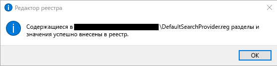
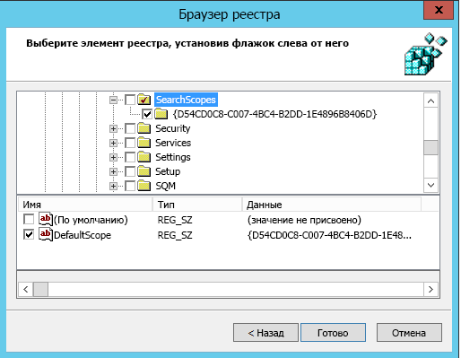
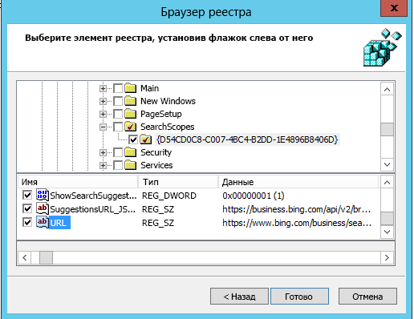

# Установка поисковой системы по умолчанию

> [!IMPORTANT]
> Эта статья относится к Поиску (Майкрософт) на портале администрирования Bing. Мы переносим портал в Центр администрирования Microsoft 365 с последующим его удалением. Чтобы приступить к работе, рекомендуется использовать Центр администрирования Microsoft 365. [Обзор Поиска (Майкрософт)](overview-microsoft-search.md).
    
Настройка браузера, поисковой системы и домашней страницы по умолчанию поможет пользователям раскрыть возможности Поиска (Майкрософт), поддерживает дополнительное использование и обеспечивает удобный интерфейс.
  
Чтобы установить поисковую систему по умолчанию для организации, следуйте указанным ниже инструкциям.
  
## Internet Explorer

### Internet Explorer 11

Пользователи смогут сменить поставщика поиска после установки этой политики.
  
#### 1. Настройте локальный компьютер, который будет использоваться для установки объекта групповой политики.

Вставьте указанный ниже текст в REG-файл (\*.reg).
  
Windows Registry Editor Version 5.00
  
<pre>[HKEY_CURRENT_USER\Software\Microsoft\Internet Explorer\SearchScopes]
"DefaultScope"="{D54CD0C8-C007-4BC4-B2DD-1E4896B8406D}"
[HKEY_CURRENT_USER\Software\Microsoft\Internet Explorer\SearchScopes\{D54CD0C8-C007-4BC4-B2DD-1E4896B8406D}]
"Codepage"=dword:0000fde9
"DisplayName"="Microsoft Search in Bing"
"OSDFileURL"="https://www.bing.com/sa/osd/bfb.xml"
"FaviconURL"="https://www.bing.com/sa/simg/bb.ico"
"SuggestionsURL_JSON"="https://business.ing.com/api/v2/browser/suggest?q={searchTerms}&amp;form=BFBSPA"
"ShowSearchSuggestions"=dword:00000001
"URL"="https://www.bing.com/business/search?q={searchTerms}&amp;form=BFBSPR"</pre>
  
Дважды щелкните созданный файл и выполните действия для импорта файла. После успешного выполнения импорта появится указанное ниже диалоговое окно:
  

  
#### 2. Откройте консоль управления групповыми политиками (gpmc.msc) и перейдите к редактированию любой существующей политики или созданию новой.

1. Перейдите к разделу **User Configuration\Policies\Preferences\Windows Settings**.
    
2. Щелкните правой кнопкой мыши **Registry\New** (Реестр\Создать) и выберите **Registry Wizard** (Мастер реестра). В окне браузера реестра выберите **Local Computer** (Локальный компьютер) и нажмите кнопку **Next** (Далее).
    
3. Перейдите к разделу **HKEY_CURRENT_USER\SOFTWARE\Microsoft\Internet Explorer\SearchScopes**.
    
4. В этом разделе обязательно выберите имя DefaultScope.
    
    
  
5. Проверьте все подразделы, содержащие идентификатор GUID для Поиска (Майкрософт) в Bing, и каждое значение в разделе, кроме путей к профилям пользователей. Прокрутите вниз, чтобы выбрать другие элементы.
    
    
  
6. Нажмите кнопку "Готово", чтобы завершить настройку.
    
#### 3. Настройка параметров пользователя для устранения предупреждения, которое может появляться при применении поиска DefaultScope

Это предупреждение является стандартным и уведомляет пользователей о программе, пытающейся изменить настройки.
  
1. В том же объекте групповой политики щелкните правой кнопкой мыши **Registry\New** (Реестр\Создать) и выберите **Registry Wizard** (Мастер реестра).
    
2. Перейдите к разделу **HKEY_CURRENT_USER\SOFTWARE\Microsoft\Internet Explorer\User Preferences**.
    
3. Выберите раздел **User Preference** (Параметры пользователя).
    
4. Нажмите кнопку **Готово**.
    
5. Щелкните созданный объект. В области справа дважды щелкните объект параметров пользователя и измените **Action** (Действие) на **Delete and Save** (Удалить и сохранить).
    
Примените полученный объект групповой политики, привязав его к нужному домену.
  
## Microsoft Edge

### Windows 10 версии 1703 или более поздней

Пользователи смогут сменить поставщика поиска после установки этой политики.
  
Последние версии ADMX-файлов для разных версий Windows см. в статье [Как создать центральное хранилище для административных шаблонов групповой политики в Windows и управлять им](https://support.microsoft.com/ru-RU/help/3087759/how-to-create-and-manage-the-central-store-for-group-policy-administra).
  
Если в GPMC не удается найти параметр, описанный в этом разделе, скачайте соответствующие ADMX-файлы и скопируйте их в центральное хранилище. Дополнительные сведения см. в статье [Изменение объектов GPO на основе домена с помощью ADMX-файлов](https://docs.microsoft.com/ru-RU/previous-versions/windows/it-pro/windows-vista/cc748955%28v%3dws.10%29). Центральное хранилище на контроллере — это папка с указанными ниже правилами именования:
  
 **%systemroot%\sysvol\\<domain\>\policies\PolicyDefinitions**
  
Все домены, обслуживаемые контроллером, должны получить отдельную папку. Чтобы скопировать ADMX-файл из командной строки, можно использовать указанную ниже команду:
  
 `Copy <path_to_ADMX.ADMX> %systemroot%\sysvol\<domain>\policies\PolicyDefinitions`
  
1. Откройте консоль управления групповыми политиками (gpmc.msc) и перейдите к редактированию любой существующей политики или созданию новой.
    
2. Перейдите к разделу **&lt;Computer/User Configuration&gt;\Administrative Templates\Windows Components\Microsoft Edge**.
    
1. Дважды щелкните параметр **Set default search engine** (Задать поисковую систему по умолчанию), установите значение **Enabled** (Включено) и введите `https://www.bing.com/sa/osd/bfb.xml`
    
3. Примените полученный объект групповой политики, привязав его к нужному домену.
    
## Google Chrome

### Windows XP с пакетом обновления 2 (SP2) или более поздняя версия

Пользователи не смогут сменить поставщика поиска после установки этой политики.
  
Chrome содержит собственный набор параметров групповой политики, которые можно скачать в виде ADMX-файла с сайта [справки Google Chrome Enterprise](https://support.google.com/chrome/a/answer/187202). Если для управления объектом GPO для домена используются операционные системы Windows Vista/Server 2008 или более поздней версии, ADMX-файл, поставляемый в этом пакете, позаботится о настройках Chrome на Windows XP SP2 или более поздней версии.
  
Скопируйте файл шаблона в центральное хранилище для ADMX-файлов на контроллере домена. Дополнительные сведения см. в статье [Изменение объектов GPO на основе домена с помощью ADMX-файлов](https://docs.microsoft.com/ru-RU/previous-versions/windows/it-pro/windows-vista/cc748955%28v%3dws.10%29). Центральное хранилище на контроллере — это папка с указанными ниже правилами именования:
  
 **%systemroot%\sysvol\\<domain\>\policies\PolicyDefinitions**
  
Все домены, обслуживаемые контроллером, должны получить отдельную папку. Чтобы скопировать ADMX-файл из командной строки, можно использовать указанную ниже команду:
  
 `Copy <path_to_Chrome.ADMX> %systemroot%\sysvol\<domain>\policies\PolicyDefinitions`
  
1. Откройте консоль управления групповыми политиками (gpmc.msc) и перейдите к редактированию любой существующей политики или созданию новой.
    
2. Проверьте, что в разделе Administrative Templates (Административные шаблоны) для обеих конфигураций User/Computer Configuration (Конфигурация пользователя/компьютера) отображаются следующие папки: Google Chrome и Google Chrome – Default Settings.
    
  - Параметры первого раздела являются фиксированными, и локальные администраторы не смогут их изменять в браузере.
    
  - Параметры последнего раздела политик могут изменяться пользователями в настройках браузера.
    
3. Перейдите к разделу **\<Computer/User\> Configuration\Administrative Templates\Google Chrome\Default search provider**
    
4. Дважды щелкните параметр **Enable the default search provider** (Включить поставщика поиска по умолчанию) и установите для него значение **Enabled** (Включено).
    
5. Дважды щелкните параметр **Default search provider icon** (Значок поставщика поиска по умолчанию), установите для него значение **Enabled** (Включено) и введите `https://www.bing.com/sa/simg/bb.ico`
    
6. Дважды щелкните параметр **Default search provider instant URL** (URL-адрес для быстрого поиска поставщика поиска по умолчанию) и введите `https://www.bing.com/business/search?q={searchTerms}&amp;form=BFBSPR`
    
7. Дважды щелкните параметр **Default search provider name** (Имя поставщика поиска по умолчанию), установите для него значение Enabled (Включено) и введите "Поиск (Майкрософт) в Bing"
    
8. Дважды щелкните параметр **Default search provider search URL** (Поисковый URL-адрес поставщика поиска по умолчанию), установите для него значение **Enabled** (Включено) и введите `https://www.bing.com/business/search?q={searchTerms}&amp;form=BFBSPR`
    
9. Дважды щелкните параметр **Default search provider suggest URL** (Рекомендуемый URL-адрес поставщика поиска по умолчанию), установите для него значение **Enabled** (Включено) и введите `https://business.bing.com/api/v2/browser/suggest?q={searchTerms}&amp;form=BFBSPA`
    
10. Примените полученный объект групповой политики, привязав его к нужному домену.
    
Настройка поисковой системы по умолчанию добавит функцию поисковых вариантов Поиска (Майкрософт) в адресной строке браузера. В настоящее время она поддерживается только для закладок. При вводе в адресной строке пользователи увидят две самые популярные рекомендации для закладок над предложениями из Интернета.