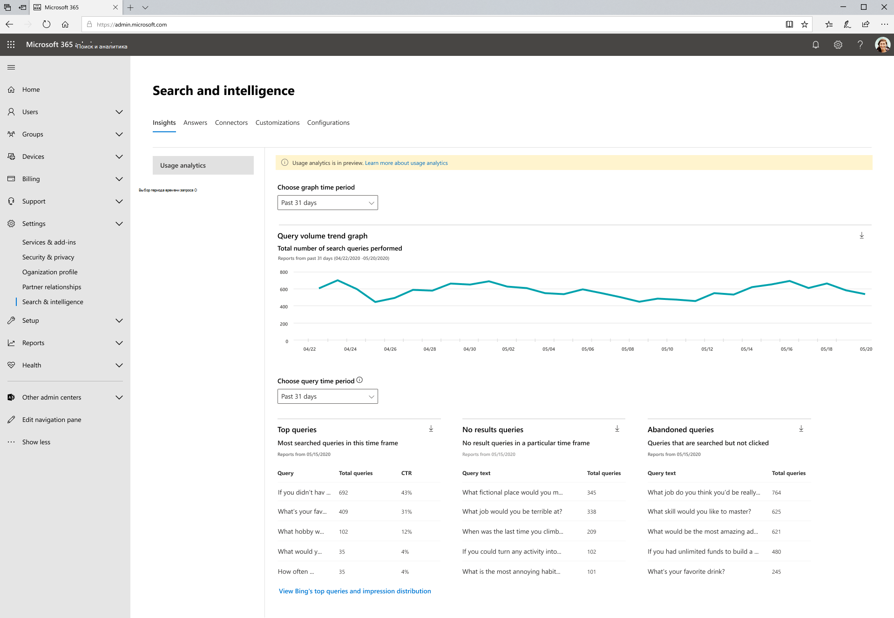

# Поиск (Майкрософт) Отчеты об использовании

Отчеты об использовании поиска позволяют получить больше понимания того, как работает поиск в организации. Сведения, полученные из этих отчетов, помогут вам принять меры, которые сделают поиск более полезным и приятным для пользователей.

> [!IMPORTANT]
> Поиск (Майкрософт) отчеты об использовании в настоящее время находятся в предварительной версии

Отчеты [Поиск (Майкрософт)](https://admin.microsoft.com/Adminportal/Home?#/MicrosoftSearch/insights) использования включают графики и таблицы, созданные из поисковых запросов, выполненных из SharePoint Home, Office.com и Поиск (Майкрософт) в Bing поисковых ящиках. Вы можете видеть данные за последние 31 день, день или месяц за предыдущий год. Эти отчеты просто развертываются, поэтому на накопление исторических данных необходимо время.

> [!div class="mx-imgBorder"]
> 

## Обзор отчетов о поиске

| Отчет | Описание |
|:-----|:-----|
|Том запроса|В этом отчете показано количество выполненных поисковых запросов. Этот отчет используется для определения тенденций объема запросов поиска и определения периодов высокой и низкой активности поиска.|
|Самые популярные запросы|В этом отчете отображаются самые популярные поисковые запросы. Запрос добавляется в этот отчет при поиске по крайней мере три раза с щелчком мыши по результату. Используйте этот отчет, чтобы понять, какие типы информации ищут пользователи.|
|Оставленные запросы|В этом отчете показаны популярные поисковые запросы, которые получают низкий щелчок. Используйте этот отчет для определения запросов поиска, которые могли привести к неудовлетворенности пользователей, и повышения вероятности обнаружения контента. Затем можно определить, правильно ли создать ответ, например закладки, или использовать новый контент Graph соединитетелем.|
|Нет запросов результатов|В этом отчете отображаются популярные поисковые запросы, которые не вернули результатов. Используйте этот отчет для определения запросов поиска, которые могли привести к неудовлетворенности пользователей, и повышения вероятности обнаружения контента. Затем можно определить, правильно ли создать ответ, например закладки, или использовать новый контент Graph соединитетелем.|

>[!NOTE]
>В настоящее время существует известная проблема, из-за которой запросы, удовлетворяемые таким ответом, как закладки, считаются заброшенным запросом.

## Просмотр отчетов

При переходе на страницу отчетов об использовании все отчеты доступны для просмотра. Фильтр даты можно использовать для просмотра определенного дня или месяца.

Загрузка отчета позволит вам видеть отчеты из более широкого диапазона времени. Щелкните стрелку загрузки и выберите **последние 31 день или** последние **12 месяцев.** Отчет загружается как Excel таблицы. Если вы выбрали за 31 день, в таблице будет иметься индивидуальная вкладка для каждого дня. В течение последних 12 месяцев загрузка будет иметь вкладку для каждого месяца.

## Вопросы и ответы

**Когда я выбираю последние 31 день или последние 12 месяцев, почему я должен выбрать определенный день или определенный месяц.**

Представление календаря на сегодняшний день в отчетах об использовании поиска Майкрософт — это двухшаговая процедура. Сначала выберите диапазон дат от отсевов (за 31 день или последние 12 месяцев), а затем выберите день начала или месяц.

В верхней, заброшенной и неудачной таблицах запросов покажут результаты дня или месяца, который вы выбрали.

**Когда я увижу совокупные данные за последние 7 дней, последние 30 дней и так далее...?**

Мы рассматриваем этот тип агрегации и упрощаем фильтрацию диапазона данных для будущих версий этих отчетов.

**Почему я не вижу разбивку отчетов об использовании различных приложений (источников)?**

В настоящее время фильтрация по источнику недоступна. Отчеты объединяют поиск в SharePoint Home и Office.com. В следующем выпуске будет фильтрация исходных источников, чтобы вы могли видеть метрик, специфические для каждого приложения.

**Какие еще фильтруются отчеты об использовании?**

Мы работаем над дополнительными фильтрами, которые помогут использовать поиск на более детальном уровне организации. Например, вы сможете увидеть том запроса для определенной географии или отдела.
